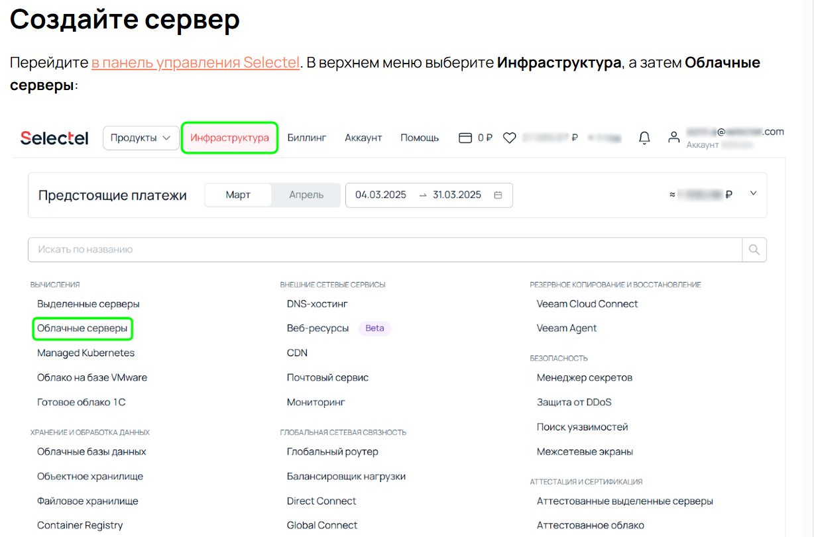
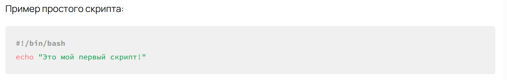

---
## Front matter
lang: ru-RU
title: Прохождение внешнего курса
subtitle: Часть 1. Основы системного администрирования и Linux
author:
  - Сергеев Д. О.
institute:
  - Российский университет дружбы народов, Москва, Россия
date: 22 ноября 2025

## i18n babel
babel-lang: russian
babel-otherlangs: english

## Formatting pdf
toc: false
toc-title: Содержание
slide_level: 2
aspectratio: 169
section-titles: true
theme: metropolis
header-includes:
 - \metroset{progressbar=frametitle,sectionpage=progressbar,numbering=fraction}
---

# Информация

## Докладчик

:::::::::::::: {.columns align=center}
::: {.column width="70%"}

  * Сергеев Даниил Олегович
  * Студент
  * Направление: Прикладная информатика
  * Российский университет дружбы народов
  * [1132246837@pfur.ru](mailto:1132246837@pfur.ru)

:::
::::::::::::::

# Цель работы

Разобрать, чем занимается системный администратор, какие задачи выполняет и почему его роль критически важна. Узнать, что такое «система», из чего состоит инфраструктура и как управлять ее элементами.

# Задание

- Модуль 1. Введение в системное администрирование
- Модуль 2. Базовые команды Linux
- Модуль 3. Файлы и каталоги

# Ход выполнения лабораторной работы

# Модуль 1. Введение в системное администрирование

## Модуль 1. Введение в системное администрирование

Состоит из 4 уроков:

- Роль системного администратора Linux
- Введение в Linux и open-source
- Почему SelectOS — стандарт работы с сетью
- Как настроить сервер для практических занятий

## Роль системного администратора Linux

- что такое системное администрирование?
- в чем заключается роль системного администратора? 
- Начало знакомства с базовыми командами Linux

## Введение в Linux и open-source

- как устроен мир Linux и свободной разработки?
- что такое дистрибутивы?
- чем отличаются свободное и открытое ПО?

## Почему SelectOS — стандарт работы с сетью

Работа с SelectOS помогает системным администраторам снизить рутину и сосредоточиться на ключевых процессах. Задача SelectelOs — создать решение, которое позволит специалисту сфокусироваться только на важных вопросах и росте компетенций. Данный блок рассматривает основные аспекты, которые облегчают работу системного администратора.

## Как настроить сервер для практических занятий

{#fig:001 width=100%}

# Модуль 2. Базовые команды Linux

## Модуль 2. Базовые команды Linux

Состоит из 5 уроков:

- Введение в модуль
- Роль командной строки в серверной среде
- Файловая структура и ключевые каталоги
- Принцип «Всё есть файл»
- Работа с базовыми командами в реальных условиях

## Введение в модуль

Владение средствами эффективного управления сервером — незаменимая часть навыков системного администратора. Этот урок знакомит с ключевыми утилитами и методами работы в Linux.

В модуле подробно разберается управление системой через терминал, редактирование текста в отсутствии привычных графических программ, установка ПО с помощью менеджера пакетов, а также мониторинг процессов.

## Роль командной строки в серверной среде

Главная идея: Серверу не всегда нужен GUI

Linux-серверы часто работают без графического интерфейса. Командная строка (CLI) служит основным инструментом управления. Модуль углубляется в роль CLI именно в контексте ресурсосбережения, удаленного администрирования и автоматизации — ключевых факторов в работе с серверной ОС.

## Файловая структура и ключевые каталоги

{#fig:001 width=100%}

## Принцип «Всё есть файл»

«Все есть файл» — это основополагающий принцип Unix-подобных ОС, включая Linux. Согласно этой концепции, практически любой компонент системы — будь то аппаратное устройство, процесс, набор параметров или поток данных — представлен в виде файла или каталога.

Пример: /proc, /dev

# Работа с базовыми командами в реальных условиях

Есть несколько ключевых простейших команд — системные администраторы постоянно используют их для навигации по файловой системе, просмотра содержимого директории и понимания структуры данных. Важно научиться свободно применять их. Это поможет вам решать более сложные задачи, связанные с анализом логов, изменением конфигурации сервисов или автоматизацией процессов.

pwd, ls, cd

# Модуль 3. Файлы и каталоги

## Модуль 3. Файлы и каталоги

Состоит из 4 уроков:

- Введение в модуль
- Базовые команды для управления файлами и каталогами
- Работа с архивами и передача данных между серверами
- Основы автоматизации с помощью Bash-скриптов

## Введение в модуль

Файлы и каталоги — это фундамент любого сервера. А работа с ними — навык, без которого невозможно стать уверенным системным администратором. Этот модуль заложит основу, на которой будет строиться дальнейшее изучение настройки серверов, работы с сервисами и автоматизации задач.

В этом модуле сказано как

- создавать, удалять, перемещать и копировать файлы;
- работать с архивами для экономии места и передачи данных;
- автоматизировать повторяющиеся задачи с помощью Bash-скриптов

## Базовые команды для управления файлами и каталогами

Работа с файлами и каталогами в Linux начинается с набора ключевых команд. Эти инструменты позволяют:

- просматривать содержимое директорий (ls);
- переходить между каталогами (cd);
- создавать, копировать, перемещать и удалять файлы (mkdir, touch, cp, mv, rm).

## Работа с архивами и передача данных между серверами

- Зачем нужны архивы?

Модуль учит тому, что

- Важно регулярно создавать резервные копии
- Дисковое пространство не бесконечно
- Передача данных должна быть максимально эффективной

## Основы автоматизации с помощью Bash-скриптов

- Почему важна автоматизация?

Многие задачи системного администрирования повторяются: резервное копирование, очистка старых логов, мониторинг состояния системы. Выполнять их вручную каждый раз неудобно и затратно по времени. Автоматизация с использованием Bash-скриптов позволяет упростить рутинные задачи, снизить вероятность ошибок и освободить время для более сложных задач.

{#fig:001 width=100%}

# Вывод

В результате прохождения первой части внешнего курса «Системный администратор Linux с нуля» я разобрал, чем занимается системный администратор, узнал о базовых командах, необходимых для управления системой, и выполнил практические занятия по управлению файлами и каталогами.
