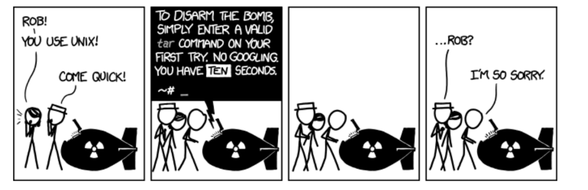
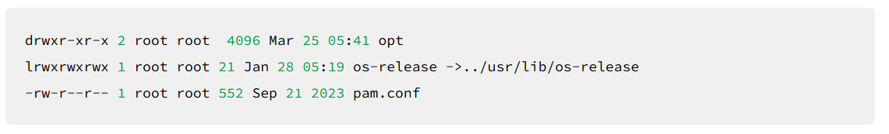
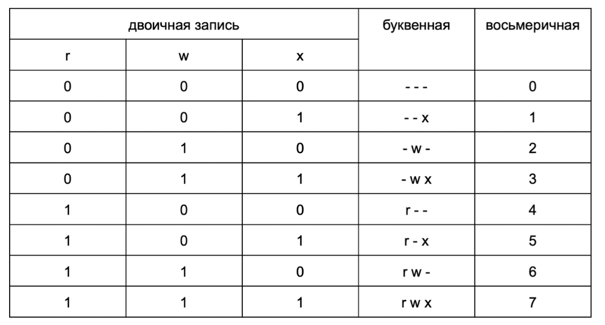
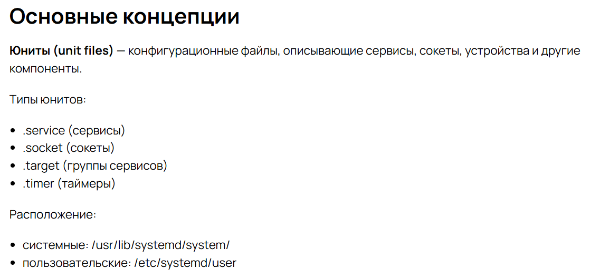
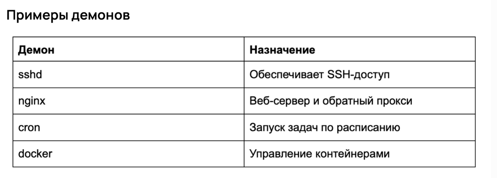

---
## Front matter
lang: ru-RU
title: Прохождение внешнего курса
subtitle: Часть 2. Работа с файлами и управление доступами
author:
  - Сергеев Д. О.
institute:
  - Российский университет дружбы народов, Москва, Россия
date: 22 ноября 2025

## i18n babel
babel-lang: russian
babel-otherlangs: english

## Formatting pdf
toc: false
toc-title: Содержание
slide_level: 2
aspectratio: 169
section-titles: true
theme: metropolis
header-includes:
 - \metroset{progressbar=frametitle,sectionpage=progressbar,numbering=fraction}
---

# Информация

## Докладчик

:::::::::::::: {.columns align=center}
::: {.column width="70%"}

  * Сергеев Даниил Олегович
  * Студент
  * Направление: Прикладная информатика
  * Российский университет дружбы народов
  * [1132246837@pfur.ru](mailto:1132246837@pfur.ru)

:::
::::::::::::::

# Цель работы

Глубже погрузиться в работу с Linux. Научиться находить справочную информацию, редактировать текстовые файлы, работать с выводом команд. Узнать, как управлять пользователями и доступом к файлам или каталогам. А еще — изучить мониторинг и управление процессами, сервисами и демонами.

# Задание

- Модуль 4. Получение справки. Использование справочных систем, работа с текстовыми файлами и логами
- Модуль 5. Управление пользователями и группами
- Модуль 6. Управление доступом
- Модуль 7. Управление процессами

# Ход выполнения лабораторной работы

# Модуль 4. Получение справки. Использование справочных систем, работа с текстовыми файлами и логами

## Модуль 4. Получение справки. Использование справочных систем, работа с текстовыми файлами и логами

Состоит из 5 уроков:

- Введение в модуль
- Поиск справочной информации в Linux
- Работа с текстовыми файлами в Linux
- Анализ системных логов
- Автоматизация анализа логов и работы с текстом

## Поиск справочной информации в Linux

В работе с Linux системный администратор постоянно сталкивается с новыми утилитами, командами и конфигурациями. Даже знакомые программы могут содержать десятки неопробованных параметров и опций — запомнить их все практически невозможно.

Умение быстро находить нужную справку помогает сэкономить время и избежать ошибок. В уроке рассматриваются основные способы получить информацию о командах и их использовании в Linux.

{#fig:001 width=100%}

## Работа с текстовыми файлами в Linux

Теперь, когда мы умеем искать справочную информацию по командам и утилитам, пора перейти к работе с самими файлами. В повседневной практике системного администратора это могут быть конфигурационные файлы, логи и любые текстовые материалы.

cat, less, grep, nano/vim, awk

## Анализ системных логов

В уроке разбирается, где хранятся логи в Linux и как с ними работать. Цель — научиться находить, фильтровать и анализировать системные логи для диагностики проблем и мониторинга работы сервисов.

journalctl, /var/log

## Автоматизация анализа логов и работы с текстом

Использование journalctl вручную удобно, но не всегда эффективно: при возникновении ошибок важна максимально быстрая реакция, особенно если речь о безопасности. Здесь на помощь приходит автоматизация обработки.

В этом уроке рассматривается, как отслеживать логи в реальном времени, выполнять команды по расписанию, а также автоматически сохранять и фильтровать ошибки.

- Автоматизация с помощью планировщика cron

# Модуль 5. Управление пользователями и группами

## Модуль 5. Управление пользователями и группами

Состоит из 5 уроков:

- Введение в модуль
- Основы управления пользователями и группами
- Основы управления доступом и разрешениями
- Повышение безопасности работы с учетными записями
- Политика паролей и учетных записей

## Основы управления пользователями и группами

В этом уроке объяснено, как создавать учетные записи пользователей и управлять ими. Разбирается зачем нужны группы и как они работают. Также описаны и технические особенности — например, где хранятся данные о пользователях.

/etc/passwd, /etc/group, /etc/shadow

## Основы управления доступом и разрешениями

В этом уроке мы узнаем о том, как управлять доступом групп и пользователей к файлам. Мы рассматриваем все способы задания доступа — как буквенную, так и цифровую форму записи. Также знакомимся с командами для управления разрешениями.

{#fig:001 width=100%}

## Повышение безопасности работы с учетными записями

- Почему лучше использовать sudo вместо su?

Есть множество аспектов безопасности, про которые надо знать. В этом уроке мы рассматриваем как ограничивать доступ пользователей, какую команду лучше использовать для повышения привилегий. Даются практические советы, как предотвращать атаки грубой силы на сервер (Fail2Ban, ufw).

## Политика паролей и учетных записей

В модуле говорится, где хранятся пароли и как их защищать, как ограничивать срок действия паролей, а при необходимости блокировать учетные записи пользователей и останавливать их процессы. Мы рассмотрели как происходит процесс хеширования. Наконец, мы заглянули в устройство модуля PAM (Pluggable Authentication Modules) и получили практические примеры гибкой настройки парольной политики и аудита безопасности пользователей.

# Модуль 6. Управление доступом

## Модуль 6. Управление доступом

Состоит из 5 уроков:

- Введение в модуль
- Основные принципы прав доступа в Linux
- Изменение прав доступа: chmod, chown, chgrp
- Расширенные списки доступа (ACL) для управления доступом
- Специальные разрешения: SUID, SGID, Sticky Bit

## Основные принципы прав доступа в Linux

Сначала вспомнили «базу», которую рассматривали в предыдущих модулях. Права доступа в Linux — это возможность пользователя системы выполнять одно из следующих действий или любую их комбинацию над файлами:

- чтение (r, read);
- запись (w, write);
- выполнение / запуск программ (x, execute).

## Основные принципы прав доступа в Linux

{#fig:001 width=100%}

## Изменение прав доступа: chmod, chown, chgrp

В этом уроке мы изучили базовые команды, которые помогут эффективно управлять доступом к файлам и каталогам. Мы подробно рассмотрели команду chmod, которая позволяет изменять права доступа, и коротко обсудили дополнительные команды (chown, chgrp).

## Расширенные списки доступа (ACL) для управления доступом

Бывают ситуации, когда доступ нужно настроить более тонко — нескольким пользователям или группам выдать специфичные права. Тут на помощь приходят ACL — расширенные списки доступа.

В этом уроке мы познакомились с концепцией расширенных списков доступа (ACL) и рассмотрели процесс установки ACL для файлов и каталогов.

## Специальные разрешения: SUID, SGID, Sticky Bit

Специальные биты разрешений SUID, SGID и Sticky Bit применяются довольно редко и чаще для системных файлов. Но в этом разделе мы изучили такую функциональность, так как при неаккуратном обращении с ним можно по ошибке раздать права root.

# Модуль 7. Управление процессами

## Модуль 7. Управление процессами

Состоит из 5 уроков:

- Введение в модуль
- Основы управления процессами в Linux
- Управление приоритетами процессов: nice и renice
- Контроль системных сервисов: systemd и systemctl
- Управление фоновыми процессами (демонами) в Linux

## Основы управления процессами в Linux

Процессы — это фундаментальная часть работы любой операционной системы. В Linux каждый запущенный экземпляр программы, сервиса или скрипта является процессом, который потребляет ресурсы (CPU, память, дисковое пространство).

Этот урок дает нам инструменты для мониторинга и управления процессами, а также понимание их жизненного цикла в Linux.

## Управление приоритетами процессов: nice и renice

После этого урока мы знаем, что такое приоритет процесса, умеем назначать, изменять и проверять его, а также настраивать сервисы в соответствии с приоритетами. Мы освоили автоматическое изменение приоритета и выяснили разницу между nice и renice.

## Контроль системных сервисов: systemd и systemctl

Systemd — это современная система инициализации и менеджер сервисов, используемая в большинстве дистрибутивов Linux. Он заменяет устаревшие системы вроде SysV init и Upstart, предоставляя:

- параллельный запуск сервисов для ускорения загрузки системы;
- гибкое управление зависимостями между сервисами;
- интегрированные инструменты мониторинга, логирования и восстановления.

## Контроль системных сервисов: systemd и systemctl

{#fig:001 width=100%}

## Управление фоновыми процессами (демонами) в Linux

Демоны (фоновые процессы) — это сервисы, которые работают в фоновом режиме, не требуя взаимодействия с пользователем. Они обеспечивают работу критически важных компонентов системы: веб-серверов (Nginx, Apache), баз данных (MySQL, PostgreSQL), SSH-доступа (sshd) и планировщиков задач (cron).

{#fig:001 width=100%}

# Вывод

В результате прохождения второй части внешнего курса «Системный администратор Linux с нуля» я глубже погрузился в работу системного администратора Linux. Я научился находить справочную информацию, редактировать файлы и работать с выводом команд. Также я узнал как управлять правами доступа к файлам и каталогам, как добавлять и менять права пользователей и как управлять процессами и юнитами.
