---
## Front matter
title: "Прохождение внешнего курса. Часть 2. Работа с файлами и управление доступами"
subtitle: "Отчёт"
author: "Сергеев Даниил Олегович"

## Generic otions
lang: ru-RU
toc-title: "Содержание"

## Bibliography
bibliography: bib/cite.bib
csl: pandoc/csl/gost-r-7-0-5-2008-numeric.csl

## Pdf output format
toc: true # Table of contents
toc-depth: 2
lof: true # List of figures
lot: true # List of tables
fontsize: 12pt
linestretch: 1.5
papersize: a4
documentclass: scrreprt
## I18n polyglossia
polyglossia-lang:
  name: russian
  options:
	- spelling=modern
	- babelshorthands=true
polyglossia-otherlangs:
  name: english
## I18n babel
babel-lang: russian
babel-otherlangs: english
## Fonts
mainfont: IBM Plex Serif
romanfont: IBM Plex Serif
sansfont: IBM Plex Sans
monofont: IBM Plex Mono
mathfont: STIX Two Math
mainfontoptions: Ligatures=Common,Ligatures=TeX,Scale=0.94
romanfontoptions: Ligatures=Common,Ligatures=TeX,Scale=0.94
sansfontoptions: Ligatures=Common,Ligatures=TeX,Scale=MatchLowercase,Scale=0.94
monofontoptions: Scale=MatchLowercase,Scale=0.94,FakeStretch=0.9
mathfontoptions:
## Biblatex
biblatex: true
biblio-style: "gost-numeric"
biblatexoptions:
  - parentracker=true
  - backend=biber
  - hyperref=auto
  - language=auto
  - autolang=other*
  - citestyle=gost-numeric
## Pandoc-crossref LaTeX customization
figureTitle: "Рис."
tableTitle: "Таблица"
listingTitle: "Листинг"
lofTitle: "Список иллюстраций"
lotTitle: "Список таблиц"
lolTitle: "Листинги"
## Misc options
indent: true
header-includes:
  - \usepackage{indentfirst}
  - \usepackage{float} # keep figures where there are in the text
  - \floatplacement{figure}{H} # keep figures where there are in the text
---

# Цель работы

Глубже погрузиться в работу с Linux. Научиться находить справочную информацию, редактировать текстовые файлы, работать с выводом команд. Узнать, как управлять пользователями и доступом к файлам или каталогам. А еще — изучить мониторинг и управление процессами, сервисами и демонами.

# Задание

- Модуль 4. Получение справки. Использование справочных систем, работа с текстовыми файлами и логами
- Модуль 5. Управление пользователями и группами
- Модуль 6. Управление доступом
- Модуль 7. Управление процессами

# Ход выполнения лабораторной работы

## Модуль 4. Получение справки. Использование справочных систем, работа с текстовыми файлами и логами

### Задания по теме «Поиск справочной информации в Linux»

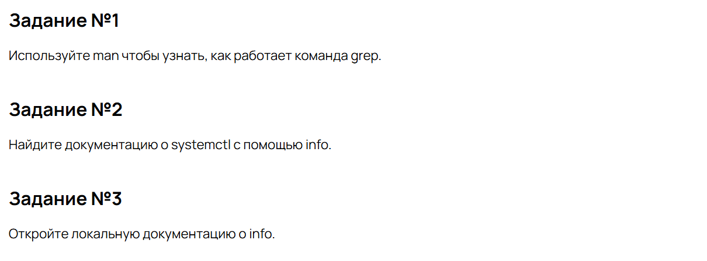{#fig:001 width=90%}

#### Задание №1

Выведем справочную информацию
```bash
man grep
```

{#fig:002 width=90%}

#### Задание №2

Теперь узнаем информацию о ```systemctl```, но уже другой командой
```bash
info systemctl
```

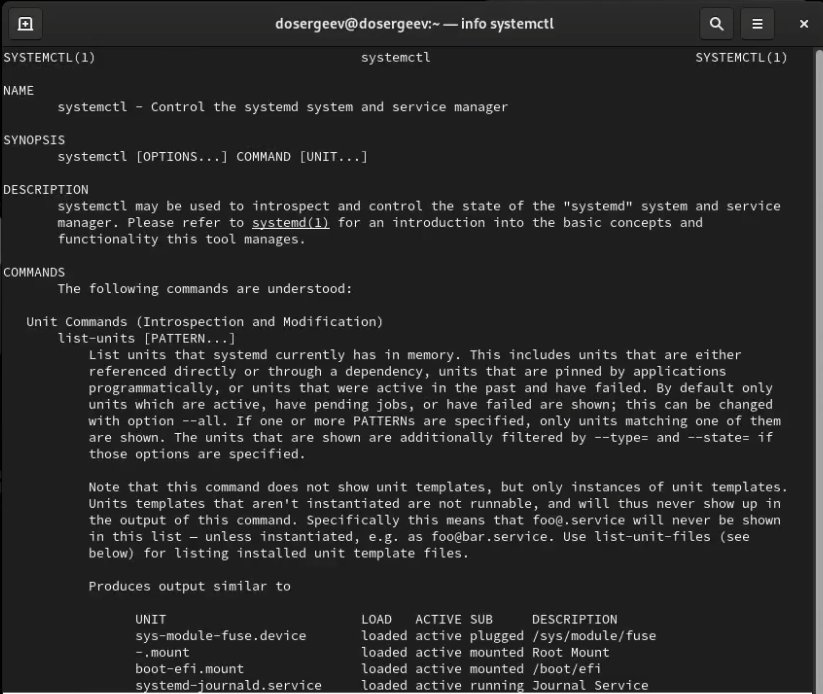{#fig:003 width=90%}

#### Задание №3

Справочная информация команды ```info``` находится в каталоге /usr/share/info
```bash
ls /usr/share/info
```

Перейдем в каталог и откроем файл документации через vim
```bash
cd /usr/share/info
# -R открыть только для чтения
vim -R info-stnd.info.gz
```

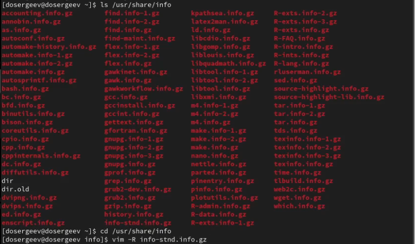{#fig:004 width=90%}

### Тест по теме «Поиск справочной информации в Linux»

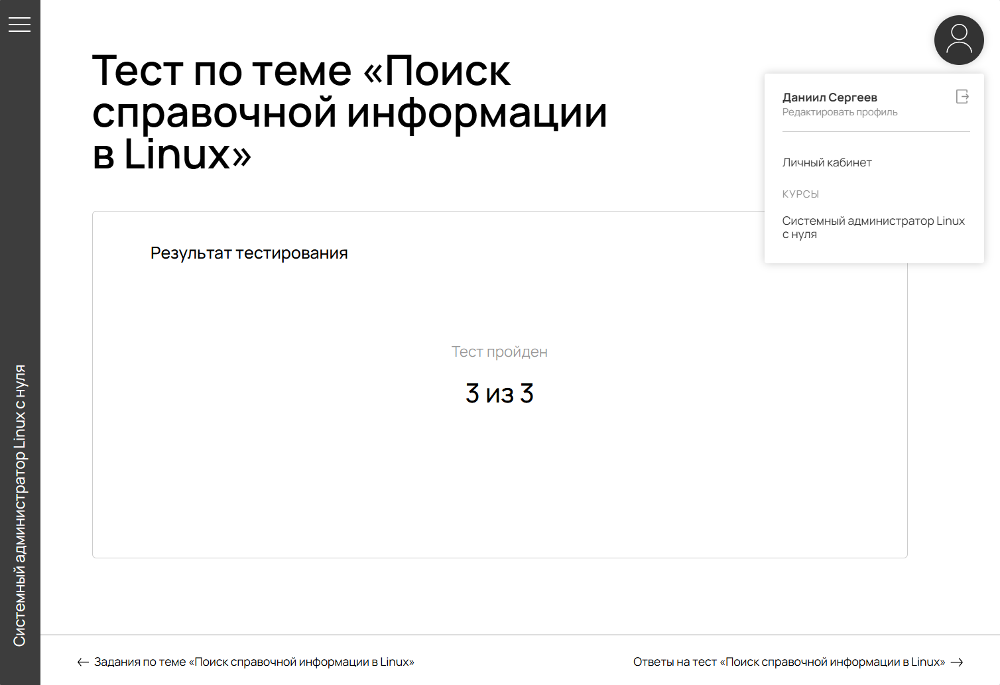{#fig:005 width=90%}

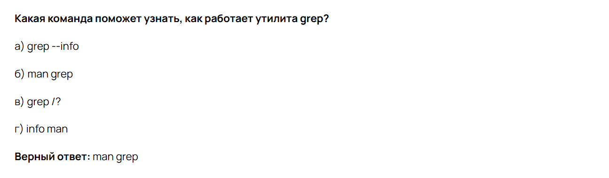{#fig:006 width=90%}

Выбранный ответ: **man grep**.

- ```grep --info``` - такой опции не существует у команды grep;
- ```grep /?``` - аналогично с первым вариантом ответа;
- ```info man``` - откроет справку о команде man, а не grep;

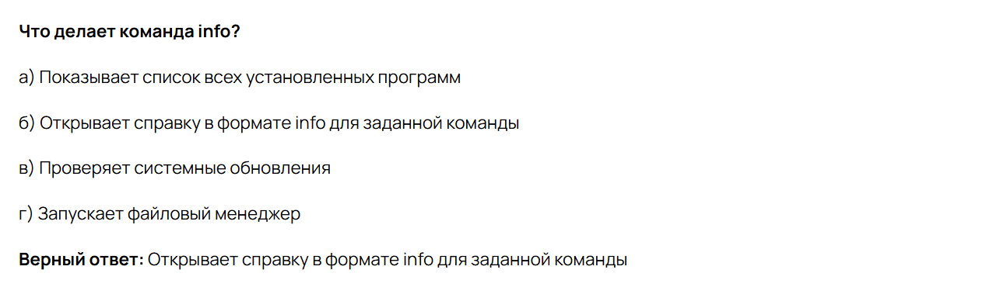{#fig:007 width=90%}

Выбранный ответ: **Открывает справку в формате info для заданной команды**.

```info``` - справочная система, которая предоставляет детальную и структурированную информацию по утилитам. Она не показывает спискок установленных программ, не проверяет обновления и не запускает файловый менеджер.

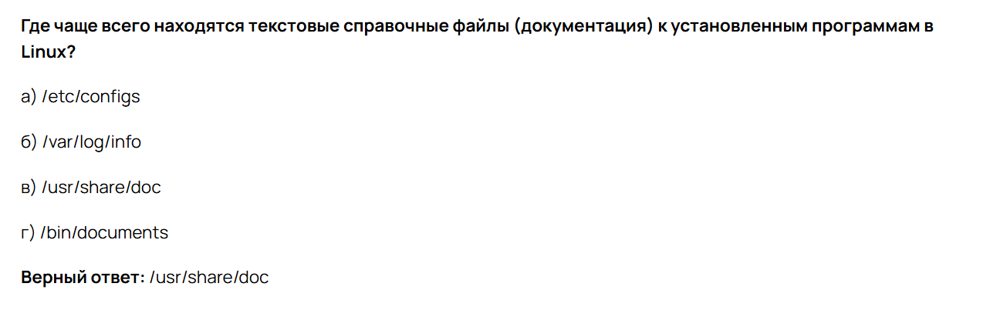{#fig:008 width=90%}

Выбранный ответ: **/usr/share/doc**.

- ```/etc/configs``` - такой директории не существует, конфигурационные файлы обычно находятся в /etc;
- ```/var/log/info``` - в /var/log хранятся логи программ, а не документация;
- ```/bin/documents``` - в /bin находятся бинарные исполняемые файлы, документация там отсутствует;

### Задания по теме «Работа с текстовыми файлами в Linux»

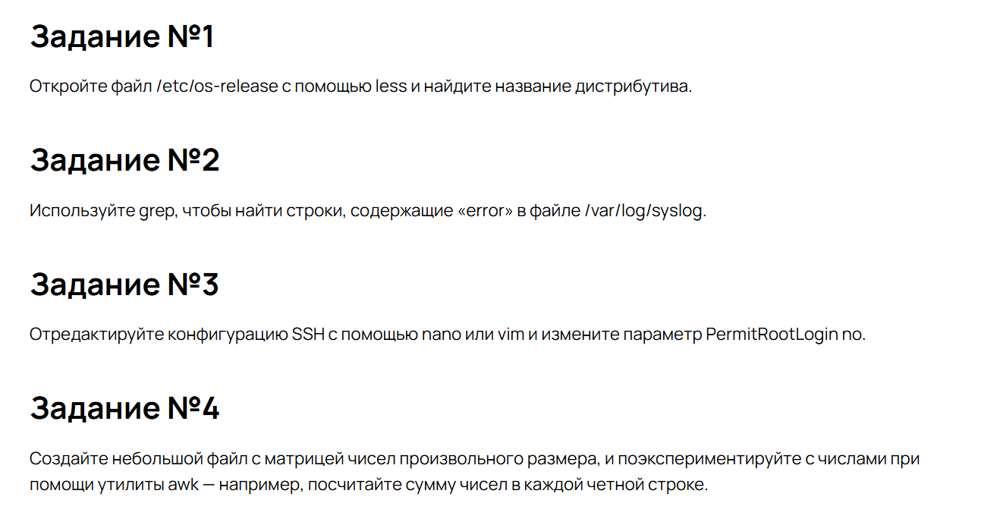{#fig:009 width=90%}

#### Задание №1

Используем команду
```bash
less /etc/os-release
```

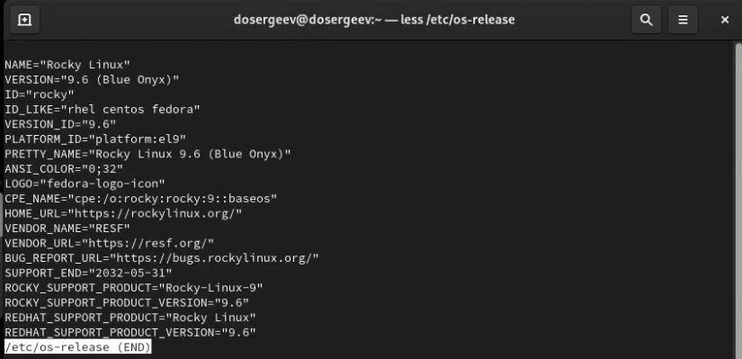{#fig:010 width=90%}

Название дистрибутива - Rocky Linux.

#### Задание №2

Так как файл логов syslog отсутствует на Rocky Linux, выведем сообщения из messages
```bash
# --color=auto выделение вхождений красным цветом
sudo grep --color=auto "error" /var/log/messages
```

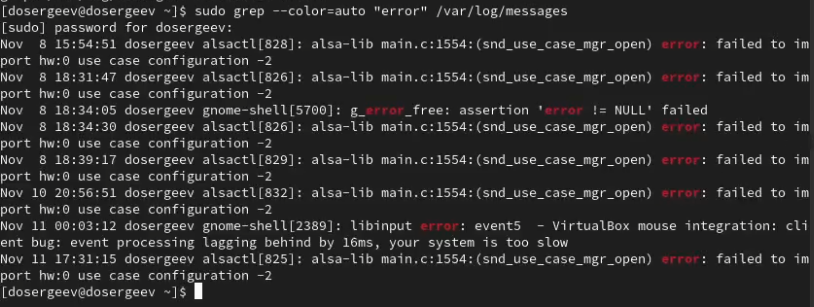{#fig:011 width=90%}

#### Задание №3

Откроем файл конфигурации sshd_config и изменим параметр
```bash
cd /etc/ssh
sudo vi sshd_config
```

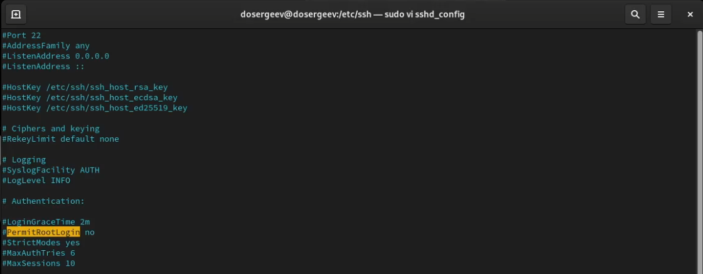{#fig:012 width=90%}

#### Задание №4

Создадим файл ```a.txt``` в домашней директории и заполним его матрицей чисел. Откроем его с использованием фильтра
```bash
cd ~
vi a.txt
# редактируем новый файл, затем :wq
awk 'NR % 2 == 0 {for (i=1; i<=NF; i++) count += $i; print NR ":", count; count = 0}' a.txt
```

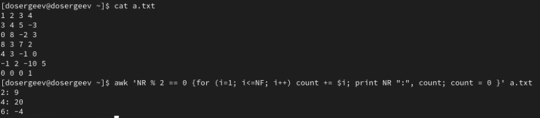{#fig:013 width=90%}

### Тест по теме «Работа с текстовыми файлами в Linux»

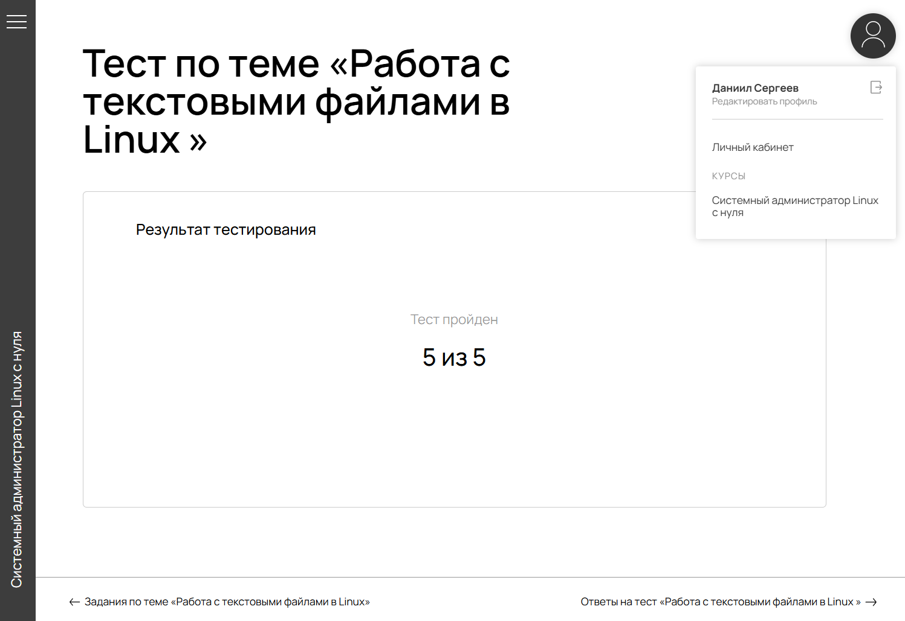{#fig:014 width=90%}

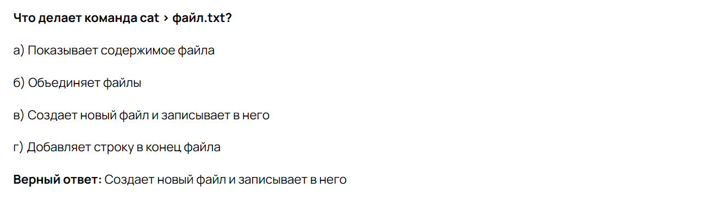{#fig:015 width=90%}

Выбранный ответ: **Создает новый файл и записывает в него**.

Оператор ```>>``` дописывает в конец файла, а ```>``` перезаписывает файл. Использование команды ```cat``` без указания файла позволит записать ввод с клавиатуры, после чего выведет его повторно (закончить ввод можно сочетанием Ctrl+D).

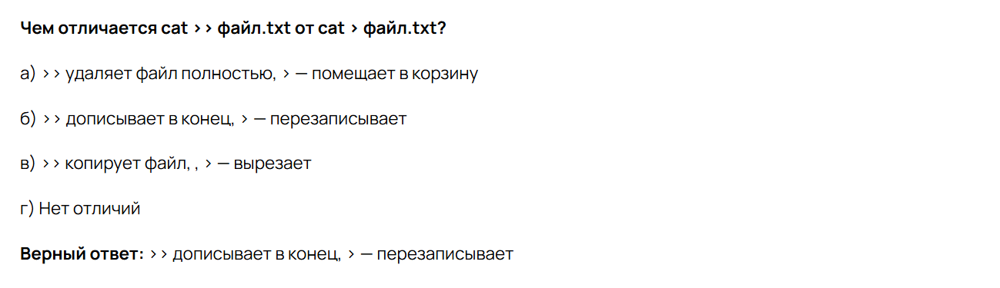{#fig:016 width=90%}

Выбранный ответ: **>> дописывает в конец, > — перезаписывает**.

Принцип работы операторов описан в самом ответе и был указан в предыдущем ответе на вопрос.

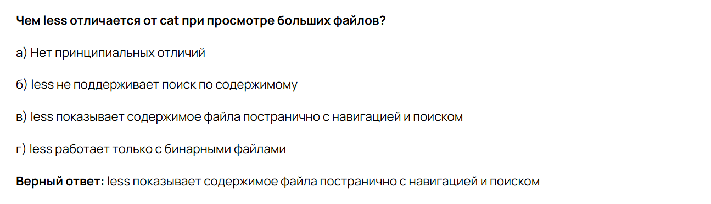{#fig:017 width=90%}

Выбранный ответ: **less показывает содержимое файла постранично с навигацией и поиском**.

Утилита ```less``` позволяет постранично просматривать файл, выполнять поиск по содержимому, а также предоставляет удобную навигацию. ```cat``` выводит всю информацию разом, что неудобно для больших объемов текста.

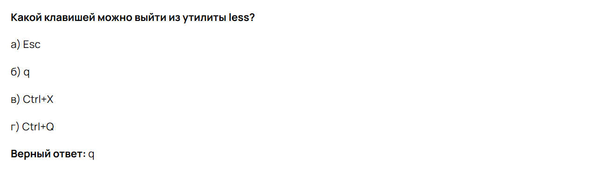{#fig:018 width=90%}

Выбранный ответ: **q**.

Выйти из утилиты ```less``` можно, нажав q

{#fig:019 width=90%}

Выбранный ответ: **:**.

- Tab используется для автодополнения;
- Esc переходит из других режимов в нормальный режим;
- Shift используется для других целей;

### Задания по теме «Анализ системных логов»

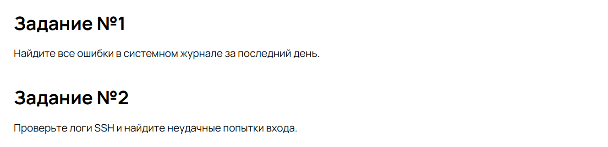{#fig:020 width=90%}

#### Задание №1

Используем команду
```bash
journalctl --since "yesterday" --grep error
```

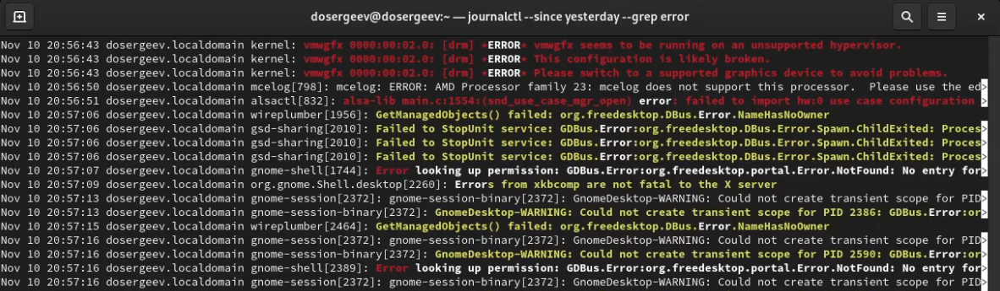{#fig:021 width=90%}

#### Задание №2

Для службы SSH
```bash
journalctl -u sshd --grep "Failed"
```

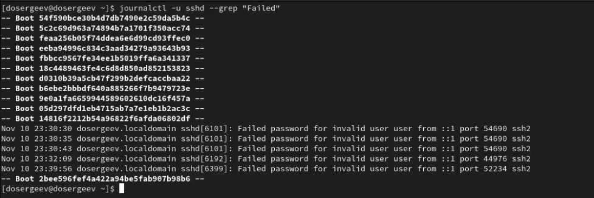{#fig:022 width=90%}

### Тест по теме «Анализ системных логов»

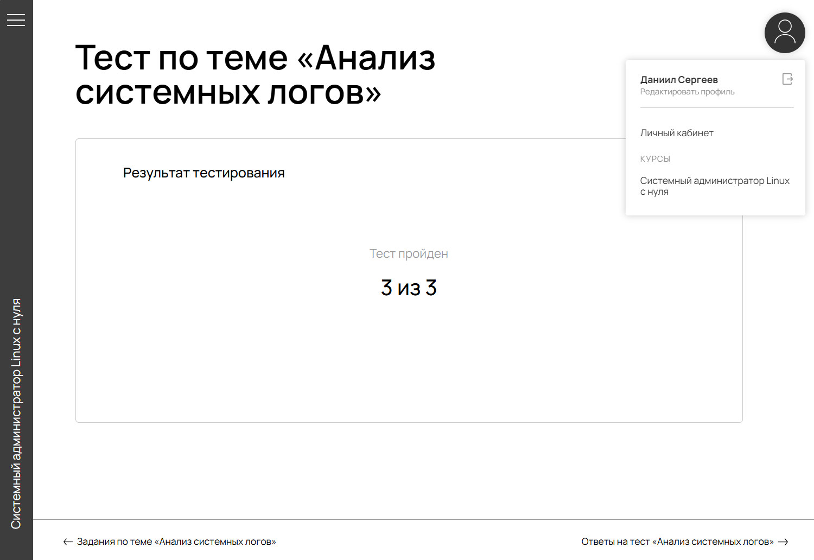{#fig:023 width=90%}

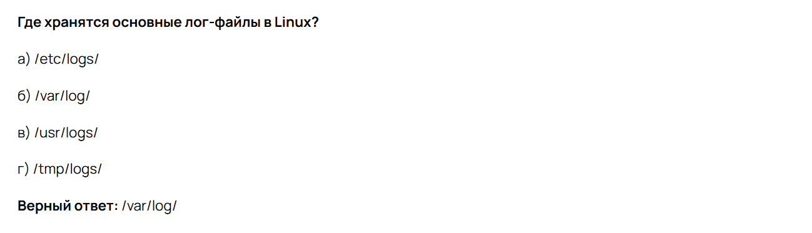{#fig:024 width=90%}

Выбранный ответ: **/var/log/**.

- /etc/logs/ - в /etc хранятся файлы конфигурации;
- /usr/logs/ - в /usr хранятся пользовательские файлы;
- /tmp/logs/ - в /tmp хранятся временные файлы;

{#fig:025 width=90%}

Выбранный ответ: **Показывает логи sshd за сегодня**.

Опция ```-u``` позволяет указать конкретный юнит, а ```--since``` время, с которого стоит искать сообщения.

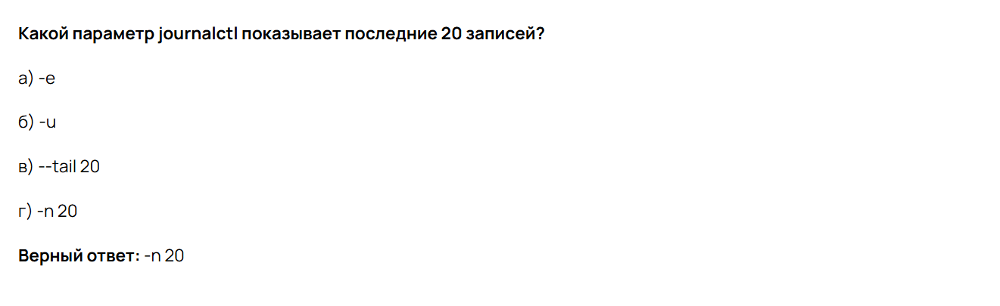{#fig:026 width=90%}

Выбранный ответ: **-n 20**.

- ```-e``` - переходит сразу к концу журнала;
- ```-u``` - фильтрует записи по конкретному юниту;
- ```--tail 20``` - такой опции нет в journalctl;

### Задания по теме «Автоматизация анализа логов и работы с текстом»

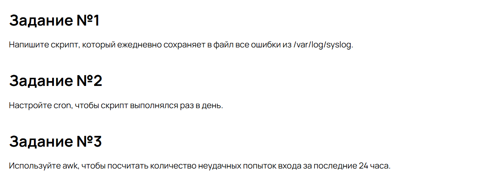{#fig:027 width=90%}

#### Задание №1

Напишем скрипт в файле /usr/bin/daily_save.sh и сделаем его исполняемым
```bash
#!/bin/bash
grep -i "error" /var/log/messages > /var/log/daily_save.log
```

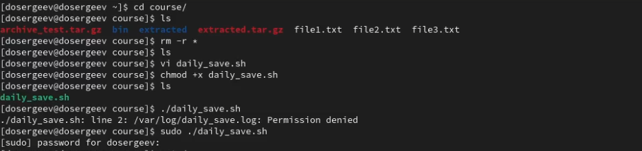{#fig:028 width=90%}

#### Задание №2

Теперь проведем настройку crontab
```bash
crontab -e
# в редакторе crontab
0 0 * * * /usr/bin/daily_save.log
```

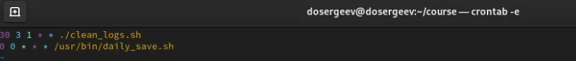{#fig:029 width=90%}

#### Задание №3

Используем несколько фильтров
```bash
journalctl -u sshd --since "yesterday" | grep "Failed password" | awk '{count += 1} END {print count}'
```

Сделаем несколько ошибок входа и проверим вывод команды

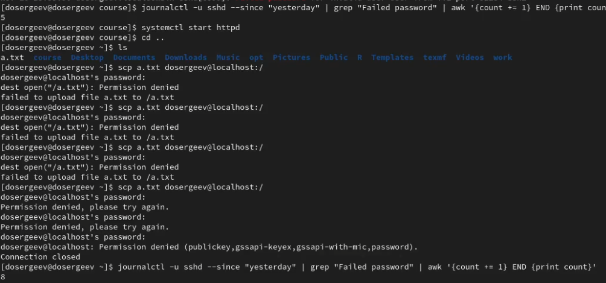{#fig:030 width=90%}

### Тест по теме «Автоматизация анализа логов и работы с текстом»

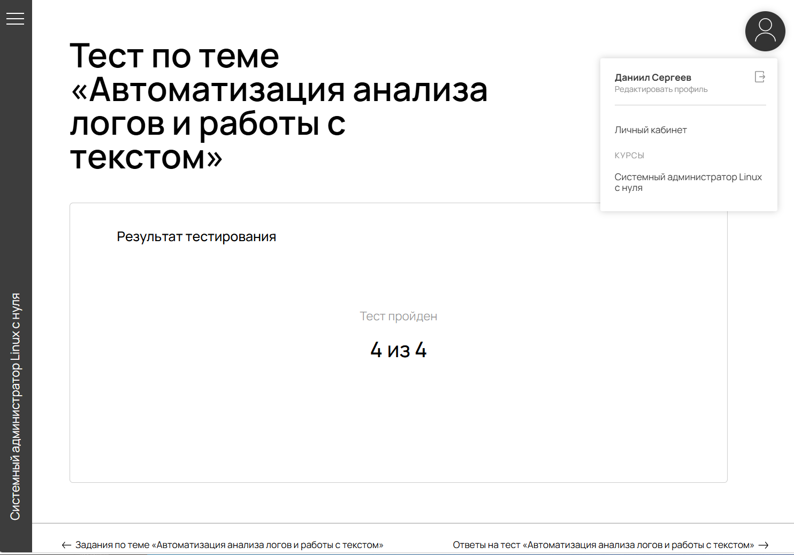{#fig:031 width=90%}

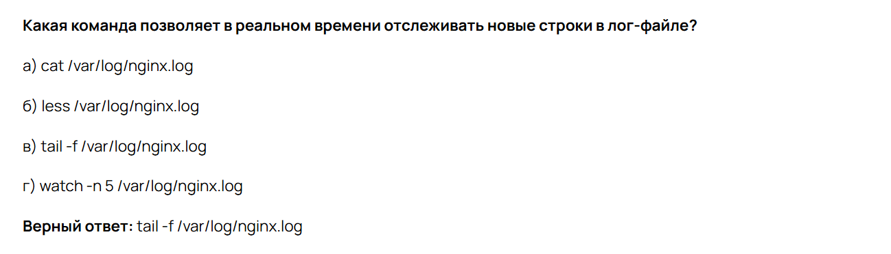{#fig:032 width=90%}

Выбранный ответ: **tail -f /var/log/nginx.log**.

Опция ```-f``` позволяет отслеживать добавление новых строк в файл в реальном времени.

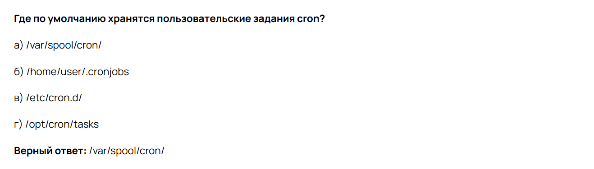{#fig:033 width=90%}

Выбранный ответ: **/var/spool/cron/**.

- /home/user/.cronjobs - такой стандартной директории не существует;
- /etc/cron.d/ - здесь хранятся системные cron-задания;
- /opt/cron/tasks - нестандартный путь для хранения cron-заданий;

{#fig:034 width=90%}

Выбранный ответ: **\***.

- ```-``` - используется для указания диапазонов значений;
- ```/``` - используется для указания шага значений;
- ```%``` - не является специальным символом в crontab;

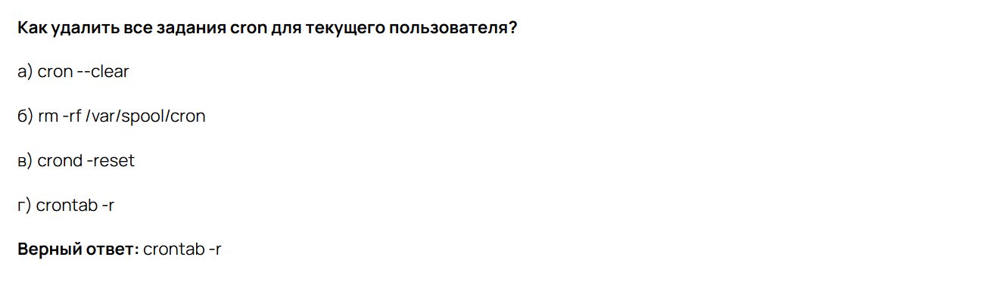{#fig:035 width=90%}

Выбранный ответ: **crontab -r**.

- ```cron --clear``` - такой команды не существует;
- ```rm -rf /var/spool/cron``` - удалит задания всех пользователей;
- ```crond -reset``` - такой команды не существует.

## Модуль 5. Управление пользователями и группами

### Задания по теме «Основы управления пользователями и группами»

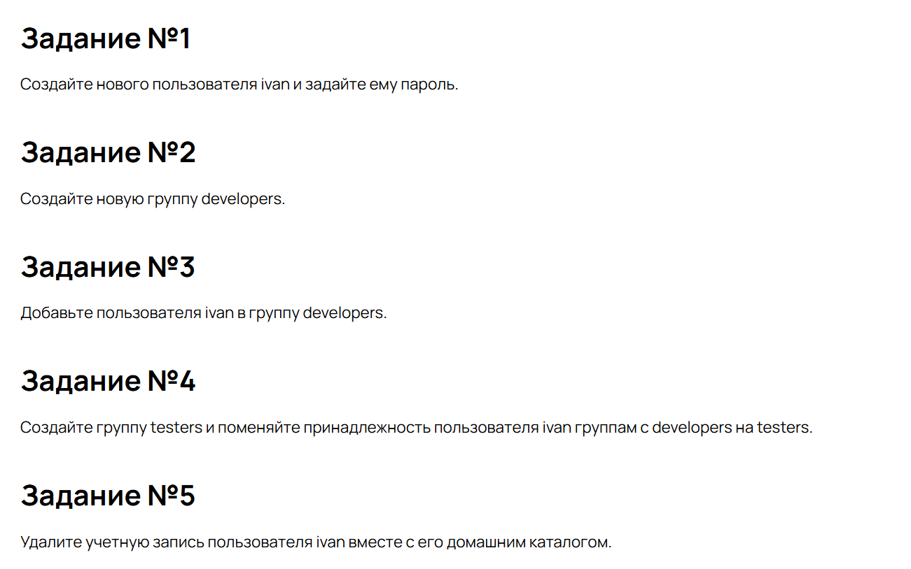{#fig:036 width=90%}

#### Задание №1

Создадим пользователя и зададим пароль
```bash
sudo adduser ivan
# проверим, что пользователь создался
sudo cat /etc/passwd | grep ivan
sudo passwd ivan
```

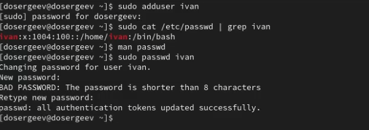{#fig:037 width=90%}

#### Задание №2

Создадим группу developers
```bash
sudo groupadd developers
sudo cat /etc/group | grep developers
```

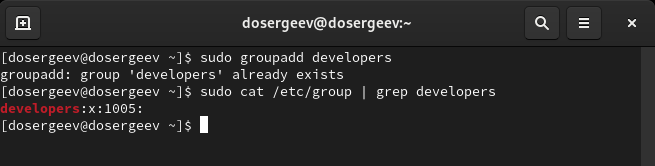{#fig:038 width=90%}

#### Задание №3

Добавим ivan в developers
```bash
sudo usermod -aG developers ivan
```

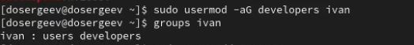{#fig:039 width=90%}

#### Задание №4

Создадим группу testers и поменяем принадлежность ivan c developers на testers.
```bash
sudo usermod -G "" ivan
sudo usermod -aG testers ivan
```

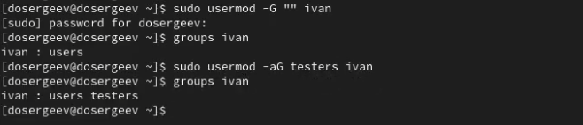{#fig:040 width=90%}

#### Задание №5

Завершаем все процессы пользователя ivan и удаляем его
```bash
sudo pkill -u ivan
sudo userdel -r ivan
```

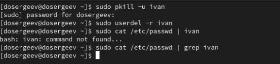{#fig:041 width=90%}

### Тест по теме «Основы управления пользователями и группами»

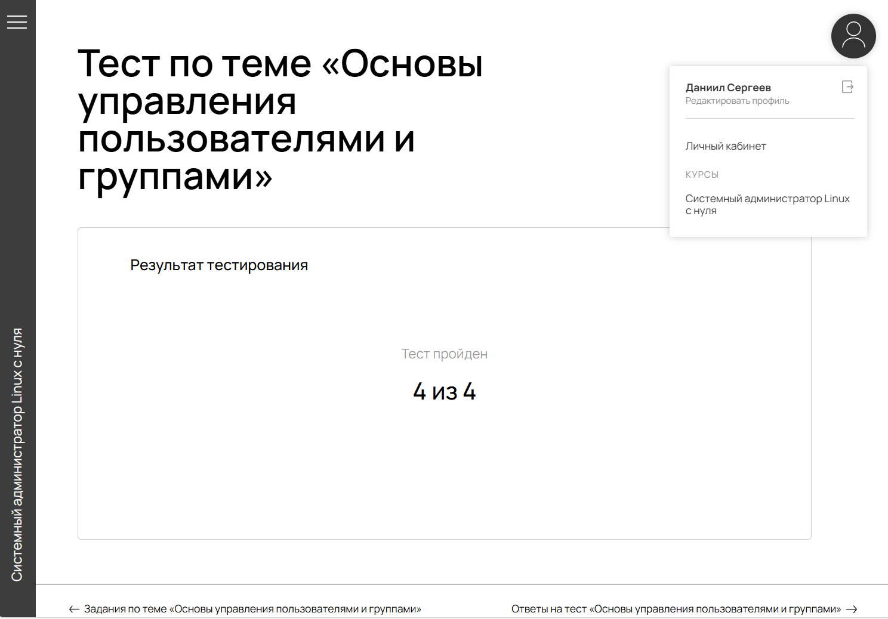{#fig:042 width=90%}

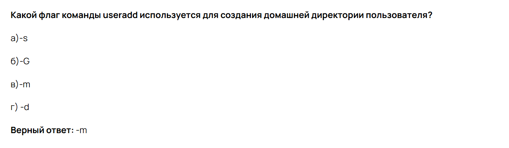{#fig:043 width=90%}

Выбранный ответ: **-m**.

- ```-s``` - указывает командную оболочку пользователя;
- ```-G``` - задает дополнительные группы пользователя;
- ```-d``` - указывает путь к домашней директории;

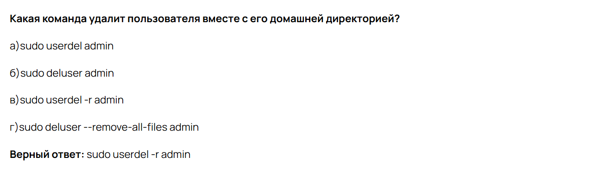{#fig:044 width=90%}

Выбранный ответ: **sudo userdel -r admin**.

- ```sudo userdel admin``` - удаляет только пользователя, домашняя директория остается;
- ```sudo deluser admin``` - в некоторых дистрибутивах может не удалить домашнюю директорию;
- ```sudo deluser --remove-all-files admin``` - не является стандартным синтаксисом;

{#fig:045 width=90%}

Выбранный ответ: **Добавляет пользователя admin в группу sudo, сохранив остальные группы**.

Команда usermod используется для изменения данных учетной записи пользователя, в том числе для добавления его в уже существующую группу. Это можно сделать с помощью опций ```-a``` и ```-G```, что означают добавить к существующим группам и указать конкретную группу соответственно.

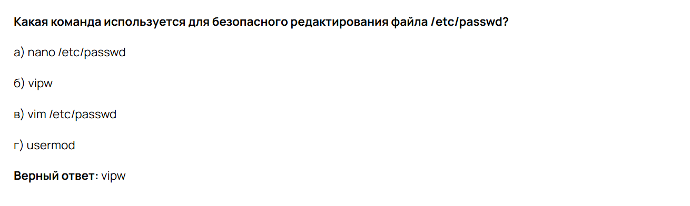{#fig:046 width=90%}

Выбранный ответ: **vipw**.

- nano /etc/passwd - прямое редактирование может быть небезопасным, поэтому ответ неверный;
- vim /etc/passwd - аналогично;
- usermod - команда для модификации пользователей, а не редактирования файла;

### Задания по теме «Основы управления доступом и разрешениями»

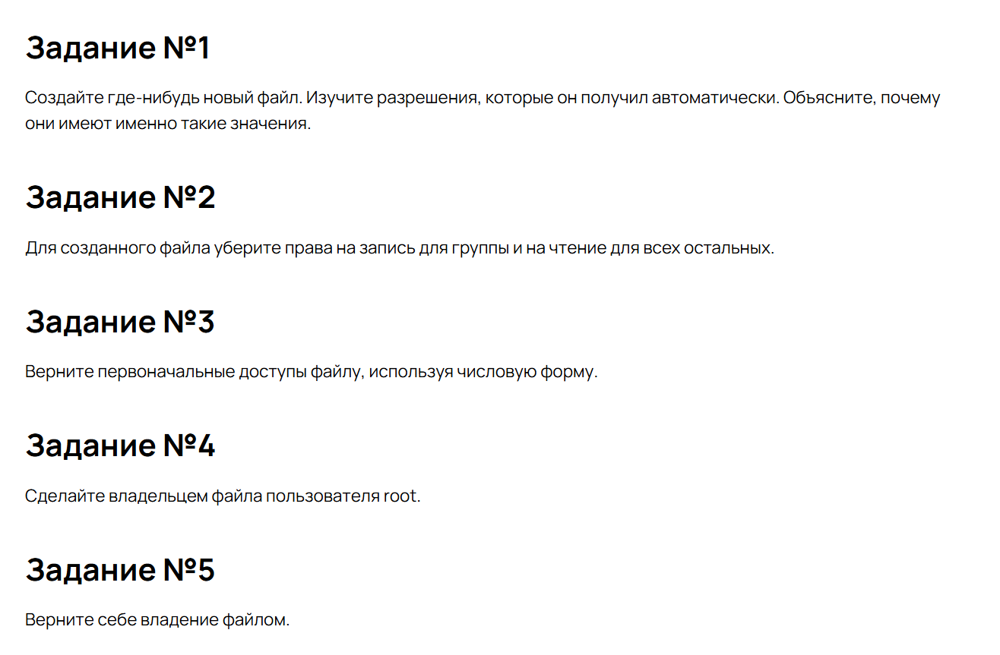{#fig:047 width=90%}

#### Задание №1

Создадим файл ```test.txt``` и проверим права пользователя
```bash
touch test.txt
ls -l | grep test.txt
```

Он создался с правами ```-rw-r--r--```. Изначально файлы создаются с правами ```-rw-rw-rw-```, после чего из них вычитается маска (по умолчанию 022), которая убирает право на запись для группы и остальных - файл получает права 644, которые равны тем, что мы получили при создании файла.

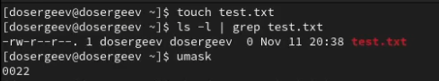{#fig:048 width=90%}

#### Задание №2

Теперь для созданного файла уберем права на запись для группы и на чтение для всех остальных
```bash
chmod g-w,o-r test.txt
ls -l | grep test.txt
```

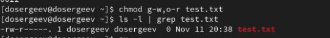{#fig:049 width=90%}

#### Задание №3

Вернем первоначальные доступы к файлу, через числовую форму (644 = 666 - 022)
```bash
chmod 644 test.txt
ls -l | grep test.txt
```

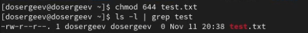{#fig:050 width=90%}

#### Задание №4

Сделаем root владельцем файла
```bash
chown root test.txt
ls -l | grep test.txt
```

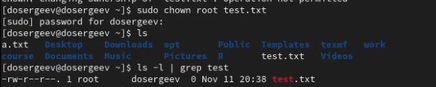{#fig:051 width=90%}

#### Задание №5

Вернем своему пользователю владение файлом
```bash
chown dosergeev test.txt
ls -l | grep test.txt
```

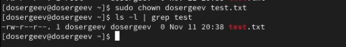{#fig:052 width=90%}

### Тест по теме «Основы управления доступом и разрешениями»

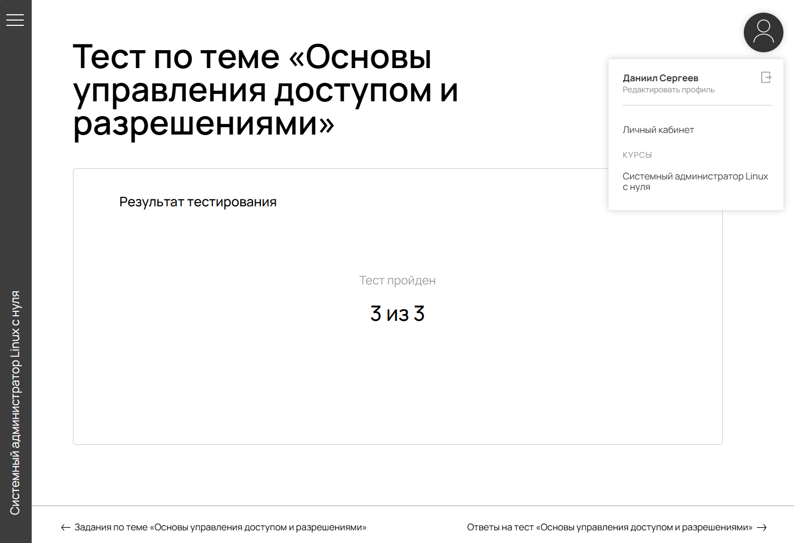{#fig:053 width=90%}

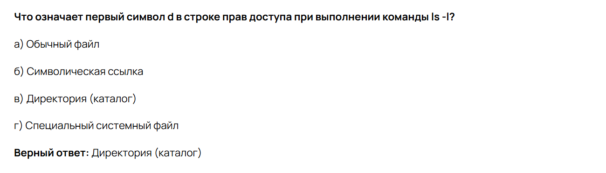{#fig:054 width=90%}

Выбранный ответ: **Директория (каталог)**.

- Символ d не является отображением специальных системных файлов;
- Обычный файл отображается как ```-```;
- Символическая ссылка отображается как ```l```;

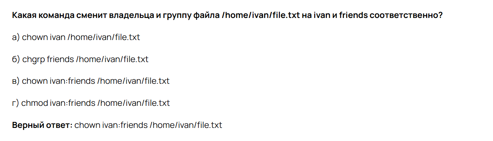{#fig:055 width=90%}

Выбранный ответ: **chown ivan:friends /home/ivan/file.txt**.

- ```chown ivan /home/ivan/file.txt``` - меняет только владельца, но не группу;
- ```chgrp friends /home/ivan/file.txt``` - меняет только группу, но не владельца;
- ```chmod ivan:friends /home/ivan/file.txt``` - команда chmod используется только для изменения прав доступа;

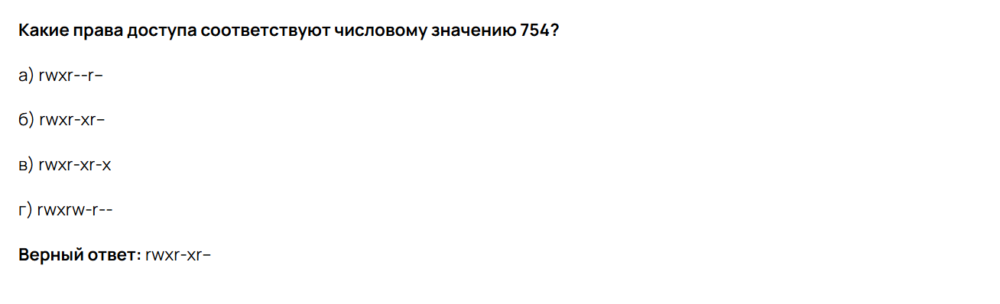{#fig:056 width=90%}

Выбранный ответ: **rwxr-xr–**.

- ```rwxr--r--``` - соответствует 744;
- ```rwxr-xr-x``` - соответствует 755;
- ```rwxrw-r--``` - соответствует 764;

### Задания по теме «Повышение безопасности работы с учетными записями»

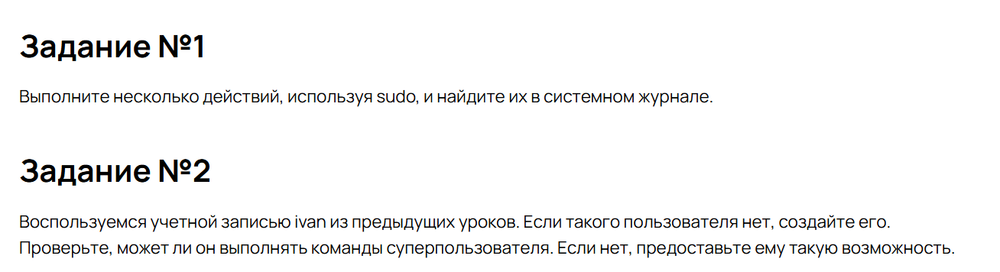{#fig:057 width=90%}

#### Задание №1

Используем специальный фильтр, встроенный в команду journalctl
```bash
sudo journalctl _COMM=sudo
```

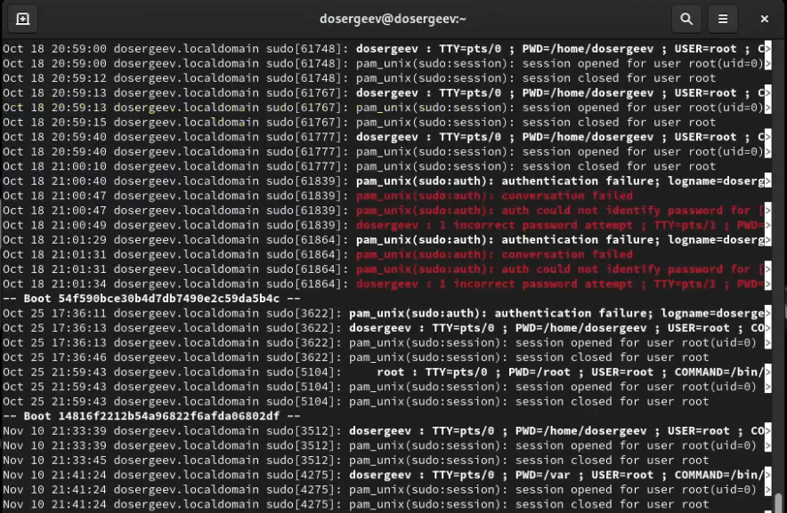{#fig:058 width=90%}

#### Задание №2

Создадим пользователя ivan, как в прошлых заданиях, и попробуем выполнить команду ls с помощью sudo
```bash
# перейдем на пользователя ivan
su ivan
sudo ls
```

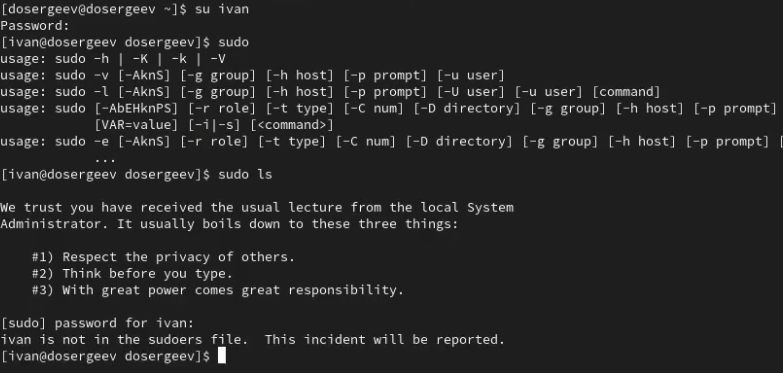{#fig:059 width=90%}

Выводит ошибку, так как пользователь ivan не имеет доступа к команде sudo. Добавим его в группу wheel, которая позволяет пользователям использовать sudo.
```bash
sudo usermod -aG wheel ivan
su ivan
sudo ls
```

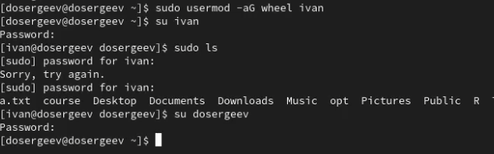{#fig:060 width=90%}

### Тест по теме «Повышение безопасности работы с учетными записями»

{#fig:061 width=90%}

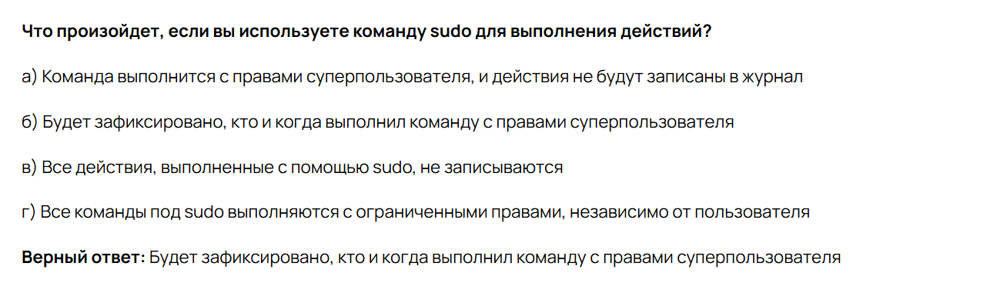{#fig:062 width=90%}

Выбранный ответ: **Будет зафиксировано, кто и когда выполнил команду с правами суперпользователя**.

Команда sudо записывает все действия в системный журнал, отмечая, кто именно, когда и какую команду выполнял с правами суперпользователя. Такой подход обеспечивает прозрачность операций и облегчает расследование в случае инцидента.

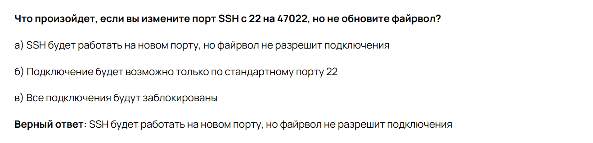{#fig:063 width=90%}

Выбранный ответ: **SSH будет работать на новом порту, но файрвол не разрешит подключения**.

Если SSH настроен слушать нестандартный порт (47022 из вопроса), то SSH-сервер будет работать, но поскольку файрвол блокирует входящие соединения, подключиться не получится. Файрвол по умолчанию может разрешать подключения только к стандартному порту 22.

{#fig:064 width=90%}

Выбранный ответ: **sudo ufw allow 47022/tcp**.

- ```sudo ufw allow 22/tcp``` - команда разрешит порт 22, а не 47022;
- ```sudo ufw allow 47022``` - команда разрешит оба протокола (TCP и UDP);

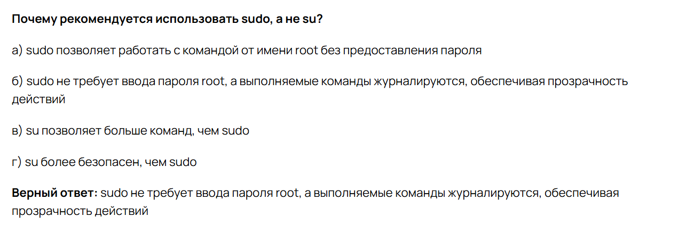{#fig:065 width=90%}

Выбранный ответ: **sudo не требует ввода пароля root, а выполняемые команды журналируются, обеспечивая прозрачность действий**.

Команда su требует ввода пароля суперпользователя. Команда sudo, напротив, требует пароль текущего пользователя, проверяя его членство в группе или права, определенные в конфигурации /etc/sudoers. Такое ограничение позволяет сохранить root-пароль в секрете и сократить количество лиц, которые его знают. Также sudo, в отличие от su, осуществляет журналирование действий.

### Задания по теме «Политика паролей и учетных записей»

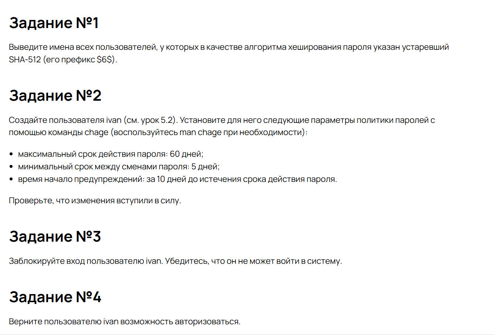{#fig:066 width=90%}

#### Задание №1

Алгоритм хэширования указан сразу же после имени пользователя в файле /etc/shadow, отфильтруем по виду алгоритма. Используем экранирование чтобы ввести символ доллара
```bash
sudo cat /etc/shadow | grep --color=auto '\$6\$'
```

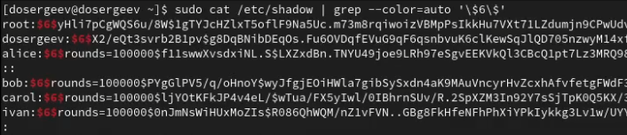{#fig:067 width=90%}

#### Задание №2

Узнать время срока действия пароля можно командой
```bash
chage -l <пользователь>
```

Узнаем время пароля для пользователя ivan и поменяем на то, что указано в условии
```bash
sudo chage -l ivan
# -M максимальный срок действия пароля
# -m минимальный срок между сменами пароля
# -W время начало предупреждений
sudo chage -M 60 -m 5 -W 10 ivan
```

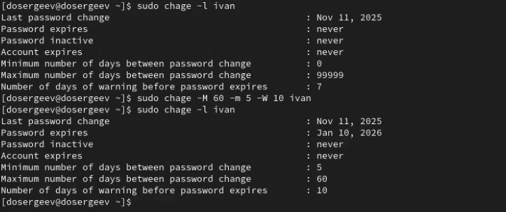{#fig:068 width=90%}

#### Задание №3

Заблокируем вход командой usermod и попробуем зайти в него через ```su```
```bash
# -L блокировка пользователя
sudo usermod -L ivan
su ivan
```

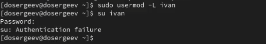{#fig:069 width=90%}

#### Задание №4

Теперь разблокируем ivan и попробуем зайти в него снова
```bash
# -U разблокировка пользователя
sudo usermod -U ivan
su ivan
```

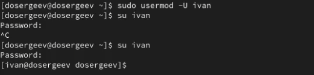{#fig:070 width=90%}

### Тест по теме «Политика паролей и учетных записей»

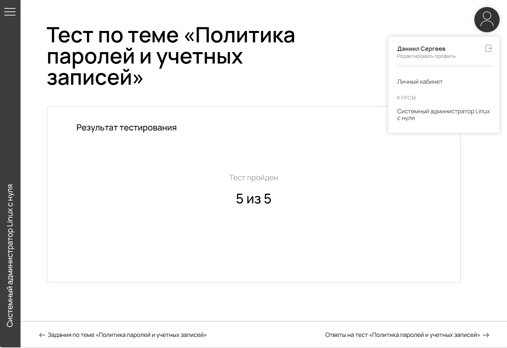{#fig:071 width=90%}

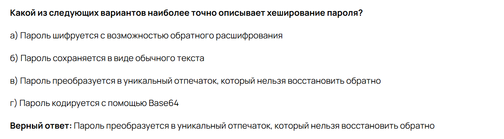{#fig:072 width=90%}

Выбранный ответ: **Пароль преобразуется в уникальный отпечаток, который нельзя восстановить обратно**.

Хеширование - это одностороннее необратимое преобразование. Оно создает уникальный "отпечаток" входных данных, при этом обратное действие - восстановление исходного текста - невозможно, даже если известен алгоритм и его параметры.

{#fig:073 width=90%}

Выбранный ответ: **Используемый алгоритм хеширования**.

```$y``` - это префикс, обозначающий используемый алгоритм хеширования (а не шифрования). В данном случае ```$y``` указывает на Yescrypt. Имя пользователя находится в начале строки и не имеет префикса.

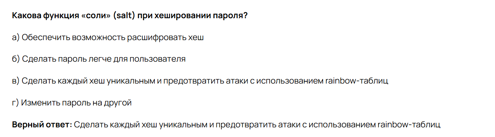{#fig:074 width=90%}

Выбранный ответ: **Сделать каждый хеш уникальным и предотвратить атаки с использованием rainbow-таблиц**.

"Соль" - уникальное случайное слово, которое добавляется во время хеширования, чтобы сделать итоговый хэш невозможным для восстановления

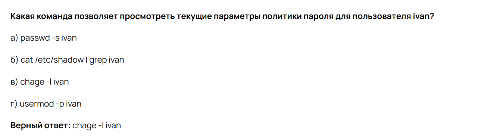{#fig:075 width=90%}

Выбранный ответ: **chage -l ivan**.

- ```passwd -s ivan``` - команда показывает статус пароля, а не подробные параметры политики;
- ```cat /etc/shadow | grep ivan``` - покажет захешированный пароль и некоторые параметры;
- ```usermod -p ivan``` - используется для установки пароля;

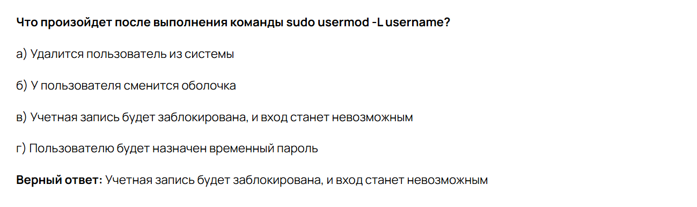{#fig:076 width=90%}

Выбранный ответ: **Учетная запись будет заблокирована, и вход станет невозможным**.

Данная команда (с флагом ```-L```) добавляет ! в начало хеша пароля в /etc/shadow, делая вход невозможным даже тогда, когда пароль известен.

## Модуль 6. Управление доступом

### Задания по теме «Что такое права доступа в Linux»

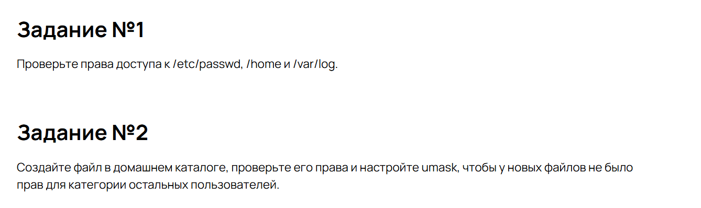{#fig:077 width=90%}

#### Задание №1

Проверим права доступа через ls
```bash
ls -l /etc | grep passwd
ls -l / | grep home
ls -l /var | grep log
```

- /etc/passwd - ```-rw-r--r--```
- /home - ```drwxr-xr-x```
- /var/log - ```drwxr-xr-x```

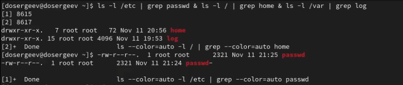{#fig:078 width=90%}

#### Задание №2

Перейдем в домашний каталог и создадим файл ```b.txt```. Поменяем маску так, чтобы новые файлы не имели прав для категории остальных пользователей. Так как изначально маска имеет вид 666 (для файлов), ты мы должны поменять umask на 026 (666 - 026 = 640, у остальных нет прав)
```bash
cd
ls -l | grep b.txt
umask 0026
touch c.txt
ls -l | grep c.txt
```

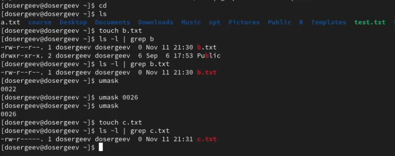{#fig:079 width=90%}

### Тест по теме «Что такое права доступа в Linux»

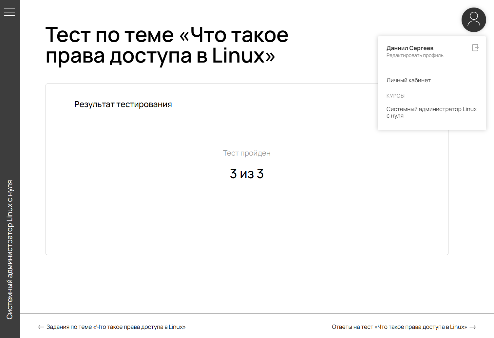{#fig:080 width=90%}

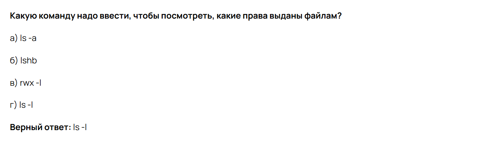{#fig:081 width=90%}

Выбранный ответ: **ls -l**.

- ```ls -a``` - ключ ```-a``` показывает скрытые файлы;
- ```lshb``` - такой команды не существует;
- ```rwx -l``` - такой команды не существует;

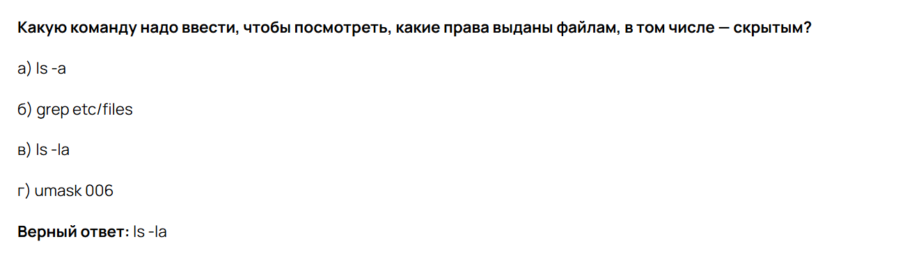{#fig:082 width=90%}

Выбранный ответ: **ls -la**.

- ```ls -a``` - показывает скрытые файлы, но без подробной информации о правах;
- ```grep etc/files``` - не имеет отношения к просмотру прав доступа;
- ```umask 006``` - команда для установки маски прав;

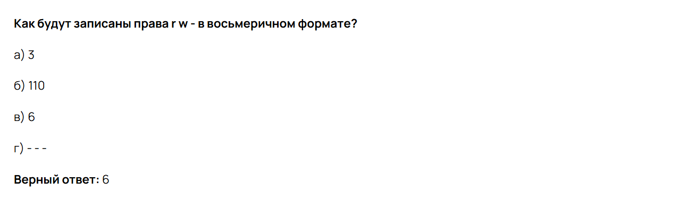{#fig:083 width=90%}

Выбранный ответ: **6**.

- ```3``` - равносильно ```-wx``` (021);
- ```110``` - двоичное представление, а не восьмеричное;
- ```----``` - символьное представление отсутствия прав, а не восьмеричное;

### Задания по теме «Изменение прав доступа: chmod, chown, chgrp»

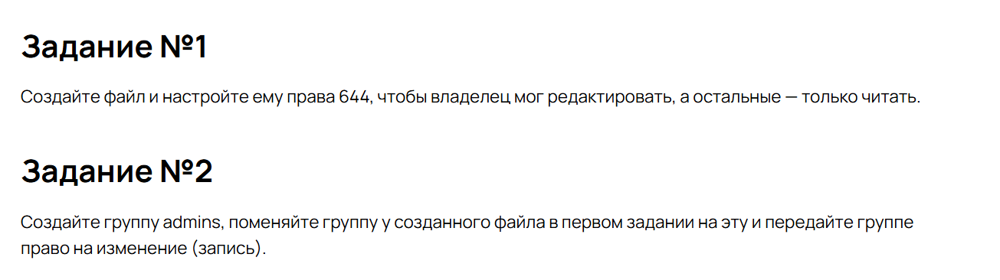{#fig:084 width=90%}

#### Задание №1

Создадим файл ```wrr.txt``` и настроим ему права 644
```bash
touch wrr.txt
chmod 644 wrr.txt
ls -l | grep wrr.txt
```

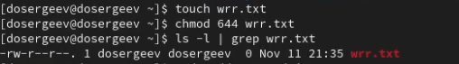{#fig:085 width=90%}

#### Задание №2

Создадим группу admins, поменяем группу файла ```wrr.txt``` с dosergeev на admins
```bash
sudo groupadd admins
sudo chgrp admins wrr.txt
ls -l | grep wrr.txt
```

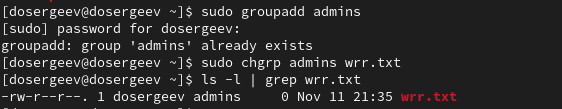{#fig:086 width=90%}

### Тест по теме «Изменение прав доступа: chmod, chown, chgrp»

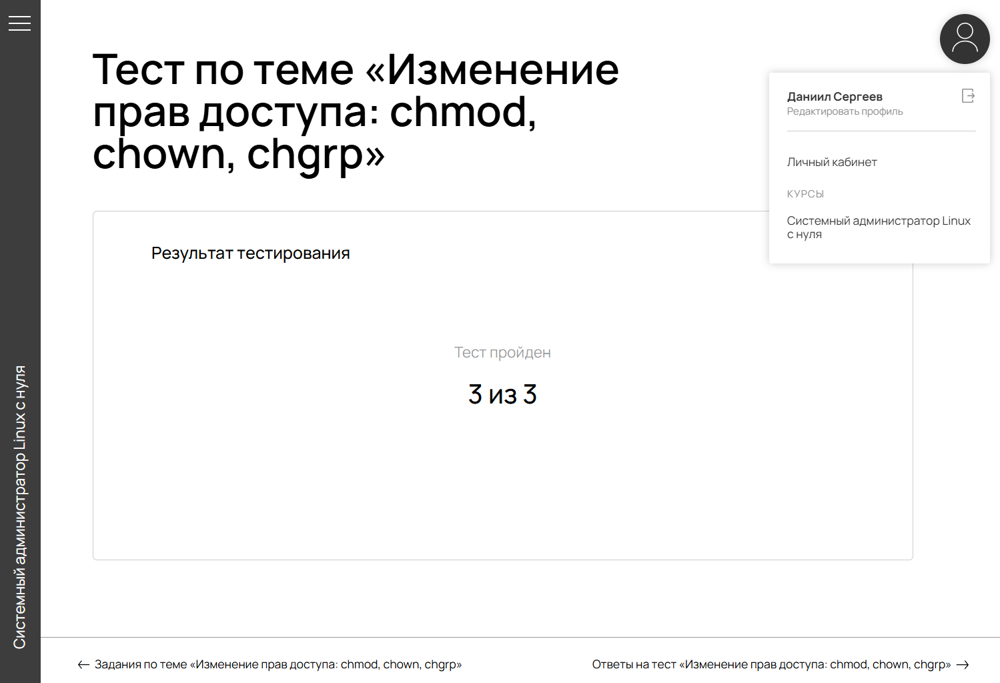{#fig:087 width=90%}

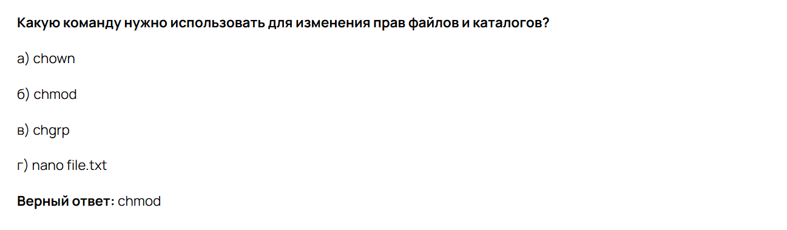{#fig:088 width=90%}

Выбранный ответ: **chmod**.

- ```chown``` - меняет владельца файла;
- ```chgrp``` - меняет группу файла;
- ```nano file.txt``` - текстовый редактор для редактирования содержимого файла;

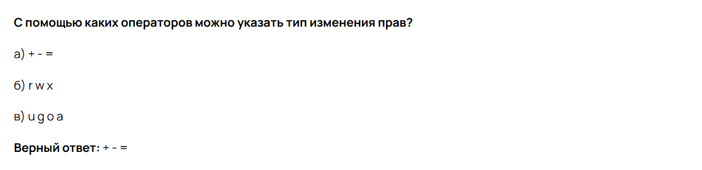{#fig:089 width=90%}

Выбранный ответ: **+ - =**.

- ```r w x``` - обозначения самих прав (read, write, execute);
- ```u g o a``` - обозначения категорий пользователей (user, group, others, all);

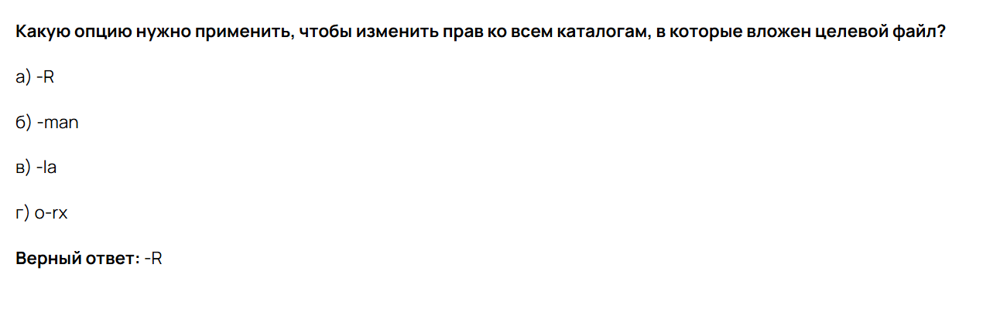{#fig:090 width=90%}

Выбранный ответ: **-R**.

- ```-man``` - не опция команды chmod;
- ```-la``` - опции команды ls для просмотра файлов;
- ```o-rx``` - часть синтаксиса изменения прав, а не опция рекурсивного применения;

### Задания по теме «Расширенные списки доступа (ACL) для управления доступом»

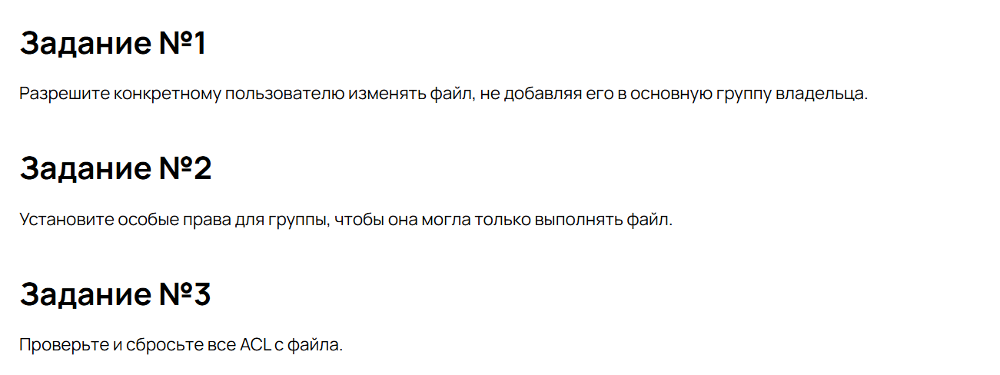{#fig:091 width=90%}

#### Задание №1

Воспользуемся списками доступа ACL. Для этого выполним команду
```bash
setfacl -m u:ivan:rw b.txt
```

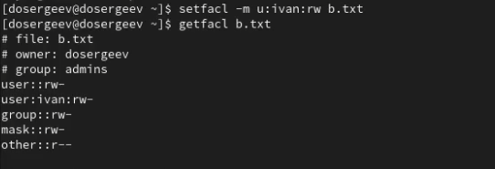{#fig:092 width=90%}

#### Задание №2

Теперь, также используя ACL, установим особые права (только на выполнение файла) для одной из групп, например admins
```bash
setfacl -m g:admins:x b.txt
```

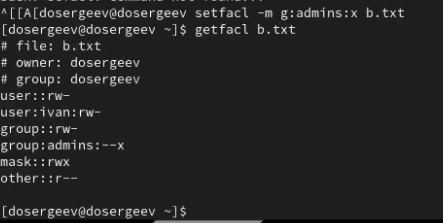{#fig:093 width=90%}

#### Задание №3

За сброс ACL отвечает ключ ```-b``` в команде setfacl, выполним
```bash
setfacl -b b.txt
# проверка прав ACL
getfacl b.txt
```

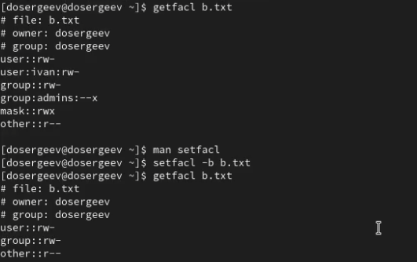{#fig:094 width=90%}

### Задания по теме «Специальные разрешения: SUID, SGID, Sticky Bit»

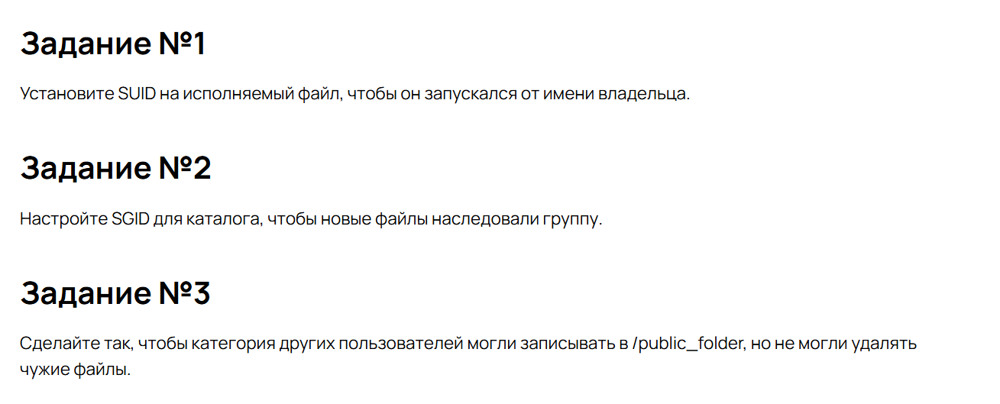{#fig:095 width=90%}

#### Задание №1

Установим SUID на исполняемый файл ```test.txt```.

```bash
# +s установка SUID
chmod u+s test.txt
ls -l | grep test.txt
```

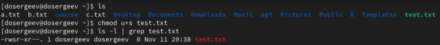{#fig:096 width=90%}

Теперь вместо права на исполнение для владельца указан специальный символ ```s```.

#### Задание №2

Создадим каталог ~/sgid_test и установим для него SGID
```bash
mkdir sgid_test
ls -l | grep sgid_test
# +s установка SGID
chmod g+s sgid_test
ls -l | grep sgid_test
```

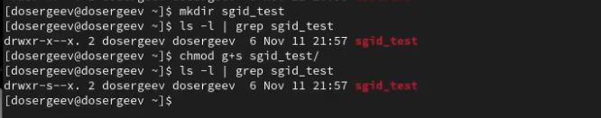{#fig:097 width=90%}

#### Задание №3

Сделать так, чтобы категории других пользователей могли записывать в /public_folder, но не могли удалять чужие файлы, можно, установив Sticky-bit.

Создадим общий каталог public_folder. Установим Sticky-bit через chmod
```bash
sudo mkdir /public_folder
ls -l / | grep public_folder
sudo chmod +t /public_folder
ls -l / | grep public_folder
```

{#fig:098 width=90%}

### Тест по теме «Специальные разрешения: SUID, SGID, Sticky Bit»

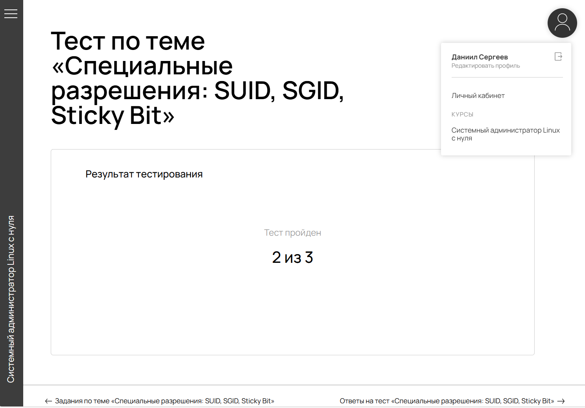{#fig:099 width=90%}

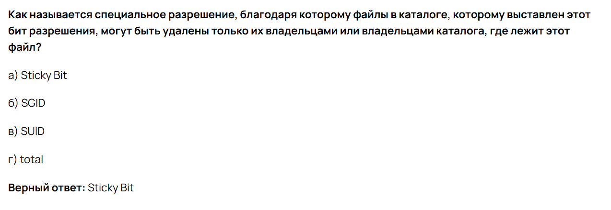{#fig:100 width=90%}

Выбранный ответ: **Sticky Bit**.

- SGID - заставляет файлы создаваться с группой владельца каталога;
- SUID - позволяет выполнять файл с правами владельца файла;
- total - слово из вывода команды ls -l, показывающее общий размер блока;

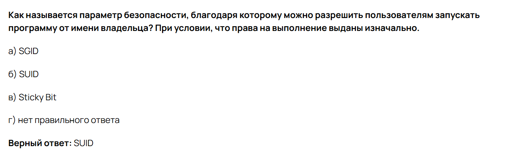{#fig:101 width=90%}

Выбранный ответ: **SUID**.

- SGID - заставляет файлы создаваться с группой владельца каталога;
- Sticky Bit - относится к правам удаления в каталогах;

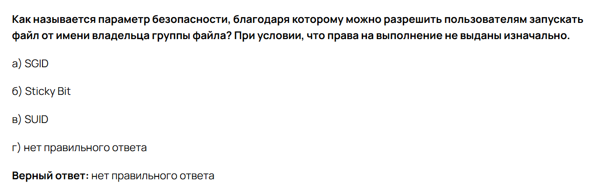{#fig:102 width=90%}

Выбранный ответ: **SGID**.

Правильный ответ: **нет правильного ответа**.

Специальные биты SUID/SGID/Sticky не могут обойти базовое право на выполнение. Если право на выполнение не выдано, файл нельзя запустить, независимо от установленных битов.

## Модуль 7. Управление процессами

### Задания по теме «Основы управления процессами в Linux»

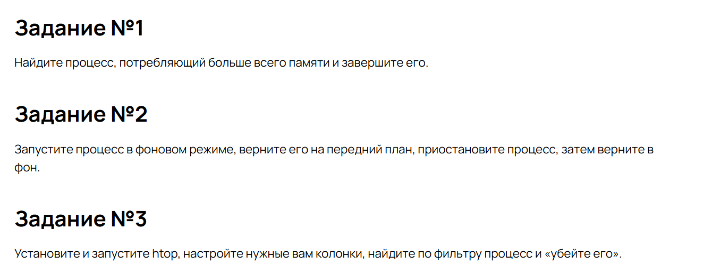{#fig:103 width=90%}

#### Задание №1

Откроем htop и отсортируем процессы по памяти. Найдем процесс с наибольшим значением %MEM и завершим его, нажав F9.

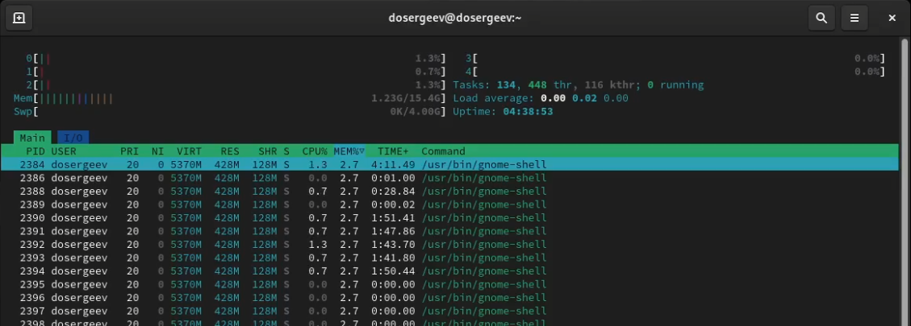{#fig:104 width=90%}

#### Задание №2

Запустим службу httpd и запустим команду ping в фоновом режиме (&), отправив вывод в /dev/null.
```bash
systemctl start httpd
ping localhost > /dev/null &
```

Переведем задачу в фоновой режим, для этого используем относительный номер задачи из списка jobs
```bash
jobs
fg %1
```

Теперь приостановим задачу (CTRL+Z) и переведем её обратно на фон
```bash
# CTRL+Z
bg %1
```

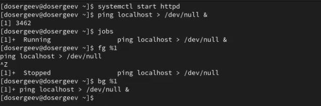{#fig:105 width=90%}

#### Задание №3

Настроим колонки в htop (F2). Затем применим фильтр по имени процесса (ping) и убьём его (F9)

{#fig:106 width=90%}

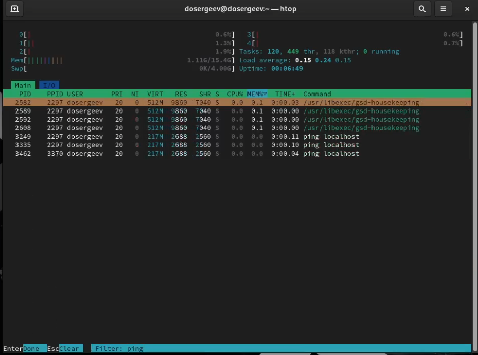{#fig:107 width=90%}

### Тест по теме «Основы управления процессами в Linux»

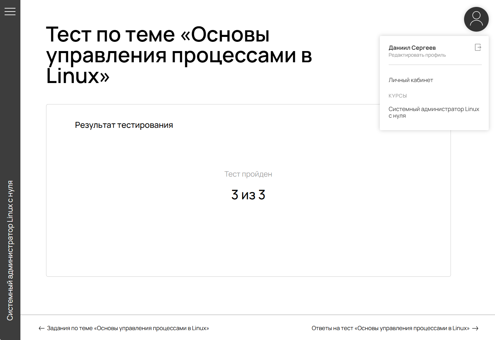{#fig:108 width=90%}

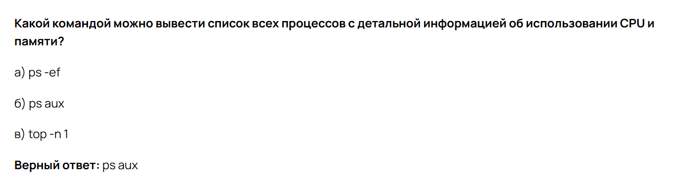{#fig:109 width=90%}

Выбранный ответ: **ps aux**.

- ```ps -ef``` - показывает все процессы, но без детальной информации об использовании ресурсов;
- ```top -n 1``` - покажет один снимок процессов;

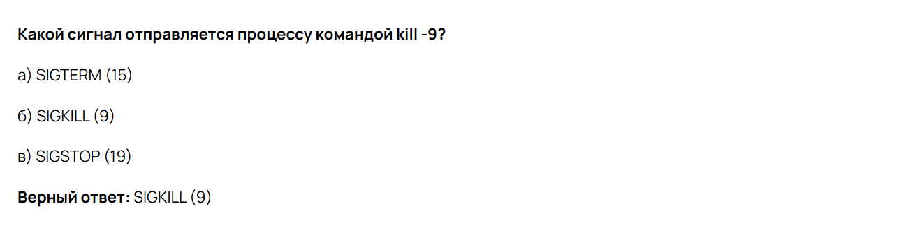{#fig:110 width=90%}

Выбранный ответ: **SIGKILL (9)**.

- SIGTERM (15) - "вежливый" сигнал завершения (по умолчанию для kill);
- SIGSTOP (19) - сигнал приостанавливает выполнение процесса;

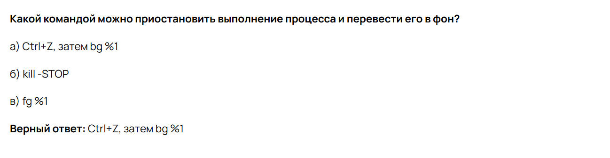{#fig:111 width=90%}

Выбранный ответ: **Ctrl+Z, затем bg %1**.

- ```kill -STOP``` - только приостанавливает процесс, но не переводит в фон;
- ```fg %1``` - переводит процесс из фона на передний план;

### Задания по теме «Управление приоритетами процессов: nice и renice»

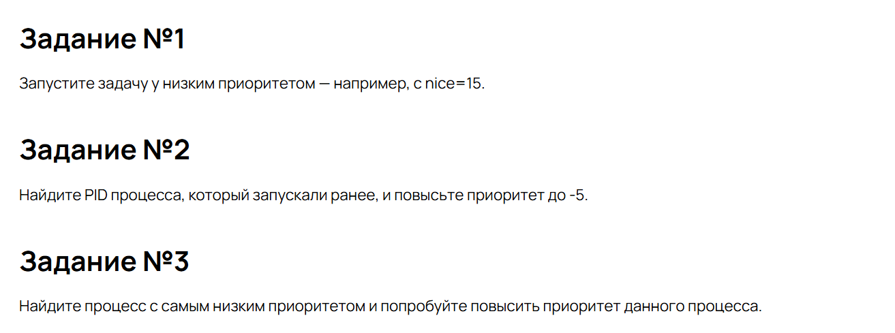{#fig:112 width=90%}

#### Задание №1

Запустим ping с низким приоритетом nice (15) в фоновом режиме.
```bash
nice -n 15 ping localhost > /dev/null &
```

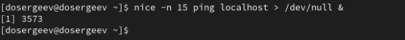{#fig:113 width=90%}

#### Задание №2

PID запущенного процесса нам известен из команды jobs (номер выводится во время запуска процесса на фоне, вместе с PID). По известному номеру повысим приоритет
```bash
sudo renice -n -5 3573
```

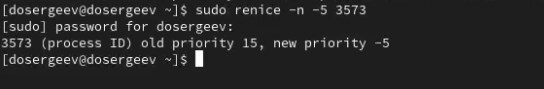{#fig:114 width=90%}

#### Задание №3

Выведем через список процессов те, что равны минимальному приоритету (19) и установим новый (-5)
```bash
ps -eo pid,ni,cmd | awk '$2 == 19'
```

Самый низкий приоритет у процесса 60
```bash
sudo renice -n -5 60
```

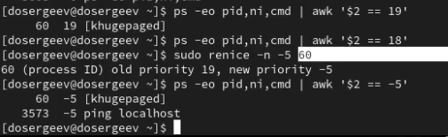{#fig:115 width=90%}

### Тест по теме «Управление приоритетами процессов: nice и renice»

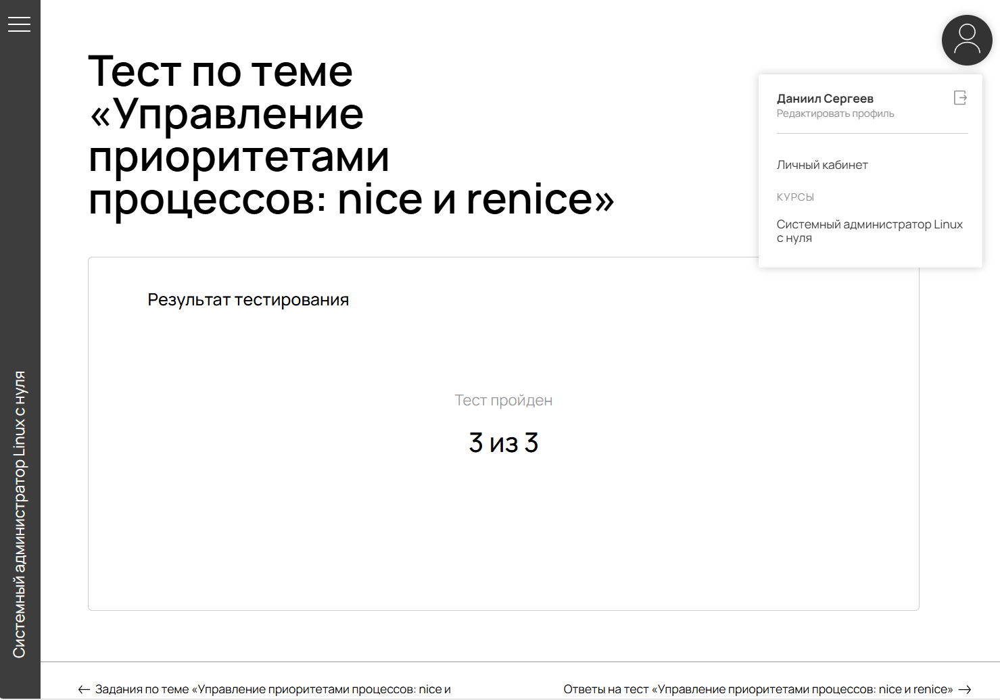{#fig:116 width=90%}

{#fig:117 width=90%}

Выбранный ответ: **-20**.

Приоритет nice меняет своё значение от -20 до 19

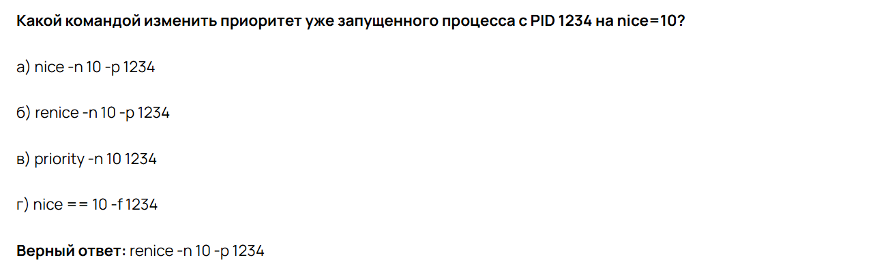{#fig:118 width=90%}

Выбранный ответ: **renice -n 10 -p 1234**.

- ```nice -n 10 -p 1234``` - команда nice используется для запуска процесса с заданным приоритетом, а не для изменения приоритета уже работающего;
- ```priority -n 10 1234``` - такой команды не существует;
- ```nice == 10 -f 1234``` - синтаксис неверный;

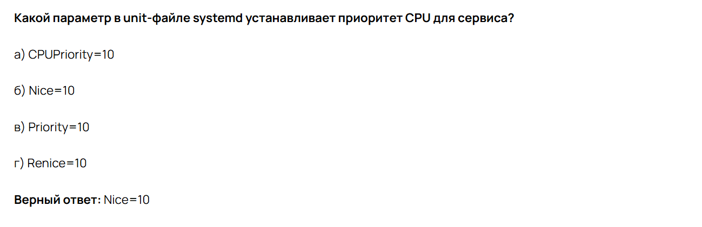{#fig:119 width=90%}

Выбранный ответ: **Nice=10**.

Всех параметров, кроме Nice не существует в systemd;

### Задания по теме «Контроль системных сервисов: systemd и systemctl»

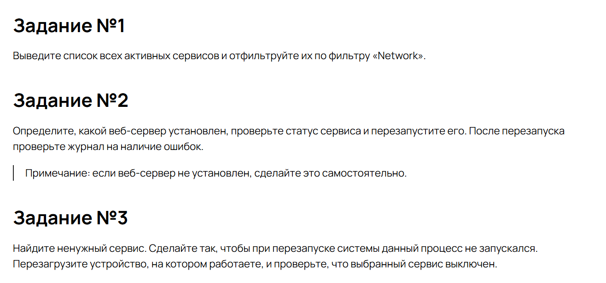{#fig:120 width=90%}

#### Задание №1

Выведем список всех юнитов и отфильтруем его с помощью встроенной опции ```--type```. Передадим вывод в grep
```bash
systemctl list-units --type=service --state=active | grep Network
```

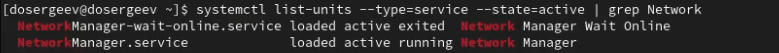{#fig:121 width=90%}

#### Задание №2

Проверим статус веб-сервера httpd и перезапустим его.
```bash
systemctl status httpd
systemctl restart httpd
```

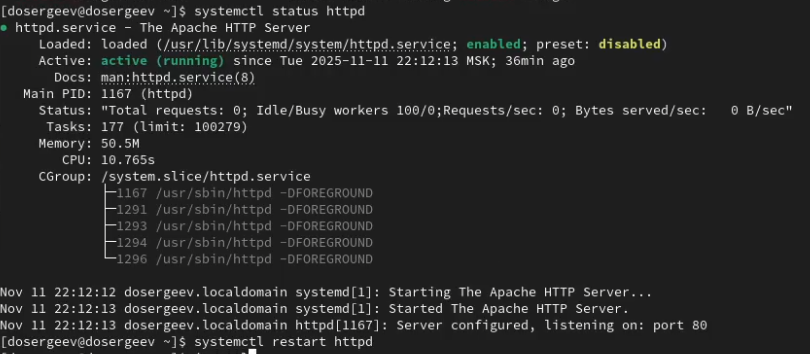{#fig:122 width=90%}

Проверим журнал на наличие ошибок
```bash
# -u вывод конкретного юнита
# -n последние 10 сообщений
journalctl -u httpd -n 10
```

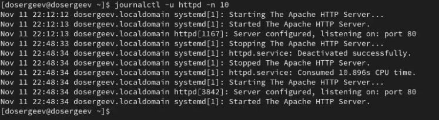{#fig:123 width=90%}

В журнале ошибок не имеется.

#### Задание №3

Сделайте так, чтобы httpd при перезапуске системы не запускался, для этого выполним команду
```bash
sudo systemctl disable httpd
# проверим статус службы
systemctl status httpd
```

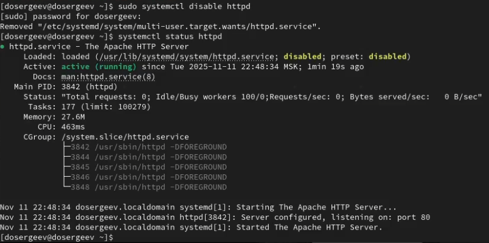{#fig:124 width=90%}

Перезапустим систему и проверим статус службы httpd
```bash
reboot
# после перезапуска
systemctl is-enabled httpd
systemctl status httpd
```

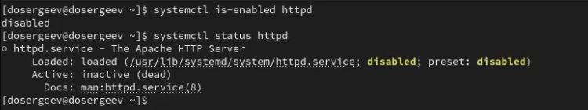{#fig:125 width=90%}

### Тест по теме «Контроль системных сервисов: systemd и systemctl»

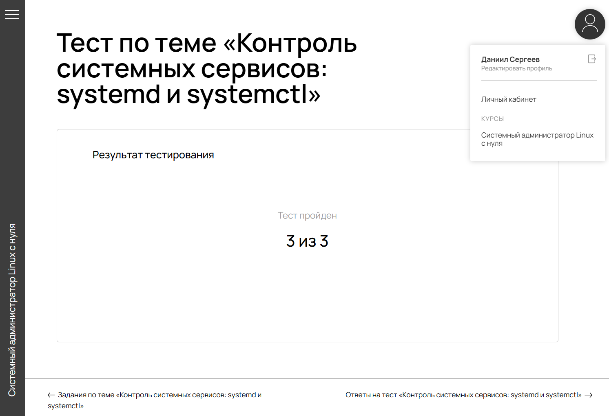{#fig:126 width=90%}

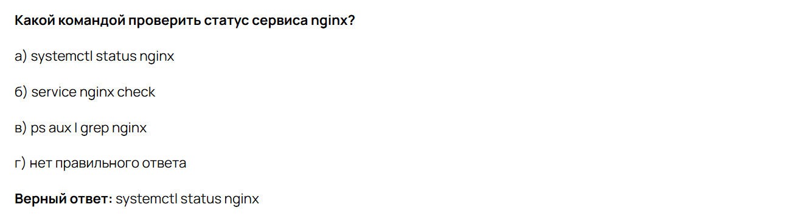{#fig:127 width=90%}

Выбранный ответ: **systemctl status nginx**.

- ```service nginx check``` - неверный синтаксис команды (status вместо check);
- ```ps aux | grep nginx``` - покажет процессы nginx, но не информацию о статусе сервиса;

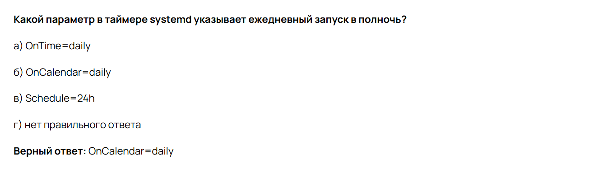{#fig:128 width=90%}

Выбранный ответ: **OnCalendar=daily**.

Параметров OnTime и Schedule не существует в таймере systemd.

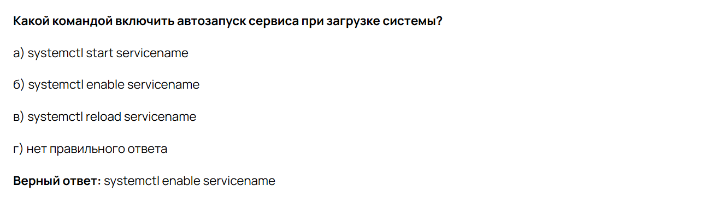{#fig:129 width=90%}

Выбранный ответ: **systemctl enable servicename**.

- ```systemctl start servicename``` - команда запускает сервис;
- ```systemctl reload servicename``` - команда перезагружает конфигурацию сервиса;

### Задания по теме «Управление фоновыми процессами (демонами) в Linux»

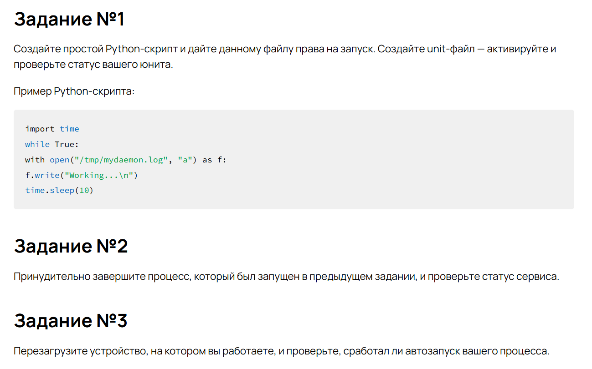{#fig:130 width=90%}

#### Задание №1

Возьмем пример python скрипта из условия и дадим ему автозапуск.

Перейдем в каталог /usr/bin и создадим новый скрипт - myscripy.py. Сделаем его исполняемым.
```bash
cd /usr/bin
sudo vi myscripy.py
sudo chmod +x myscripy.py
```

Теперь перейдем в каталог /etc/stystemd/system и создадим unit-файл.
```bash
cd /etc/systemd/system/
sudo vi mydaemon.service
```

Запишем параметры unit-файла
```bash
# /etc/systemd/system/mydaemon.service  
[Unit]  
Description=Мой тестовый сервис
After=network.target
Documentation=https://example.com/docs

[Service]  
Type=simple
ExecStart=/usr/bin/python3 /usr/bin/myscripy.py
Restart=always
RestartSec=10
User=dosergeev
Group=dosergeev
Environment="PATH=/usr/bin:/bin"
WorkingDirectory=/home/dosergeev
StandardOutput=syslog  
StandardError=syslog  

[Install]  
WantedBy=multi-user.target
```

Активируем сервис
```bash
sudo systemctl daemon-reload  
sudo systemctl start mydaemon
sudo systemctl status mydaemon
sudo systemctl enable mydaemon
sudo systemctl status mydaemon
```

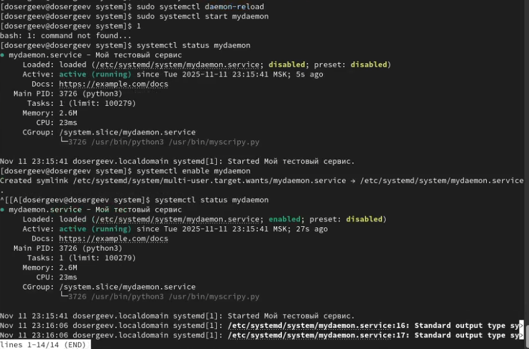{#fig:131 width=90%}

#### Задание №2

Узнаем PID процесса из systemctl status и принудительно завершм процесс, затем проверим его статус
```bash
systemctl status mydaemon
kill -9 3726
systemctl status mydaemon
```

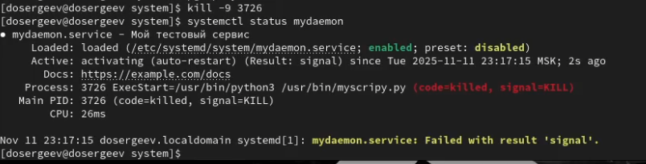{#fig:132 width=90%}

#### Задание №3

Перезагрузим устройство и проверим, сработал ли автозапуск
```bash
reboot
# после перезапуска
systemctl status mydaemon
```

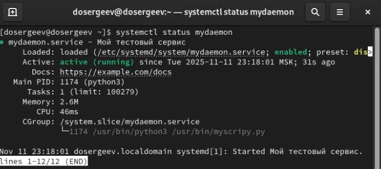{#fig:133 width=90%}

### Тест по теме «Управление фоновыми процессами (демонами) в Linux»

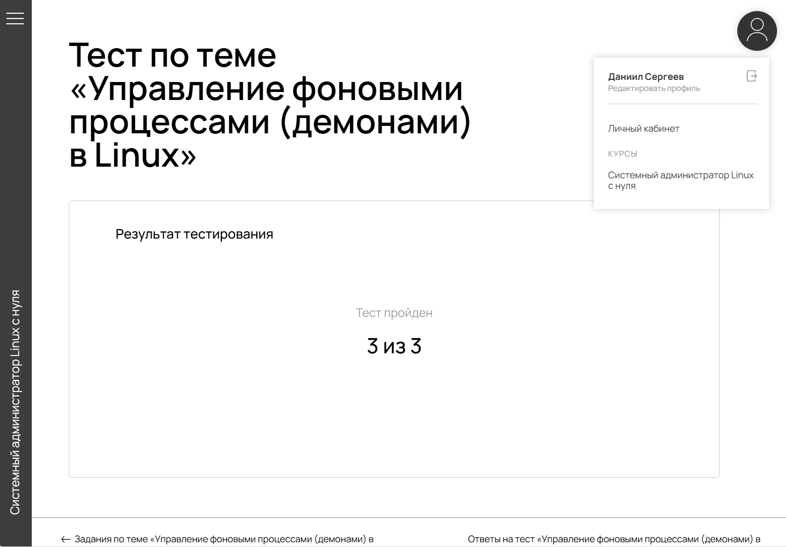{#fig:134 width=90%}

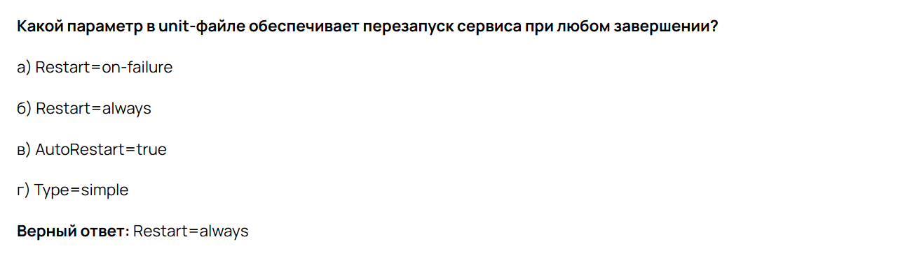{#fig:135 width=90%}

Выбранный ответ: **Restart=always**.

- Restart=on-failure - перезапускает сервис только при ошибке (ненулевом коде завершения);
- AutoRestart=true - такого параметра не существует в systemd;
- Type=simple - определяет тип запуска сервиса, а не политику перезапуска;

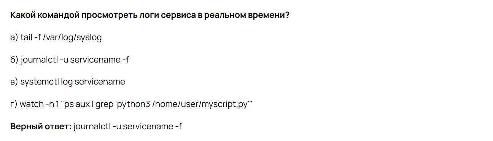{#fig:136 width=90%}

Выбранный ответ: **journalctl -u servicename -f**.

- ```tail -f /var/log/syslog``` - показывает общий системный лог, а не логи конкретного сервиса;
- ```systemctl log servicename``` - такой команды не существует;
- ```watch -n 1 "ps aux | grep 'python3 /home/user/myscript.py'"``` - показывает статус процесса, а не логи;

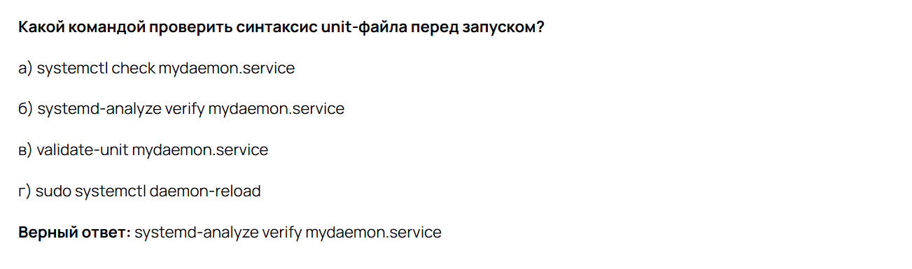{#fig:137 width=90%}

Выбранный ответ: **systemd-analyze verify mydaemon.service**.

- ```systemctl check mydaemon.service``` - такой команды не существует;
- ```validate-unit mydaemon.service``` - такой команды не существует;
- ```sudo systemctl daemon-reload``` - обновляет конфигурацию системного менеджера systemd;

## Вывод

В результате прохождения второй части внешнего курса «Системный администратор Linux с нуля» я глубже погрузился в работу системного администратора Linux. Я научился находить справочную информацию, редактировать файлы и работать с выводом команд. Также я узнал как управлять правами доступа к файлам и каталогам, как добавлять и менять права пользователей и как управлять процессами и юнитами.
