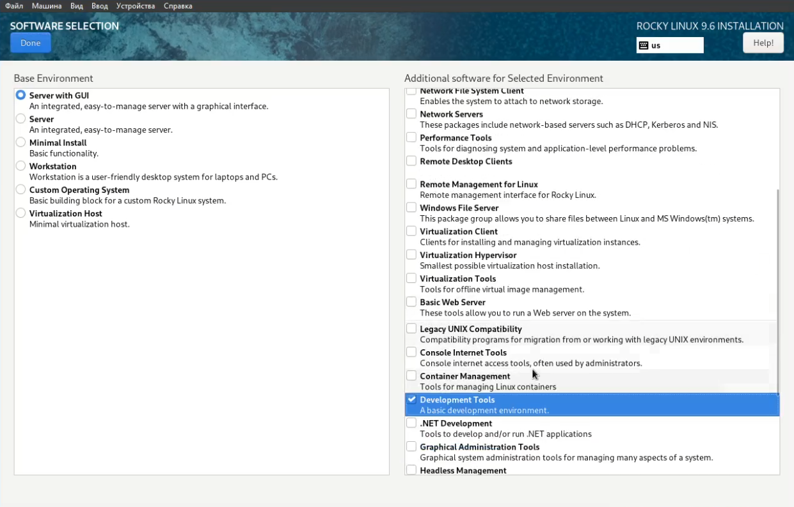

---
## Front matter
lang: ru-RU
title: Лабораторная работа №1
subtitle: Отчёт
author:
  - Сергеев Д. О.
institute:
  - Российский университет дружбы народов, Москва, Россия
date: 06 сентября 2025

## i18n babel
babel-lang: russian
babel-otherlangs: english

## Formatting pdf
toc: false
toc-title: Содержание
slide_level: 2
aspectratio: 169
section-titles: true
theme: metropolis
header-includes:
 - \metroset{progressbar=frametitle,sectionpage=progressbar,numbering=fraction}
---

# Информация

## Докладчик

:::::::::::::: {.columns align=center}
::: {.column width="70%"}

  * Сергеев Даниил Олегович
  * Студент
  * Направление: Прикладная информатика
  * Российский университет дружбы народов
  * [1132246837@pfur.ru](mailto:1132246837@pfur.ru)

:::
::::::::::::::

# Цель работы

Целью данной работы является приобретение практических навыков установки операционной системы на виртуальную машину, настройки минимально необходимых для дальнейшей работы сервисов.

# Задание

- Установить образ Rocky Linux в Virutal Box.
- Настроить параметры в установщике ОС.
- Подключить и установить образ диска дополнений гостевой ОС.

# Ход выполнения лабораторной работы

## Создание виртуальной машины

Откроем менеджер виртуальных машин Oracle VirtualBox и нажмем на кнопку создать в графическом интерфейсе. Выберем тип машины Linux, подтип Red Hat (64-bit). Зададим имя, удовлетворяющее соглашению о наименовании.

{#fig:001 width=45%}

## Создание виртуальной машины

Выделим размер основной памяти виртуальной машины до 8192 МБ и 4 процессора.

{#fig:002 width=55%}

## Создание виртуальной машины

Для жёсткого диска выделим 40 ГБ.

{#fig:003 width=55%}

## Установка операционной системы

Запустим ОС. Выберем вариант Install Rocky Linux 9.6.

{#fig:004 width=70%}

## Установка операционной системы

Поставим язык English в качестве основного в ОС. В качестве дополнительного поставим русский язык. Также добавим русскую раскладку клавиатуры и возможность её переключения через сочетание клавиш Alt+Shift.

{#fig:005 width=50%}

## Установка операционной системы

{#fig:006 width=70%}

## Установка операционной системы

{#fig:007 width=70%}

## Установка операционной системы

В разделе выбора программ укажем в качестве базового окружения Server with GUI, а в качестве дополнительного Development Tools. Отключим KDUMP

{#fig:008 width=60%}

## Установка операционной системы

Включим сетевое соединение и в качестве имени узла укажем dosergeev.localdomain.

{#fig:009 width=60%}

## Установка операционной системы

Установим пароль для root, разрешение на ввод пароля для root при использовании SSH. Затем зададим локального пользователя с правами администратора и пароль.

## Установка операционной системы

Начнем установку ОС. После её завершения корректно перезагрузим ОС. Подключим образ гостевой ОС и начнем установку. После неё снова перезагрузим Rocky.

{#fig:010 width=60%}

# Ход выполнения домашнего задания

1. Дождемся загрузки графического окружения и откроем терминал. Пропишем команду dmesg и узнаем последовательность загрузки системы.

{#fig:011 width=70%}

## Ход выполнения домашнего задания

{#fig:012 width=70%}

## Ход выполнения домашнего задания

2. Получим имформацию о:
- Версии ядра Linux -> 5.14.0-570.37.1.el9_6.x86_64
- Частоте процессора -> 3400 MHz
- Модели процессора -> AMD Ryzen 5 2600
- Объёме доступной ОЗУ -> ~6 GB
- Типе гипервизора -> KVM
- Типе файловой системы корневого раздела -> XFS
- Последовательности монтирования файловых систем -> Корневая система(dm-0/XFS) -> Дополнительная файловая система (sda1/XFS)

# Ответы на контрольные вопросы

1. Команды терминала для:
- получения справки о команде: man, например: man cd
- перемещения по файловой системе: cd, например: cd ~
- просмотра содержимого каталога: ls, например: ls ~/
- определения объёма каталога: du -sh, например: du -sh ~/
- создания/удаления каталогов/файлов: mkdir, rmdir(rm -r), touch, rm, например: mkdir work/rm -r work
- задания определённых прав на файл/каталог: chmod, например: chmod a=rwx passwords.txt
- просмотра истории команд: history

## Ответы на контрольные вопросы

2. Учётная запись пользователя хранит в себе имя, пароль, уникальный UID пользователя и GID группы, домашний каталог и командную оболочку пользователя. В качестве команд можно использовать id и whoami.

3. Файловая система — это способ организации, хранения и управления данными на носителе информации. XFS - высокопроизводительная ФС, используется на серверах для работы с большими данными. Ext4 - стандартная ФС большинства дистрибутивов Linux, поддерживает журналы, может быть как корневым, так и домшним разделом.

4. Чтобы посмотреть подмонтированные файловые системы, можно использовать команды mount или findmnt (более удобная).

5. Чтобы удалить зависший процесс, нужно найти его UID командой ps и завершить командой kill. Если она не помогает то надо его устранить с помощью kill -9.

# Вывод

В результате выполнения лабораторной работы я приобрел навыки установки операционной системы на виртуальную машину и научился минимально настраивать систему для дальнейшей работы сервисов.
