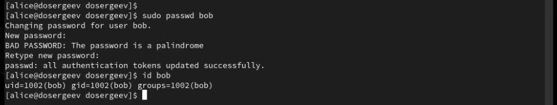
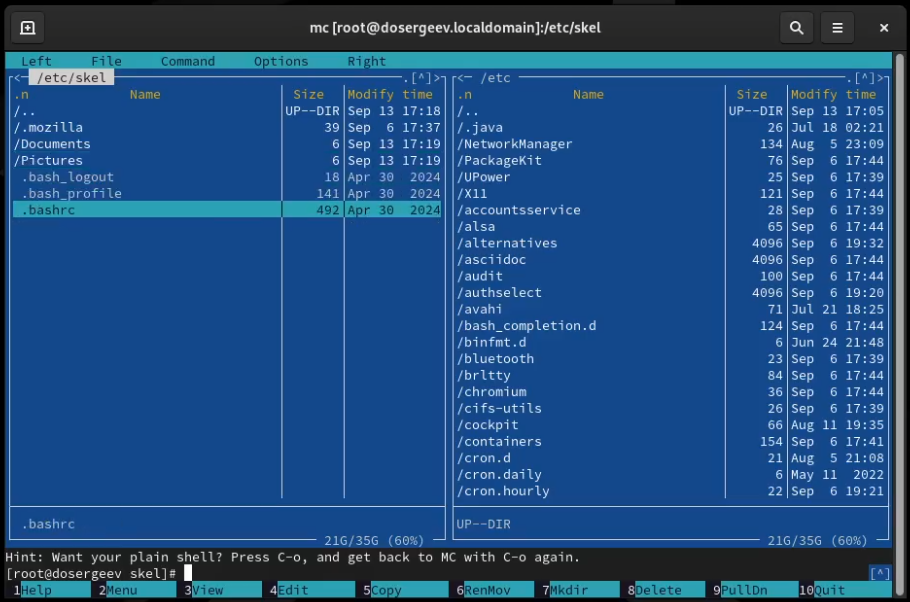
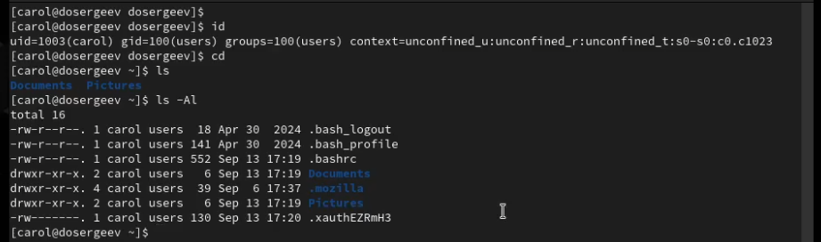

---
## Front matter
lang: ru-RU
title: Лабораторная работа №2
subtitle: Управление пользователями и группами
author:
  - Сергеев Д. О.
institute:
  - Российский университет дружбы народов, Москва, Россия
date: 13 сентября 2025

## i18n babel
babel-lang: russian
babel-otherlangs: english

## Formatting pdf
toc: false
toc-title: Содержание
slide_level: 2
aspectratio: 169
section-titles: true
theme: metropolis
header-includes:
 - \metroset{progressbar=frametitle,sectionpage=progressbar,numbering=fraction}
---

# Информация

## Докладчик

:::::::::::::: {.columns align=center}
::: {.column width="70%"}

  * Сергеев Даниил Олегович
  * Студент
  * Направление: Прикладная информатика
  * Российский университет дружбы народов
  * [1132246837@pfur.ru](mailto:1132246837@pfur.ru)

:::
::::::::::::::

# Цель работы

Получить представление о работе с учётными записями пользователей и группами пользователей в операционной системетипа Linux.

# Задание

- Прочитать справочное описание man по командам ls, whoami, id, groups, su, sudo, passwd, vi, visudo, useradd, usermod, userdel, groupadd, groupdel.
- Выполнить действия по переключению между учётными записями пользователей, по управлению учётными записями пользователей.
- Выполнить действия по созданию пользователей и управлению их учётными записями.
- Выполнить действия по работе с группами пользователей.

# Ход выполнения лабораторной работы

## Переключение учётных записей пользователей

Войдем в систему и откроем терминал. Проверим какая учётная запись используется на данный момент командой whoami. Выведем более подробную информацию с помощью id. Данная команда выводит:

- uid=1000 - уникальный номер пользователя
- gid=1000 - уникальный номер основной группы пользователя
- groups=1000,10 - список групп (основной и дополнительных), в которых состоит пользователь
- context=... - контекст безопасности пользователя SELinux

## Переключение учётных записей пользователей

{#fig:001 width=90%}

## Переключение учётных записей пользователей

Перейдем в учётную запись root и также напишем команду id. На этот раз получим такую информацию:

- uid=0
- gid=0
- groups=0

То есть для пользователя root и его основной группы предназначен специальный идентификатор 0, одинаковый для каждой системы.

{#fig:002 width=90%}

## Переключение учётных записей пользователей

Вернемся к своей учётной записи и откроем файл /etc/sudoers в безопасном режиме с помощью visudo. Это нужно для того чтобы измененные строки были проверены на синтаксис, иначе ошибка в файле может привести к полной блокировке доступа к sudo для всех пользователей. Убедимся что в открытом файле присутствует нужная строка

## Переключение учётных записей пользователей

{#fig:003 width=70%}

## Переключение учётных записей пользователей

Эта строка означает, что все пользователи, входящие в специальную группу wheel, предназначенную для администраторов, смогут использовать команду sudo для получения доступа к root-правам.

## Переключение учётных записей пользователей

Теперь создадим пользователя alice и добавим его в группу wheel. Проверим что он добавлен в группу и зададим пароль. Переключимся на учётную запись alice.

{#fig:004 width=90%}

## Переключение учётных записей пользователей

Создадим пользователя bob и снова установим пароль. Проверим группы в которые он входит - только в основную 1002.

{#fig:005 width=90%}

## Переключение учётных записей пользователей

{#fig:006 width=90%}

## Создание учётных записей пользователей

Переключимся на учётную запись root и откроем файл конфигурации /etc/login.defs с помощью mc. Найдем параметры CREATE_HOME и USERGROUPS_ENAB. Убедимся что первый из них установлен в значении yes, а второй установим в значении no.

{#fig:007 width=50%}

## Создание учётных записей пользователей

Перейдем в каталог /etc/skel и создадим каталоги Pictures и Documents. Изменим содержимое файла .bashrc, добавив две строки.

{#fig:008 width=60%}

## Создание учётных записей пользователей

{#fig:009 width=70%}

## Создание учётных записей пользователей

Переключимся на пользователя alice и создадим нового с именем carol, установим пароль. С помощью команды id узнаем, что вместо основной группы с именем пользователя, carol состоит только в группе 100(users). Проверим наличие созданных каталогов по умолчанию.

{#fig:010 width=80%}

## Создание учётных записей пользователей

{#fig:011 width=80%}

## Создание учётных записей пользователей

Откроем строку записи о пароле пользователя carol в файле /etc/shadow. В нем мы можем увидеть следующую информацию: carol:(хеш-код пароля):20344:0:99999:7:::.

- carol - имя пользователя
- хеш-код пароль - пароль в зашифрованном виде
- 20344 - количество дней с 1 января 1970 года, когда пароль был изменен в последний раз
- 0 - минимальное число дней между сменами пароля
- 99999 - максимальное число дней, в течение которых пароль будет работать
- 7 - количество дней, за которое пользователь будет предупрежден о конце срока действия пароля

## Создание учётных записей пользователей

Изменим свойства пароля пользователя carol так, как сказано в лабораторной работе. Проверим изменения.

{#fig:012 width=90%}

## Создание учётных записей пользователей

Убедимся что идентификатор alice существует во всех трёх файлах и что идентификатор carol существует не во всех трёх файлах.

{#fig:013 width=90%}

{#fig:014 width=90%}

## Работа с группами

Находясь в учётной записи пользователя alice, создадим группы main и third. Используем usermod для добавления alice и bob в группу main, а carol в группу third. Убедимся что carol правильно добавлен в группу.

{#fig:015 width=90%}

## Работа с группами

Определим, участниками каких групп являются другие пользователи, созданные в ходе лабораторной работы.

- alice: groups=1001(alice),10(wheel),1003(main)
- bob: groups=1002(bob),1003(main)

# Ответы на контрольные вопросы

## 1. При помощи каких команд можно получить информацию о номере(идентификаторе), назначенном пользователю Linux, о группах,в которые включён пользователь?

- Информация о номере: id
- Информация о группах: groups

## 2. Какой UID имеет пользователь root? При помощи какой команды можно узнать UID пользователя? Приведите примеры.

- Пользователь root имеет UID под номером 0. UID можно узнать с помощью команды id или echo $UID.

{#fig:016 width=90%}

## 3. В чём состоит различие между командами su и sudo?

- Команда su позволяет переключиться на другого пользователя(включая root), а sudo позволяет выполнить текущую команду от прав root.

## 4. В каком конфигурационном файле определяются параметры sudo?

- В файле /etc/sudoers

## 5. Какую команду следует использовать для безопасного изменения конфигурации sudo?

- Стоит использовать команду visudo

## 6. Если выхотите предоставить пользователю доступ ко всем командам администрирования системы через sudo, членом какой группы он должен быть?

- Он должен быть членом группы wheel

## 7. Какие файлы/каталоги можно использовать для определения параметров,которые будут использоваться при создании учётных записей пользователей? Приведите примеры настроек.

- Можно использовать:
- /etc/skel - каталог-шаблон для новых пользователей, содержит конфигурационный файл .bashrc
- /etc/login.defs - файл, содержит такие настройки как USERGROUPS_ENAB(Указывает, создавать ли частную группы для новых пользователей с таким же именем), CREATE_HOME(Указывает, следует ли создавать домашний каталог для новых пользователей)

## 8. Где хранится информация о первичной и дополнительных группах пользователей ОС типа Linux?

- Информация о первичной группе содержится в файле /etc/passwd (идентификатор вслед на идентификатором пользователя), а о дополнительных в файле /etc/group

{#fig:017 width=90%}

## 9. Какие команды вы можете использовать для изменения информации о пароле пользователя (например о сроке действия пароля)?

- Можно использовать команду passwd для изменения пароля и chage для изменения срока действия пароля.

## 10. Какую команду следует использовать для прямого изменения информации в файле /etc/group и почему?

- Следует использовать команду vigr -g. Она нужна для безопасного редактирования файла /etc/group (с опцией -g). В отличие от стандартных текстовых редакторов, vigr будет блокировать файлы на время редактирования, предотвращая одновременные изменения, которые могут повредить системный файл. 

# Вывод

В результате выполнения лабораторной работы я получил представление о работе с учётными записями и группами пользователей и изучил как работает управление доступом в операционной системе типа Linux.
