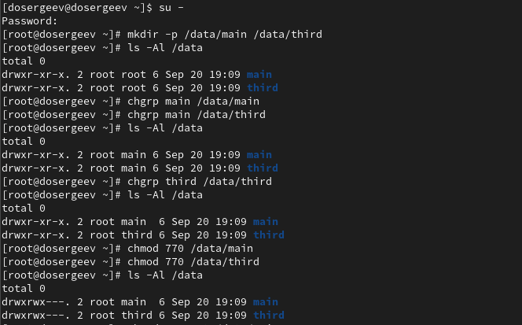
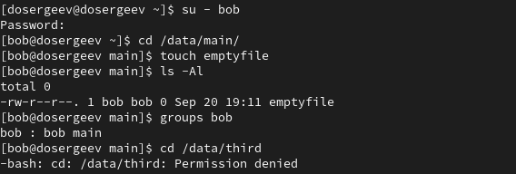
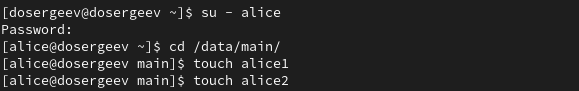
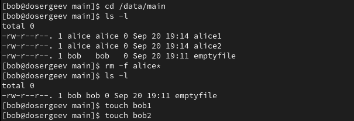
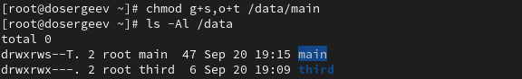
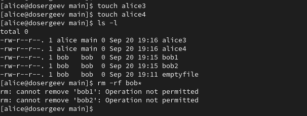
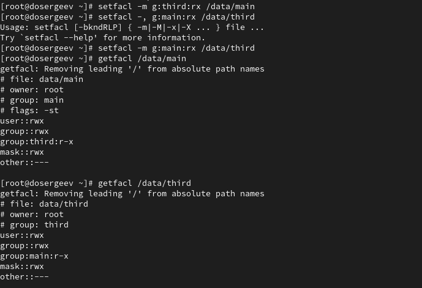
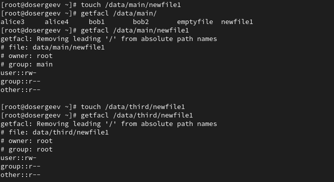
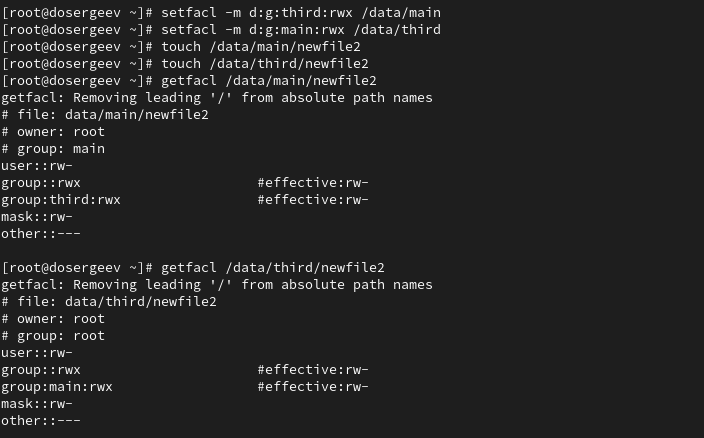
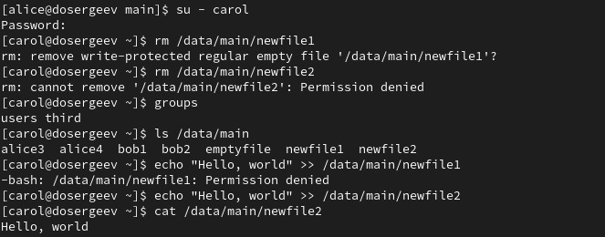

---
## Front matter
title: "Лабораторная работа №3. Настройка прав доступа"
subtitle: "Отчёт"
author: "Сергеев Даниил Олегович"

## Generic otions
lang: ru-RU
toc-title: "Содержание"

## Bibliography
bibliography: bib/cite.bib
csl: pandoc/csl/gost-r-7-0-5-2008-numeric.csl

## Pdf output format
toc: true # Table of contents
toc-depth: 2
lof: true # List of figures
lot: true # List of tables
fontsize: 12pt
linestretch: 1.5
papersize: a4
documentclass: scrreprt
## I18n polyglossia
polyglossia-lang:
  name: russian
  options:
	- spelling=modern
	- babelshorthands=true
polyglossia-otherlangs:
  name: english
## I18n babel
babel-lang: russian
babel-otherlangs: english
## Fonts
mainfont: IBM Plex Serif
romanfont: IBM Plex Serif
sansfont: IBM Plex Sans
monofont: IBM Plex Mono
mathfont: STIX Two Math
mainfontoptions: Ligatures=Common,Ligatures=TeX,Scale=0.94
romanfontoptions: Ligatures=Common,Ligatures=TeX,Scale=0.94
sansfontoptions: Ligatures=Common,Ligatures=TeX,Scale=MatchLowercase,Scale=0.94
monofontoptions: Scale=MatchLowercase,Scale=0.94,FakeStretch=0.9
mathfontoptions:
## Biblatex
biblatex: true
biblio-style: "gost-numeric"
biblatexoptions:
  - parentracker=true
  - backend=biber
  - hyperref=auto
  - language=auto
  - autolang=other*
  - citestyle=gost-numeric
## Pandoc-crossref LaTeX customization
figureTitle: "Рис."
tableTitle: "Таблица"
listingTitle: "Листинг"
lofTitle: "Список иллюстраций"
lotTitle: "Список таблиц"
lolTitle: "Листинги"
## Misc options
indent: true
header-includes:
  - \usepackage{indentfirst}
  - \usepackage{float} # keep figures where there are in the text
  - \floatplacement{figure}{H} # keep figures where there are in the text
---

# Цель работы

Получение навыков настройки базовых и специальных прав доступа для групп пользователей в операционной системе типа Linux. [@tuis]

# Задание

- Прочитать справочное описание man по командам chgrp, chmod, getfacl, setfacl.
- Выполнить действия по управлению базовыми разрешениями для групп пользователей.
- Выполнить действия по управлению специальными разрешениями для групп пользователей.
- Выполнить действия по управлению расширенными разрешениями с использованием списков ACL для групп пользователей.

# Ход выполнения лабораторной работы

## Управление базовыми разрешениями для групп пользователей

Откроем терминал под учётной записью root. В корневом каталоге создадим каталоги /data/main и /data/third и проверим, кто является владельцем этих каталогов. Узнаем, что владелец - root. Теперь сменим владельца этих каталогов с root на main и third. Перепроверим, после установим разрешение владельцам каталогов записывать файлы в эти каталоги и запрещающие доступ к содержимому каталогов всем другим пользователям и группам.

{#fig:001 width=90%}

В другом терминале перейдем под учётную запись bob из лабораторной работы №2. Попробуем перейти в катлог /data/main и создать файл emptyfile в этом каталоге. Пользователь bob принадлежит группе main, поэтому мы без проблем создаём файл в каталоге. Теперь попробуем сделать то же самое, но с каталогом /data/third. На этот раз выходит ошибка доступа, так как bob не находится в группе third, файл не создается.

{#fig:002 width=90%}

## Управление специальными разрешениями для групп пользователей

Откроем терминал под пользователем alice. Перейдем в каталог /data/main и создадим два файла: alice1, alice2. Их владельцем является alice.

{#fig:003 width=90%}

В другом терминале перейдем под учётную запись bob и перейдем в каталог /data/main. Проверим файлы в каталоге. После проверки попробуем удалить файлы, принадлежащие alice. Убедимся, что файлы удалены. Они удалились, поэтому создадим файлы bob1 и bob2.

{#fig:004 width=90%}

В терминале под root установим для каталога /data/main бит идентификатора группы и stiky-бит для общего каталога группы. 

{#fig:005 width=90%}

Под пользователем alice создадим файл alice3 и alice4. Проверим принадлежность файлов к группе main. Под тем же пользователем попробуем удалить файлы пользователя bob - нам это не удается, так как включен sticky-bit.

{#fig:006 width=90%}

## Управление расширенными разрешениями с использованием списков ACL для групп пользователей

Откроем терминал с root. Установим права на чтение и выполнение для групп third в каталоге /data/main и main в каталоге /data/third с помощью ACL. Используем getfacl, и увидим что права для соответствующих групп установлены правильно.

{#fig:007 width=90%}

Создадим новый файл с именем newfile1 в каталоге /data/main. Проверим полномочия. Владелец имеет права на чтение и запись, группа и остальные имеют только право на чтение. При создании файла, к нему применяется специальная маска, характерная для каждого пользователя. В нашем случае пользователь - root, поэтому файл создался с правами под маской пользователя root по умолчанию. Аналогично поступим для каталога third.

{#fig:008 width=90%}

Установим права доступа ACL по умолчанию для каталогов /data/main и /data/third. Убедимся что настройки работают, добавив файл newfile2 и проверив текущие полномочия. Аналогично для каталога /data/third.

{#fig:009 width=90%}

Для проверки полномочий группы third в каталоге /data/main войдем в другого пользователя carol, члена группы third. Попробуем удалить файл newfile1 и newfile2 - у нас не получится, так как в каталоге main включен sticky-bit, который предотвращает удаление файла, если он не владелец или root. Также попробуем записать в два файла "Hello, world". Строка запишется только во второй файл, так как для файла newfle1 группе third не выдано право на запись.

{#fig:010 width=90%}

# Ответы на контрольные вопросы

1. Как следует использовать команду chown, чтобы установить владельца группы для файла?

- Чтобы установить владельца группы и группу: chown пользователь:группа файл, или же chown :группа файл.
- Например из лабораторной работы: chown carol:third /data/main/* установит для всех файлов в каталоге main владельца carol и группу third.

2. С помощью какой команды можно найти все файлы, принадлежащие конкретному пользователю?

- Можно использовать 
- find / -user пользователь 
- find / -uid UID_пользователя.

3. Как применить разрешения на чтение, запись и выполнение для всех файлов в каталоге /data для пользователей и владельцев групп, не устанавливая никаких прав для других?

- Можно использовать команду chmod с ключем -R
- Напимер используем chmod -R ug=rwx,o-rwx /data

4. Какая команда позволяет добавить разрешение на выполнение для файла, который необходимо сделать исполняемым?

- Можно использовать команду chmod +x файл

5. Какая команда позволяет убедиться, что групповые разрешения для всех новых файлов, создаваемых в каталоге, будут присвоены владельцу группы этого каталога?

- Для этого нужно поставить SGID с помощью команды chmod с опцией +s.
- Например используем chmod g+s /data/main - все файлы в каталоге будут созданы с группой main.

6. Необходимо, чтобы пользователи могли удалять только те файлы, владельцами которых они являются, или которые находятся в каталоге, владельцами которого они являются. С помощью какой команды можно это сделать?

- Для этого нужно поставить sticky-бит. Это можно сделать с помощью команды: chmod +t каталог

7. Какая команда добавляет ACL, который предоставляет членам группы права доступа на чтение для всех существующих файлов в текущем каталоге?

- Используем команду setfacl -R -m g:группа:r * для рекурсивного изменения прав доступа в текущем каталоге.

8. Что нужно сделать для гарантии того, что члены группы получат разрешения на чтение для всех файлов в текущем каталоге и во всех его подкаталогах, а также для всех файлов, которые будут созданы в этом каталоге в будущем?

- Сначала нужно установить право на чтение для текущих файлов: setfacl -R -m g:группа:r каталог
- Потом установить права для умолчанию для будущих файлов: setfacl -m d:g:группа:r каталог
- Например для каталога /data/third можно сразу прописать setfacl -R -m d:g:dosergeev:r /data/main.

9. Какое значение umask нужно установить, чтобы «другие» пользователи не получали какие-либо разрешения на новые файлы?

- Нужно использовать команду umask.
- Например чтобы другие пользователи не получали какие-либо разрешения на новые файлы напишем umask 007(rwxrwx---) для установление маски по умолчанию для текущего пользователя

10. Какая команда гарантирует, что никто не сможет удалить файл myfile случайно? 

- Используем команду chattr с атрибутом +i. Он устанавливает файл как неизменяемый, что защищает его от любых изменений, в том числе и удаления.
- Например: chattr +i файл

# Вывод

В результате выполнения лабораторной работы я получил навыки настройки базовых и специальных прав доступа для групп пользователей в Linux, в том числе с использованием ACL.

# Список литературы{.unnumbered}

::: {#refs}
:::
