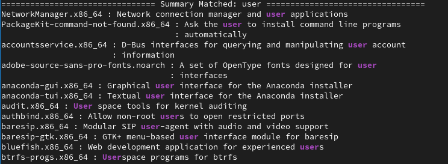
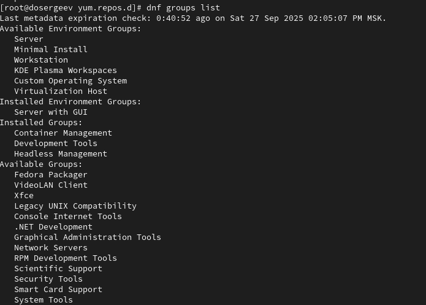
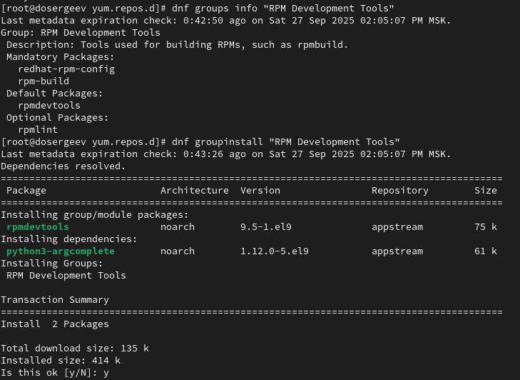
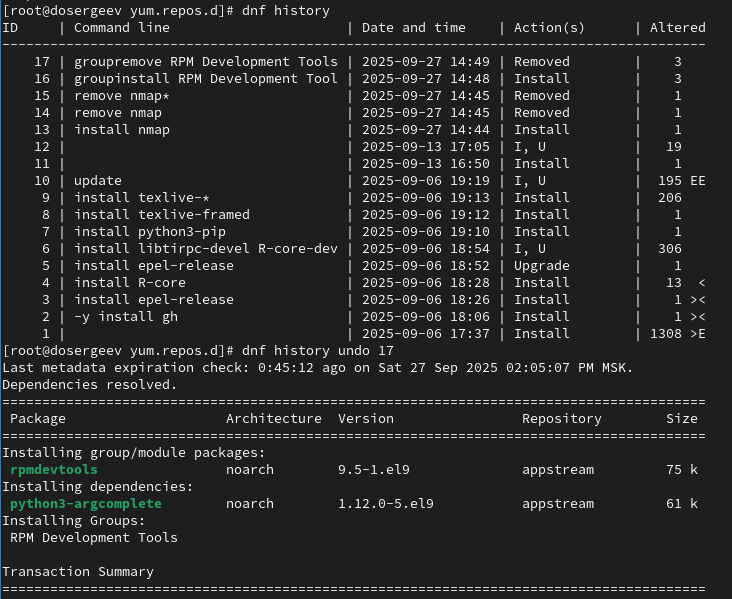
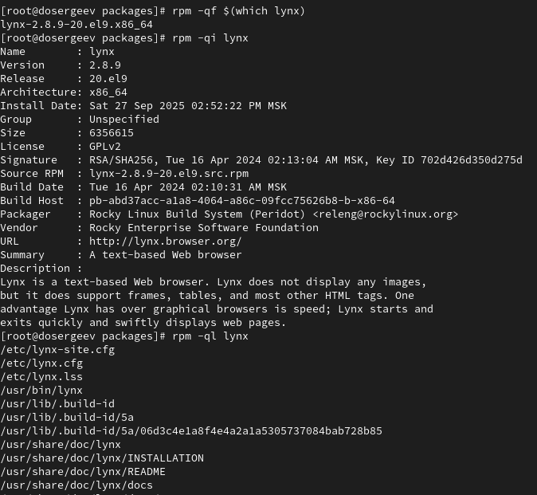
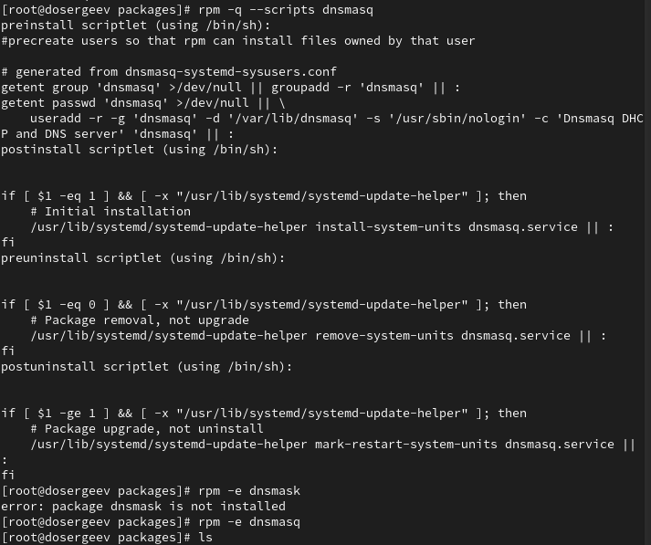

---
## Front matter
lang: ru-RU
title: Лабораторная работа №4
subtitle: Работа с программными пакетами
author:
  - Сергеев Д. О.
institute:
  - Российский университет дружбы народов, Москва, Россия
date: 27 сентября 2025

## i18n babel
babel-lang: russian
babel-otherlangs: english

## Formatting pdf
toc: false
toc-title: Содержание
slide_level: 2
aspectratio: 169
section-titles: true
theme: metropolis
header-includes:
 - \metroset{progressbar=frametitle,sectionpage=progressbar,numbering=fraction}
---

# Информация

## Докладчик

:::::::::::::: {.columns align=center}
::: {.column width="70%"}

  * Сергеев Даниил Олегович
  * Студент
  * Направление: Прикладная информатика
  * Российский университет дружбы народов
  * [1132246837@pfur.ru](mailto:1132246837@pfur.ru)

:::
::::::::::::::

# Цель работы

Получить навыки работы с репозиториями и менеджерами пакетов.

# Задание

- Изучить, как и в каких файлах подключаются репозитории для установки программного обеспечения; изучить основные возможности (поиск, установка, обновление, удаление пакета, работа с историей действий) команды dnf.
- Изучить и повторить процесс установки/удаления определённого пакета с использованием возможностей dnf.
- Изучить и повторите процесс установки/удаления определённого пакета с использованием возможностей rpm.

# Ход выполнения лабораторной работы

## Работа с репозиториями

{#fig:001 width=90%}

## Работа с репозиториями

:::::::::::::: {.columns align=center}
::: {.column width="70%"}

{#fig:002 width=80%}

:::
::: {.column width="30%"}

- название пакета;
- ссылка на скачивание;
- тип пакета;
- состояния (включен/выключен);
- срок истечения мета-данных;
- прочая информация о ключе gpg.

:::
::::::::::::::

## Работа с репозиториями

{#fig:003 width=90%}

## Работа с репозиториями

Выведем на экран список пакетов, в названии или описании которых есть слово user. Сделаем это командой dnf search "шаблон". Она выведет 3 вида совпадений: по названию и описанию, по названию, по описанию.

{#fig:004 width=90%}

## Работа с репозиториями

{#fig:005 width=90%}

## Работа с репозиториями

{#fig:006 width=90%}

## Работа с репозиториями

{#fig:007 width=60%}

## Работа с репозиториями

{#fig:008 width=90%}

## Работа с репозиториями

{#fig:009 width=90%}

## Работа с репозиториями

{#fig:010 width=90%}

## Работа с репозиториями

{#fig:011 width=70%}

## Работа с репозиториями

{#fig:012 width=65%}

## Работа с репозиториями

{#fig:013 width=90%}

## Работа с репозиториями

{#fig:014 width=60%}

## Использование rpm

Скачаем rpm-пакет lynx.

{#fig:015 width=90%}

## Использование rpm

{#fig:016 width=90%}

## Использование rpm

{#fig:017 width=50%}

## Использование rpm

{#fig:018 width=90%}

Попробуем вывести рпсположение и содержание скриптов, выполнямых при установке пакета. В моем случае их нет, поэтому продолжим.

## Использование rpm

{#fig:019 width=70%}

## Использование rpm

Вернемся в root и удалим lynx.

{#fig:020 width=90%}

## Использование rpm

Совершим похожие действия для пакета dnsmasq.

{#fig:021 width=90%}

## Использование rpm

{#fig:022 width=55%}

## Использование rpm

{#fig:023 width=90%}

## Использование rpm

:::::::::::::: {.columns align=center}
::: {.column width="60%"}

{#fig:024 width=80%}

:::
::: {.column width="40%"}

- preinstall: предварительно создает пользователей чтобы RPM мог установить файлы от лица этого пользователя;
- postinstall: осуществляет первоначальную установку;
- preuninstall: удаляет пакет rpm;
- postuninstall: обновление пакета, вместо удаления.

:::
::::::::::::::

# Ответы на контрольные вопросы

1. Какая команда позволяетвам искать пакет rpm, содержащий файл useradd?

- Можно использовать rpm -qf $(which useradd).

2. Какие команды вам нужно использовать, чтобы показать имя группы dnf, которая содержит инструменты безопасности и показывает, что находится в этой группе?

- Можно использовать последовательность dnf group list | grep -i security , dnf group info "группа, которую нашли"
- Или же одной командой dnf group info "\*security\*"

## Ответы на контрольные вопросы

3. Какая команда позволяет вам установить rpm, который вы загрузили из Интернета и который не находится в репозиториях?

- sudo rpm -i пакет.rpm или sudo dnf install (путь к пакету)/пакет.rpm

4. Вы хотите убедиться, что пакет rpm, который вы загрузили, не содержит никакого опасного кода сценария. Какая команда позволяет это сделать?

- Можно использовать rpm -qp --scripts пакет.rpm

## Ответы на контрольные вопросы

5. Какая команда показывает всю документацию в rpm?

- rpm -qd имя_пакета

6. Какая команда показывает, какому пакету rpm принадлежит файл?

- rpm -qf $(which имя_исполняемого_файла) или же rpm -qf $(путь_до_исполняемого_файла)

# Вывод

В результате выполнения лабораторной работы я получил навыки работы с репозиториями, менеджером пакетов dnf и пакетами rpm.
