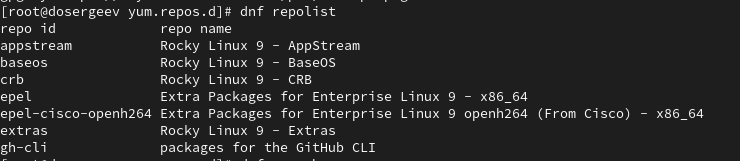

---
## Front matter
lang: ru-RU
title: Лабораторная работа №3
subtitle: Настройка прав доступа
author:
  - Сергеев Д. О.
institute:
  - Российский университет дружбы народов, Москва, Россия
date: 20 сентября 2025

## i18n babel
babel-lang: russian
babel-otherlangs: english

## Formatting pdf
toc: false
toc-title: Содержание
slide_level: 2
aspectratio: 169
section-titles: true
theme: metropolis
header-includes:
 - \metroset{progressbar=frametitle,sectionpage=progressbar,numbering=fraction}
---

# Информация

## Докладчик

:::::::::::::: {.columns align=center}
::: {.column width="70%"}

  * Сергеев Даниил Олегович
  * Студент
  * Направление: Прикладная информатика
  * Российский университет дружбы народов
  * [1132246837@pfur.ru](mailto:1132246837@pfur.ru)

:::
::::::::::::::

# Цель работы

Получение навыков настройки базовых и специальных прав доступа для групп пользователей в операционной системе типа Linux.

# Задание

- Прочитать справочное описание man по командам chgrp, chmod, getfacl, setfacl.
- Выполнить действия по управлению базовыми разрешениями для групп пользователей.
- Выполнить действия по управлению специальными разрешениями для групп пользователей.
- Выполнить действия по управлению расширенными разрешениями с использованием списков ACL для групп пользователей.

# Ход выполнения лабораторной работы

## Управление базовыми разрешениями для групп пользователей

{#fig:001 width=80%}

## Управление базовыми разрешениями для групп пользователей

{#fig:002 width=90%}

## Управление специальными разрешениями для групп пользователей

{#fig:003 width=90%}

## Управление специальными разрешениями для групп пользователей

{#fig:004 width=90%}

## Управление специальными разрешениями для групп пользователей

{#fig:005 width=90%}

## Управление специальными разрешениями для групп пользователей

{#fig:006 width=90%}

## Управление расширенными разрешениями с использованием списков ACL для групп пользователей

{#fig:007 width=60%}

## Управление расширенными разрешениями с использованием списков ACL для групп пользователей

{#fig:008 width=80%}

## Управление расширенными разрешениями с использованием списков ACL для групп пользователей

{#fig:009 width=70%}

## Управление расширенными разрешениями с использованием списков ACL для групп пользователей

{#fig:010 width=90%}

# Ответы на контрольные вопросы

1. Как следует использовать команду chown, чтобы установить владельца группы для файла?

- Чтобы установить владельца группы и группу: chown пользователь:группа файл, или же chown :группа файл.
- Например из лабораторной работы: chown carol:third /data/main/* установит для всех файлов в каталоге main владельца carol и группу third.

2. С помощью какой команды можно найти все файлы, принадлежащие конкретному пользователю?

- Можно использовать 
- find / -user пользователь 
- find / -uid UID_пользователя.

## Ответы на контрольные вопросы

3. Как применить разрешения на чтение, запись и выполнение для всех файлов в каталоге /data для пользователей и владельцев групп, не устанавливая никаких прав для других?

- Можно использовать команду chmod с ключем -R
- Напимер используем chmod -R ug=rwx,o-rwx /data

4. Какая команда позволяет добавить разрешение на выполнение для файла, который необходимо сделать исполняемым?

- Можно использовать команду chmod +x файл

## Ответы на контрольные вопросы

5. Какая команда позволяет убедиться, что групповые разрешения для всех новых файлов, создаваемых в каталоге, будут присвоены владельцу группы этого каталога?

- Для этого нужно поставить SGID с помощью команды chmod с опцией +s.
- Например используем chmod g+s /data/main - все файлы в каталоге будут созданы с группой main.

6. Необходимо, чтобы пользователи могли удалять только те файлы, владельцами которых они являются, или которые находятся в каталоге, владельцами которого они являются. С помощью какой команды можно это сделать?

- Для этого нужно поставить sticky-бит. Это можно сделать с помощью команды: chmod +t каталог

## Ответы на контрольные вопросы

7. Какая команда добавляет ACL, который предоставляет членам группы права доступа на чтение для всех существующих файлов в текущем каталоге?

- Используем команду setfacl -R -m g:группа:r * для рекурсивного изменения прав доступа в текущем каталоге.

## Ответы на контрольные вопросы

8. Что нужно сделать для гарантии того, что члены группы получат разрешения на чтение для всех файлов в текущем каталоге и во всех его подкаталогах, а также для всех файлов, которые будут созданы в этом каталоге в будущем?

- Сначала нужно установить право на чтение для текущих файлов: setfacl -R -m g:группа:r каталог
- Потом установить права для умолчанию для будущих файлов: setfacl -m d:g:группа:r каталог
- Например для каталога /data/third можно сразу прописать setfacl -R -m d:g:dosergeev:r /data/main.

## Ответы на контрольные вопросы

9. Какое значение umask нужно установить, чтобы «другие» пользователи не получали какие-либо разрешения на новые файлы?

- Нужно использовать команду umask.
- Например чтобы другие пользователи не получали какие-либо разрешения на новые файлы напишем umask 007(rwxrwx---) для установление маски по умолчанию для текущего пользователя

10. Какая команда гарантирует, что никто не сможет удалить файл myfile случайно? 

- Используем команду chattr с атрибутом +i. Он устанавливает файл как неизменяемый, что защищает его от любых изменений, в том числе и удаления.
- Например: chattr +i файл

# Вывод

В результате выполнения лабораторной работы я получил навыки настройки базовых и специальных прав доступа для групп пользователей в Linux, в том числе с использованием ACL.

