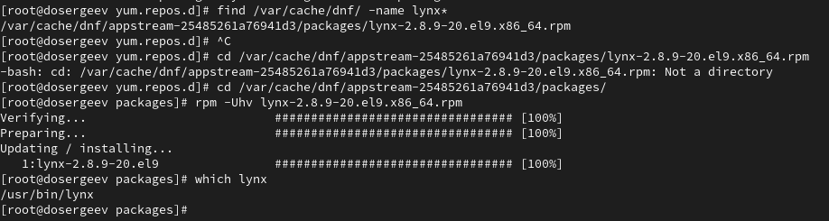
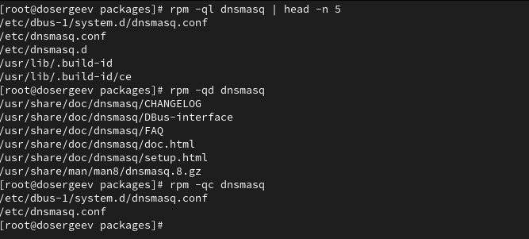

---
## Front matter
title: "Лабораторная работа №4. Работа с программными пакетами"
subtitle: "Отчёт"
author: "Сергеев Даниил Олегович"

## Generic otions
lang: ru-RU
toc-title: "Содержание"

## Bibliography
bibliography: bib/cite.bib
csl: pandoc/csl/gost-r-7-0-5-2008-numeric.csl

## Pdf output format
toc: true # Table of contents
toc-depth: 2
lof: true # List of figures
lot: true # List of tables
fontsize: 12pt
linestretch: 1.5
papersize: a4
documentclass: scrreprt
## I18n polyglossia
polyglossia-lang:
  name: russian
  options:
	- spelling=modern
	- babelshorthands=true
polyglossia-otherlangs:
  name: english
## I18n babel
babel-lang: russian
babel-otherlangs: english
## Fonts
mainfont: IBM Plex Serif
romanfont: IBM Plex Serif
sansfont: IBM Plex Sans
monofont: IBM Plex Mono
mathfont: STIX Two Math
mainfontoptions: Ligatures=Common,Ligatures=TeX,Scale=0.94
romanfontoptions: Ligatures=Common,Ligatures=TeX,Scale=0.94
sansfontoptions: Ligatures=Common,Ligatures=TeX,Scale=MatchLowercase,Scale=0.94
monofontoptions: Scale=MatchLowercase,Scale=0.94,FakeStretch=0.9
mathfontoptions:
## Biblatex
biblatex: true
biblio-style: "gost-numeric"
biblatexoptions:
  - parentracker=true
  - backend=biber
  - hyperref=auto
  - language=auto
  - autolang=other*
  - citestyle=gost-numeric
## Pandoc-crossref LaTeX customization
figureTitle: "Рис."
tableTitle: "Таблица"
listingTitle: "Листинг"
lofTitle: "Список иллюстраций"
lotTitle: "Список таблиц"
lolTitle: "Листинги"
## Misc options
indent: true
header-includes:
  - \usepackage{indentfirst}
  - \usepackage{float} # keep figures where there are in the text
  - \floatplacement{figure}{H} # keep figures where there are in the text
---

# Цель работы

Получить навыки работы с репозиториями и менеджерами пакетов. [@tuis]

# Задание

- Изучить, как и в каких файлах подключаются репозитории для установки программного обеспечения; изучить основные возможности (поиск, установка, обновление, удаление пакета, работа с историей действий) команды dnf.
- Изучить и повторить процесс установки/удаления определённого пакета с использованием возможностей dnf.
- Изучить и повторите процесс установки/удаления определённого пакета с использованием возможностей rpm.

# Ход выполнения лабораторной работы

## Работа с репозиториями

Откроем терминал под учётной записью root. Перейдем в каталог /etc/yum.repos.d и узнаем какие репозитории в нем расположены.

{#fig:001 width=90%}

Откроем один из них, например epel-cisco-openh264.repo, и изучим его содержимое. В нем находится информация репозитория:

- название пакета;
- ссылка на скачивание;
- тип пакета;
- состояния (включен/выключен);
- срок истечения мета-данных;
- прочая информация о ключе gpg.

{#fig:002 width=90%}

Список репозиториев можно вывести более удобным способом, прописав команду dnf repolist. Она выводит два столбца: идентификатор и имя репозитория. Первый соответствует названию файла, а второй значению в поле name. На рисунке ниже можем убедиться, что репозитории из списка команды соответствуют тем, что находятся в каталоге.

{#fig:003 width=90%}

Выведем на экран список пакетов, в названии или описании которых есть слово user. Сделаем это командой dnf search "шаблон". Она выведет 3 вида совпадений: по названию и описанию, по названию, по описанию.

{#fig:004 width=90%}

{#fig:005 width=90%}

{#fig:006 width=90%}

Установим nmap, предварительно проверив наличие пакета в менеджере. В задании дополнительно необходимо применить команду dnf install nmap\*. В отличие от dnf install nmap, она установит все пакеты, которые начинаются с nmap. Например, в этот список попадет пакет nmap-ncat. Удалим установленные пакеты.

{#fig:007 width=90%}

{#fig:008 width=90%}

{#fig:009 width=90%}

{#fig:010 width=90%}

Получим список групп пакетов и установим RPM Development Tools.

{#fig:011 width=90%}

{#fig:012 width=90%}

Также удалим его.

{#fig:013 width=90%}

Просмотрим историю использования команд dnf и отменим последнее действие, чтобы использовать пакет rpm в следующем задании.

{#fig:014 width=90%}

## Использование rpm

Скачаем rpm-пакет lynx.

{#fig:015 width=90%}

Найдем каталог, в который был помещен пакет, перейдем в него и установим его. Определим расположение исполняемого файла: /usr/bin/lynx.

{#fig:016 width=90%}

Определим по имени файла к какому пакету принадлежит lynx. Получим дополнительную информацию о содержимом пакета, список всех файлов в пакете, перечень файлов с документацией пакета и перечень и месторасположение конфигурационных файлов пакета.

{#fig:017 width=90%}

{#fig:018 width=90%}

Попробуем вывести рпсположение и содержание скриптов, выполнямых при установке пакета. В моем случае их нет, поэтому продолжим.

В отдельном терминале под своей учётной записью откроем lynx. Браузер успешно запустился.

{#fig:019 width=90%}

Вернемся в root и удалим lynx.

{#fig:020 width=90%}

Совершим похожие действия для пакета dnsmasq.

{#fig:021 width=90%}

Определим расположение dnsmasq и к какому пакету он относится. Получим список всех файлов в пакете, дополнительную информацию о содержимом пакета, перечень файлов с документацией пакета и перечень и месторасположение конфигурационных фалов пакета.

{#fig:022 width=90%}

{#fig:023 width=90%}

Выведем на экран расположение и содержание скриптов, выполняемых при установке пакета. Удалим пакет dnsmasq.

{#fig:024 width=90%}

Всего для пакета dnsmasq существует 4 скрипта:

- preinstall: предварительно создает пользователей чтобы RPM мог установить файлы от лица этого пользователя;
- postinstall: осуществляет первоначальную установку;
- preuninstall: удаляет пакет rpm;
- postuninstall: обновление пакета, вместо удаления.

# Ответы на контрольные вопросы

1. Какая команда позволяетвам искать пакет rpm, содержащий файл useradd?

- Можно использовать rpm -qf $(which useradd).

2. Какие команды вам нужно использовать, чтобы показать имя группы dnf, которая содержит инструменты безопасности и показывает, что находится в этой группе?

- Можно использовать последовательность dnf group list | grep -i security , dnf group info "группа, которую нашли"
- Или же одной командой dnf group info "*security*"

3. Какая команда позволяет вам установить rpm, который вы загрузили из Интернета и который не находится в репозиториях?

- sudo rpm -i пакет.rpm или sudo dnf install (путь к пакету)/пакет.rpm

4. Вы хотите убедиться, что пакет rpm, который вы загрузили, не содержит никакого опасного кода сценария. Какая команда позволяет это сделать?

- Можно использовать rpm -qp --scripts пакет.rpm

5. Какая команда показывает всю документацию в rpm?

- rpm -qd имя_пакета

6. Какая команда показывает, какому пакету rpm принадлежит файл?

- rpm -qf $(which путь_до_исполняемого_файла) или же rpm -qf $(which имя_исполняемого_файла)

# Вывод

В результате выполнения лабораторной работы я получил навыки работы с репозиториями, менеджером пакетов dnf и пакетами rpm.

# Список литературы{.unnumbered}

::: {#refs}
:::
