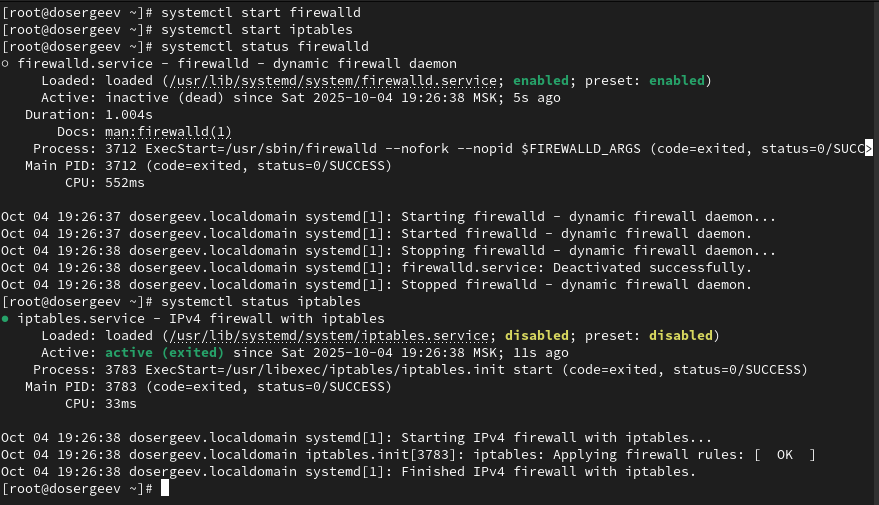
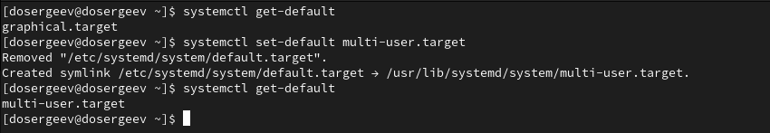
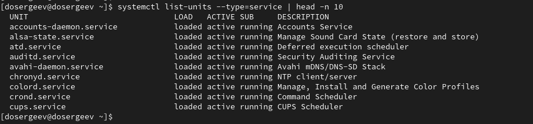

---
## Front matter
title: "Лабораторная работа № 5. Управление системными службами"
subtitle: "Отчёт"
author: "Сергеев Даниил Олегович"

## Generic otions
lang: ru-RU
toc-title: "Содержание"

## Bibliography
bibliography: bib/cite.bib
csl: pandoc/csl/gost-r-7-0-5-2008-numeric.csl

## Pdf output format
toc: true # Table of contents
toc-depth: 2
lof: true # List of figures
lot: true # List of tables
fontsize: 12pt
linestretch: 1.5
papersize: a4
documentclass: scrreprt
## I18n polyglossia
polyglossia-lang:
  name: russian
  options:
	- spelling=modern
	- babelshorthands=true
polyglossia-otherlangs:
  name: english
## I18n babel
babel-lang: russian
babel-otherlangs: english
## Fonts
mainfont: IBM Plex Serif
romanfont: IBM Plex Serif
sansfont: IBM Plex Sans
monofont: IBM Plex Mono
mathfont: STIX Two Math
mainfontoptions: Ligatures=Common,Ligatures=TeX,Scale=0.94
romanfontoptions: Ligatures=Common,Ligatures=TeX,Scale=0.94
sansfontoptions: Ligatures=Common,Ligatures=TeX,Scale=MatchLowercase,Scale=0.94
monofontoptions: Scale=MatchLowercase,Scale=0.94,FakeStretch=0.9
mathfontoptions:
## Biblatex
biblatex: true
biblio-style: "gost-numeric"
biblatexoptions:
  - parentracker=true
  - backend=biber
  - hyperref=auto
  - language=auto
  - autolang=other*
  - citestyle=gost-numeric
## Pandoc-crossref LaTeX customization
figureTitle: "Рис."
tableTitle: "Таблица"
listingTitle: "Листинг"
lofTitle: "Список иллюстраций"
lotTitle: "Список таблиц"
lolTitle: "Листинги"
## Misc options
indent: true
header-includes:
  - \usepackage{indentfirst}
  - \usepackage{float} # keep figures where there are in the text
  - \floatplacement{figure}{H} # keep figures where there are in the text
---

# Цель работы

Получить навыки управления системными службами операционной системы посредством systemd. [@tuis]

# Задание

- Выполните основные операции по запуску (останову), определению статуса, добавлению(удалению) в автозапуск и пр. службы Very Secure FTP.
- Продемонстрируйте навыки по разрешению конфликтов юнитов для служб firewalld и iptables.
- Продемонстрируйте навыки работы с изолированными целями.

# Ход выполнения лабораторной работы

## Управление сервисами

Откроем терминал под учётной записью root и проверим статус службы VerySecureFTP. Вывод показывает, что юнит vsftpd.service не найден, так как служба ещё не установлена. Поставим VerySecureFTP себе на устройство.

{#fig:001 width=90%}

Запустим службу и проверим её статус. В описании службы указано, что она активна: Active: active (running), но не загружена для автозапуска: Loaded: loaded (...; disabled; ...).

{#fig:002 width=90%}

Добавим службу VSFTP в автозапуск, для этого используем systemctl enable vsftp, затем проверим статус. В строке Loaded стутс disabled сменился на enabled. Теперь удалим службу из автозапуска, написав systemctl disable vsftpd. Ещё раз проверим статус - теперь в строке Loaded снова написано disabled.

{#fig:003 width=90%}

Выведем на экран символические ссылки, ответственные за запуск различных сервисов, для этого напишем команду ls /etc/systemd/system/multi-user.target.wants. Заметим, что ссылки на vsftpd.service нет. Дополнительно проверим это, использовав grep -i vsftp для вывода команды.

{#fig:004 width=90%}

Снова добавим VSFTP в автозапуск и выведем символические ссылки, используя grep. Теперь в каталоге multi-user.target.wants находится символическая ссылка vsftpd.service.

{#fig:005 width=90%}

Снова проверим стаутс VSFTP и проверим ещё раз строку с автозапуском. Теперь в Loaded указан статус enabled.

{#fig:006 width=90%}

Выведем на экран зависимости юнита VSFTP и, наоборот, список юнитов, которые зависят он него.

{#fig:007 width=90%}

## Конфликты юнитов

Установим пакеты iptables.

{#fig:008 width=90%}

Проверим статусы firewalld и iptables. Один из них запущен (firewalld), а другой неактивен (iptables).

{#fig:009 width=90%}

Попробуем запустить эти службы по очереди, проверяя их статус. После запуска iptables, юнит firewalld стал неактивен, так как он несовместим.

{#fig:010 width=90%}

Проверим зависимости этих служб, открыв юниты командами cat /usr/lib/systemd/system/firewalld.service и cat /usr/lib/systemd/system/iptables.service. Служба iptables не имеет конфликтных сервисов, однако в firewalld указаны конфликты: iptables.service, ip6tables.service, ebtables.service, ipset.service.

{#fig:011 width=90%}

{#fig:012 width=90%}

Выгрузим службу iptables и загрузим firewalld. Заблокируем запуск iptables, наложив на него маску. Попробуем снова запустить и добавить в автозапуск службу iptables. Обе попытки выдадут ошибку, которая указывает что сервис находится под маской.

{#fig:013 width=90%}

## Изолируемые цели

Получим список всех активных загруженных целей, введя systemctl --type=target. Теперь выведем список всех целей с помощью systemctl --type=target --all.

{#fig:014 width=90%}

Перейдем в каталог systemd и проверим, какие цели можно изолировать, использовав команду grep Isolate \*.target.

{#fig:015 width=90%}

Переключим операционную систему в режим восстановления: systemctl isolate rescue.target. Выполнение данной команды прекратит дургие службы кроме rescue и её зависимостей.

{#fig:016 width=90%}

Введем пароль root, чтобы войти в систему, и перезапустим ОС.

## Цель по умолчанию

Войдем в терминал под учетной записью администратора. Выведем на экран цель по умолчанию: system get-default. Получим в выводе службу graphical.target. Установим для запуска по умолчанию текстовый режим, указав в опции команды systemctl set-default юнит multi-user.target.

{#fig:017 width=90%}

Перезагрузим ОС. Система запустилась в текстовом режиме. Войдем в учетную запись root и вернем цель по умолчанию graphical.target. Снова перезапустим ОС.

{#fig:018 width=90%}

Система загрузилась в графическом режиме.

{#fig:019 width=90%}

# Ответы на контрольные вопросы

1. Что такое юнит(unit)? Приведите примеры.

- Юнит(unit) - это объекты конфигурации, используются для выполнения операций над системными службами systemd. Они бывают разных типов. Например, существует service (управляет запуском системных служб), timer(аналог cron для планирования задач), target(объединение нескольких сервисов) и прочие.
- Пример: graphical.target используется для запуска графического интерфейса, sshd.service задает параметры для демона(процесса) sshd, тем самым управляя им.

2. Какая команда позволяетвам убедиться,что цель больше не входит в список автоматического запуска при загрузке системы?

- systemctl is-enabled \<цель\> - узнать напрямую
- systemctl status \<цель\> | grep -i loaded - получить через статус цели

{#fig:020 width=90%}

3. Какую команду вы должны использовать для отображения всех сервисных юнитов, которые в настоящее время загружены?

- systemctl list-units --type=service - все юниты типа service

{#fig:021 width=90%}

4. Как создать потребность (wants) в сервисе?

- systemctl add-wants \<цель\>.target \<сервис\>.service - автоматическое добавление через systemctl
- ln -s /usr/lib/systemd/system/\<зависимый сервис\>.service /etc/systemd/system/\<сервис\>.service.wants/ - добавление символической ссылки вручную

5. Как переключить текущее состояние на цель восстановления (rescue target)?

- systemctl rescue
- systemctl isolate rescue.target

6. Поясните причину получения сообщения о том, что цель не может быть изолирована.

- Цель не может быть изолирована, если в ней отсутствует параметр AllowIsolate=yes, либо его значение равно AllowIsolate=no

7. Вы хотите отключить службу systemd, но, прежде чем сделать это, вы хотите узнать, какие другие юниты зависят от этой службы. Какую команду вы бы использовали?

- systemctl list-dependencies \<цель\>

# Вывод

В результате выполнения лабораторной работы я ознакомился с инструментами управления системными службами операционной системы, выполнил основные операции со службами на примере VerySecureFTP, научился разрешать конфликты юнитов и изолировать их.

# Список литературы{.unnumbered}

::: {#refs}
:::
