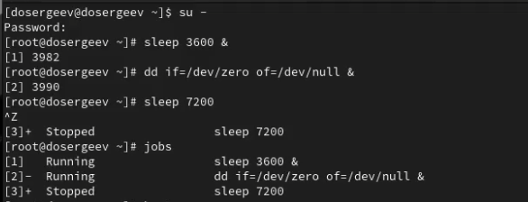
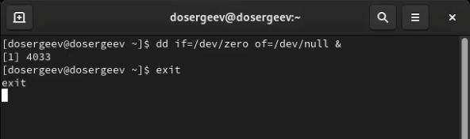
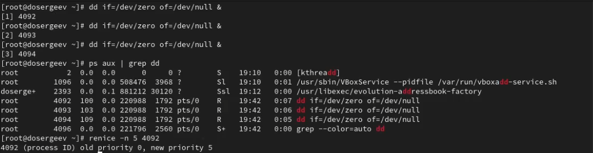
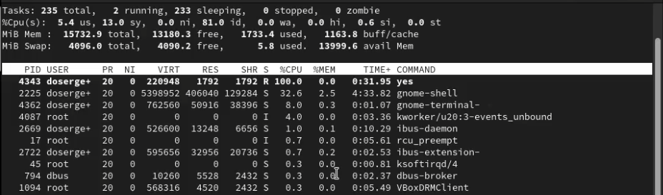
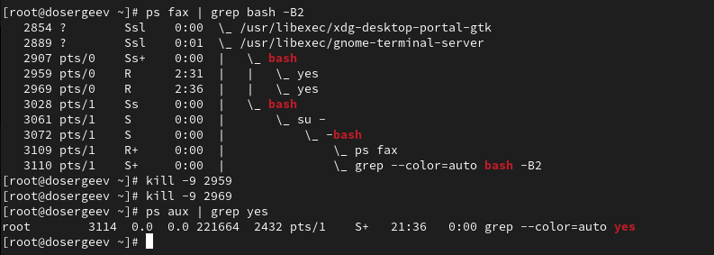
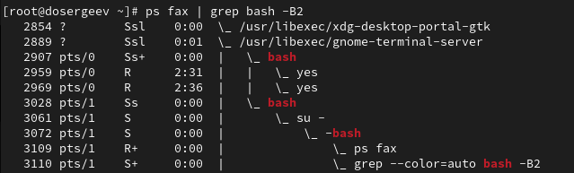

---
## Front matter
lang: ru-RU
title: Лабораторная работа № 5
subtitle: Управление системными службами
author:
  - Сергеев Д. О.
institute:
  - Российский университет дружбы народов, Москва, Россия
date: 04 октября 2025

## i18n babel
babel-lang: russian
babel-otherlangs: english

## Formatting pdf
toc: false
toc-title: Содержание
slide_level: 2
aspectratio: 169
section-titles: true
theme: metropolis
header-includes:
 - \metroset{progressbar=frametitle,sectionpage=progressbar,numbering=fraction}
---

# Информация

## Докладчик

:::::::::::::: {.columns align=center}
::: {.column width="70%"}

  * Сергеев Даниил Олегович
  * Студент
  * Направление: Прикладная информатика
  * Российский университет дружбы народов
  * [1132246837@pfur.ru](mailto:1132246837@pfur.ru)

:::
::::::::::::::

# Цель работы

Получить навыки управления системными службами операционной системы посредством systemd.

# Задание

- Выполните основные операции по запуску (останову), определению статуса, добавлению(удалению) в автозапуск и пр. службы Very Secure FTP.
- Продемонстрируйте навыки по разрешению конфликтов юнитов для служб firewalld и iptables.
- Продемонстрируйте навыки работы с изолированными целями.

# Ход выполнения лабораторной работы

# Управление сервисами

## Управление сервисами

{#fig:001 width=90%}

## Управление сервисами

{#fig:002 width=90%}

## Управление сервисами

{#fig:003 width=90%}

## Управление сервисами

{#fig:004 width=90%}

## Управление сервисами

{#fig:005 width=90%}

## Управление сервисами

{#fig:006 width=90%}

## Управление сервисами

{#fig:007 width=90%}

# Конфликты юнитов

## Конфликты юнитов

{#fig:008 width=90%}

## Конфликты юнитов

{#fig:009 width=90%}

## Конфликты юнитов

{#fig:010 width=80%}

## Конфликты юнитов

{#fig:011 width=90%}

## Конфликты юнитов

{#fig:012 width=90%}

## Конфликты юнитов

{#fig:013 width=90%}

# Изолируемые цели

## Изолируемые цели

{#fig:014 width=90%}

## Изолируемые цели

{#fig:015 width=90%}

## Изолируемые цели

{#fig:016 width=90%}

# Цель по умолчанию

## Цель по умолчанию

{#fig:017 width=90%}

## Цель по умолчанию

{#fig:018 width=90%}

## Цель по умолчанию

{#fig:019 width=90%}

# Ответы на контрольные вопросы

1. Что такое юнит(unit)? Приведите примеры.

- Юнит(unit) - это объекты конфигурации, используются для выполнения операций над системными службами systemd. Они бывают разных типов. Например, существует service (управляет запуском системных служб), timer(аналог cron для планирования задач), target(объединение нескольких сервисов) и прочие.
- Пример: graphical.target используется для запуска графического интерфейса, sshd.service задает параметры для демона(процесса) sshd, тем самым управляя им.

## Ответы на контрольные вопросы

2. Какая команда позволяетвам убедиться,что цель больше не входит в список автоматического запуска при загрузке системы?

- systemctl is-enabled \<цель\> - узнать напрямую
- systemctl status \<цель\> | grep -i loaded - получить через статус цели

{#fig:020 width=90%}

## Ответы на контрольные вопросы

3. Какую команду вы должны использовать для отображения всех сервисных юнитов, которые в настоящее время загружены?

- systemctl list-units --type=service - все юниты типа service

{#fig:021 width=90%}

## Ответы на контрольные вопросы

4. Как создать потребность (wants) в сервисе?

- systemctl add-wants \<цель\>.target \<сервис\>.service - автоматическое добавление через systemctl
- ln -s /usr/lib/systemd/system/\<зависимый сервис\>.service /etc/systemd/system/\<сервис\>.service.wants/ - добавление символической ссылки вручную

## Ответы на контрольные вопросы

5. Как переключить текущее состояние на цель восстановления (rescue target)?

- systemctl rescue
- systemctl isolate rescue.target

6. Поясните причину получения сообщения о том, что цель не может быть изолирована.

- Цель не может быть изолирована, если в ней отсутствует параметр AllowIsolate=yes, либо его значение равно AllowIsolate=no

## Ответы на контрольные вопросы

7. Вы хотите отключить службу systemd, но, прежде чем сделать это, вы хотите узнать, какие другие юниты зависят от этой службы. Какую команду вы бы использовали?

- systemctl list-dependencies \<цель\>

# Вывод

В результате выполнения лабораторной работы я ознакомился с инструментами управления системными службами операционной системы, выполнил основные операции со службами на примере VerySecureFTP, научился разрешать конфликты юнитов и изолировать их.
