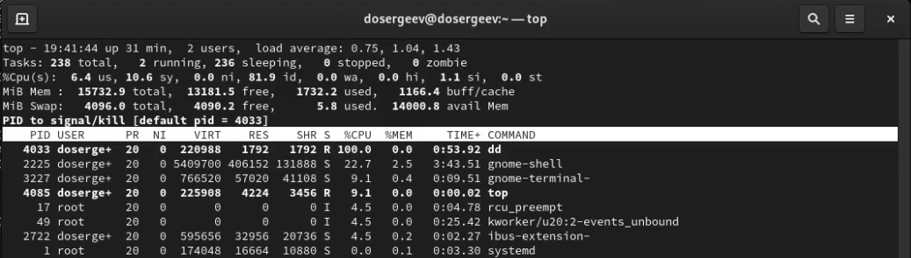
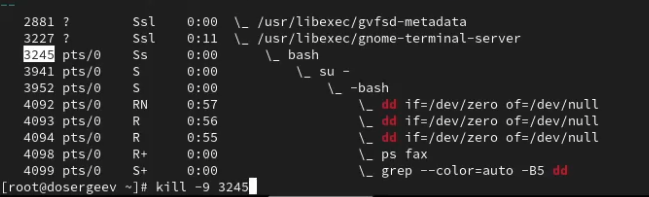

---
## Front matter
title: "Лабораторная работа № 6. Управление процессами"
subtitle: "Отчёт"
author: "Сергеев Даниил Олегович"

## Generic otions
lang: ru-RU
toc-title: "Содержание"

## Bibliography
bibliography: bib/cite.bib
csl: pandoc/csl/gost-r-7-0-5-2008-numeric.csl

## Pdf output format
toc: true # Table of contents
toc-depth: 2
lof: true # List of figures
lot: true # List of tables
fontsize: 12pt
linestretch: 1.5
papersize: a4
documentclass: scrreprt
## I18n polyglossia
polyglossia-lang:
  name: russian
  options:
	- spelling=modern
	- babelshorthands=true
polyglossia-otherlangs:
  name: english
## I18n babel
babel-lang: russian
babel-otherlangs: english
## Fonts
mainfont: IBM Plex Serif
romanfont: IBM Plex Serif
sansfont: IBM Plex Sans
monofont: IBM Plex Mono
mathfont: STIX Two Math
mainfontoptions: Ligatures=Common,Ligatures=TeX,Scale=0.94
romanfontoptions: Ligatures=Common,Ligatures=TeX,Scale=0.94
sansfontoptions: Ligatures=Common,Ligatures=TeX,Scale=MatchLowercase,Scale=0.94
monofontoptions: Scale=MatchLowercase,Scale=0.94,FakeStretch=0.9
mathfontoptions:
## Biblatex
biblatex: true
biblio-style: "gost-numeric"
biblatexoptions:
  - parentracker=true
  - backend=biber
  - hyperref=auto
  - language=auto
  - autolang=other*
  - citestyle=gost-numeric
## Pandoc-crossref LaTeX customization
figureTitle: "Рис."
tableTitle: "Таблица"
listingTitle: "Листинг"
lofTitle: "Список иллюстраций"
lotTitle: "Список таблиц"
lolTitle: "Листинги"
## Misc options
indent: true
header-includes:
  - \usepackage{indentfirst}
  - \usepackage{float} # keep figures where there are in the text
  - \floatplacement{figure}{H} # keep figures where there are in the text
---

# Цель работы

Получить навыки управления процессами операционной системы. [@tuis]

# Задание

- Продемонстрируйте навыки управления заданиями операционной системы
- Продемонстрируйте навыки управления процессами операционной системы
- Выполните задания для самостоятельной работы

# Ход выполнения лабораторной работы

## Управление заданиями

Откроем терминал под учётной записью root и введем команды: sleep 3600 & ; dd if=/dev/zero of=/dev/null & ; sleep 7200. Введем Ctrl+Z чтобы остановить последний процесс. Выведем текущие задания через команду jobs.

{#fig:001 width=90%}

Для продолжения выполнения задания 3 в фоновом режиме введем команду bg 3. Переместим задание 1 на передний план и введем fg 1, после чего отменим задание 1 командой Ctrl+C. Проверим статус задач командой jobs. Аналогично сделаем для отмены заданий 2 и 3.

{#fig:002 width=90%}

Откроем во втором терминале под учетной записью пользователя новый процесс dd в фоновом режиме и напишем exit, чтобы закрыть этот терминал.

{#fig:003 width=90%}

Используем команду top, чтобы проверить состояние процесса dd. Как мы можем увидеть, он все ещё запущен. Выйдем из top, нажав q. Снова запустим top и убьём задание dd, нажав k и указав PID процесса и номер сигнала (9/termkill).

{#fig:004 width=90%}

## Управление процессами

Снова запустим терминал и получим полномочия администратора. Запустим процесс dd в фоновом режиме 3 раза. Введем ps aux | grep dd, чтобы вывести запущенные процессы. Используем PID процесса 4092 и изменим его приоритет на +5 по nice.

{#fig:005 width=90%}

Введем команду ps fax | grep -B5 dd и узнаем иерархию отношений процессов. Из неё можем увидеть, что процессы dd были запущены из оболочки bash с PID 3245. Остановим родительский процесс, чтобы остановить все дочерние dd-процессы.

{#fig:006 width=90%}

# Задания для самостоятельной работы

## Задание №1

Запустим команду dd if=/dev/zero of=/dev/null три раза на фоне. Изменим приоритет 4230 на -5, используя команду renice -5 4230. Повторим действие, но уже с приоритетом -15. В зависимости от заданного приоритета, процесс будет выполнен быстрее, как только освободятся процессы с большим приоритетом. Если изменить nice, то раньше будут выполненны процессы с приоритетом до -20, а позже с приоритетом до 19. Завершим все процессы dd с помощью killall dd.

{#fig:007 width=90%}

## Задание №2

Запустим программу yes в фоновом режиме и на переднем плане с подавлением потока вывода (yes > /dev/null &). Остановим выполнение программы, использовав Ctrl+Z, запустим её заного и завершим выполнение с помощью Ctrl+C. Проведем аналогичные действия для команды без подавления потока.

{#fig:008 width=90%}

Проверим состояние, написав команду jobs. Переведем процесс 2, который выполняется в фоновом режиме, на передний план и остановим его. Затем снова переведем его в фоновой режим и проверим состояние. Теперь он Running.

{#fig:009 width=90%}

Запустим процесс в фоновом режиме так, чтобы он продолжил работу даже после отключения терминала. Для этого воспользуемся командой nohup yes > /dev/null &. Закроем терминал и в новом окне проверим состояние процесса в окне top.

{#fig:010 width=90%}

Запустим ещё три программы yes в фоновом режиме с подавлением потока вывода. Закроем один из них с помощью PID и номера задачи:

- kill -9 %2
- kill -9 4437

{#fig:011 width=90%}

Попробуем послать сигнал SIGHUP двум запущенным процессам. Процесс с номером 1 завершился с статусом Hangup, а процесс 4437, ранее запущенный в другом терминале, продолжил свою работу.

{#fig:012 width=90%}

Запустим ещё несколько программ yes. Завершим их работу одной командой: killall yes.

{#fig:013 width=90%}

Запустим программу yes с теми же параметрами. Снова запустим её, но уже с приоритетом, большим на 5, с использованием команды nice. И абсолютный, и относительный приоритеты различаются на 5 у первого и второго процесса. Сделаем так, чтобы приоритеты процессов стали одинаковыми. Для этого напишем renice -n 5 4571.

{#fig:014 width=90%}

# Ответы на контрольные вопросы

1. Какая команда даёт обзор всех текущих заданий оболочки?

- Можно использовать команду jobs

{#fig:015 width=90%}

2. Как остановить текущее задание оболочки, чтобы продолжить его выполнение в фоновом режиме?

- Переходим на текущее задание: fg \<номер\>
- Используем сочетание клавиш Ctrl+Z, чтобы остановить задание
- Переводим его в фоновой режим: bg \<номер\>

{#fig:016 width=90%}

3. Какую комбинацию клавиш можно использовать для отмены текущего задания оболочки?

- Можно использовать сочетание Ctrl+C

{#fig:017 width=90%}

4. Необходимо отменить одно из начатых заданий. Доступ к оболочке, в которой в данный момент работает пользователь, невозможен. Что можно сделать, чтобы отменить задание?

- Откроем новую оболочку под учётной записью root. Узнаем PID запущенных процессов другой оболочки. Пропишем команду kill для каждого процесса, либо killall -9 \<процесс\>

{#fig:018 width=90%}

5. Какая команда используется для отображения отношений между родительскими и дочерними процессами?

- Используется команда ps fax.

{#fig:019 width=90%}

6. Какая команда позволит изменить приоритет процесса с идентификатором 1234 на более высокий?

- renice -n \<новый приоритет до 19\> \<процесс или PID\>

7. В системе в настоящее время запущено 20 процессов dd. Как проще всего остановить их все сразу?

- killall -9 dd

8. Какая команда позволяет остановить команду с именем mycommand?

- pkill mycommand

9. Какая команда используется в top, чтобы убить процесс?

- Используем k, затем номер процесса и сигнал 9.

10. Как запустить команду с достаточно высоким приоритетом, не рискуя, что не хватит ресурсов для других процессов?

- nice -n \<приоритет\> \<команда\>

# Вывод

В результате выполнения лабораторной работы я получил навыки управления задачами и процессами. Узнал как менять режим работы процессов (фоновой и передний), приостанавливать и завершать текущие процессы, запущенные в переднем режиме, изменять их приорететы с помощью команд nice и renice, а также научился запускать процессы так, чтобы они работали даже после закрытия текущей оболочки.

# Список литературы{.unnumbered}

::: {#refs}
:::
