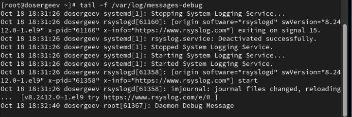
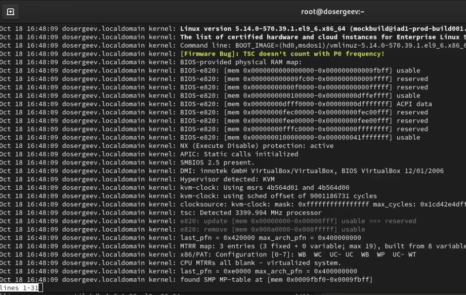
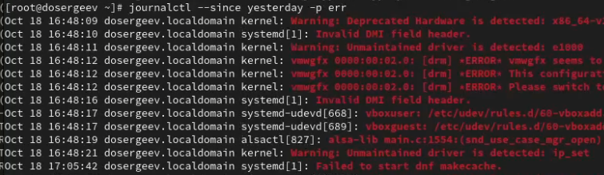

---
## Front matter
lang: ru-RU
title: Лабораторная работа № 6
subtitle: Управление процессами
author:
  - Сергеев Д. О.
institute:
  - Российский университет дружбы народов, Москва, Россия
date: 11 октября 2025

## i18n babel
babel-lang: russian
babel-otherlangs: english

## Formatting pdf
toc: false
toc-title: Содержание
slide_level: 2
aspectratio: 169
section-titles: true
theme: metropolis
header-includes:
 - \metroset{progressbar=frametitle,sectionpage=progressbar,numbering=fraction}
---

# Информация

## Докладчик

:::::::::::::: {.columns align=center}
::: {.column width="70%"}

  * Сергеев Даниил Олегович
  * Студент
  * Направление: Прикладная информатика
  * Российский университет дружбы народов
  * [1132246837@pfur.ru](mailto:1132246837@pfur.ru)

:::
::::::::::::::

# Цель работы

Получить навыки управления процессами операционной системы.

# Задание

- Продемонстрируйте навыки управления заданиями операционной системы
- Продемонстрируйте навыки управления процессами операционной системы
- Выполните задания для самостоятельной работы

# Ход выполнения лабораторной работы

## Управление заданиями

{#fig:001 width=90%}

## Управление заданиями

Для продолжения выполнения задания 3 в фоновом режиме введем команду bg 3. Переместим задание 1 на передний план и введем fg 1, после чего отменим задание 1 командой Ctrl+C. Проверим статус задач командой jobs. Аналогично сделаем для отмены заданий 2 и 3.

{#fig:002 width=80%}

## Управление заданиями

{#fig:003 width=90%}

## Управление заданиями

запустим top и убьём задание dd, нажав k и указав PID процесса и номер сигнала (9/termkill).

{#fig:004 width=90%}

# Управление процессами

## Управление процессами

{#fig:005 width=90%}

## Управление процессами

ps fax | grep -B5 dd

{#fig:006 width=80%}

# Задания для самостоятельной работы

## Задание №1

Запустим команду dd if=/dev/zero of=/dev/null три раза на фоне.

{#fig:007 width=90%}

## Задание №2

{#fig:008 width=90%}

## Задание №2

{#fig:009 width=90%}

## Задание №2

nohup yes > /dev/null &. Закроем терминал и в новом окне проверим состояние процесса в окне top.

{#fig:010 width=90%}

## Задание №2

:::::::::::::: {.columns align=center}
::: {.column width="30%"}

Запустим ещё три программы yes в фоновом режиме с подавлением потока вывода. Закроем один из них с помощью PID и номера задачи:

- kill -9 %2
- kill -9 4437

:::
::: {.column width="70%"}

{#fig:011 width=90%}

:::
::::::::::::::

## Задание №2

Попробуем послать сигнал SIGHUP двум запущенным процессам. Процесс с номером 1 завершился с статусом Hangup, а процесс 4437, ранее запущенный в другом терминале, продолжил свою работу.

{#fig:012 width=90%}

## Задание №2

Запустим ещё несколько программ yes. Завершим их работу одной командой: killall yes.

{#fig:013 width=90%}

## Задание №2

{#fig:014 width=90%}

# Ответы на контрольные вопросы

1. Какая команда даёт обзор всех текущих заданий оболочки?

- Можно использовать команду jobs

{#fig:015 width=90%}

## Ответы на контрольные вопросы

2. Как остановить текущее задание оболочки, чтобы продолжить его выполнение в фоновом режиме?

- Переходим на текущее задание: fg \<номер\>
- Используем сочетание клавиш Ctrl+Z, чтобы остановить задание
- Переводим его в фоновой режим: bg \<номер\>

{#fig:016 width=90%}

## Ответы на контрольные вопросы

3. Какую комбинацию клавиш можно использовать для отмены текущего задания оболочки?

- Можно использовать сочетание Ctrl+C

{#fig:017 width=90%}

## Ответы на контрольные вопросы

4. Необходимо отменить одно из начатых заданий. Доступ к оболочке, в которой в данный момент работает пользователь, невозможен. Что можно сделать, чтобы отменить задание?

- Откроем новую оболочку под учётной записью root. Узнаем PID запущенных процессов другой оболочки. Пропишем команду kill для каждого процесса, либо killall -9 \<процесс\>

{#fig:018 width=90%}

## Ответы на контрольные вопросы

5. Какая команда используется для отображения отношений между родительскими и дочерними процессами?

- Используется команда ps fax.

{#fig:019 width=90%}

## Ответы на контрольные вопросы

6. Какая команда позволит изменить приоритет процесса с идентификатором 1234 на более высокий?

- renice -n \<новый приоритет до 19\> \<процесс или PID\>

7. В системе в настоящее время запущено 20 процессов dd. Как проще всего остановить их все сразу?

- killall -9 dd

## Ответы на контрольные вопросы

8. Какая команда позволяет остановить команду с именем mycommand?

- pkill mycommand

9. Какая команда используется в top, чтобы убить процесс?

- Используем k, затем номер процесса и сигнал 9.

10. Как запустить команду с достаточно высоким приоритетом, не рискуя, что не хватит ресурсов для других процессов?

- nice -n \<приоритет\> \<команда\>

# Вывод

В результате выполнения лабораторной работы я получил навыки управления задачами и процессами. Узнал как менять режим работы процессов (фоновой и передний), приостанавливать и завершать текущие процессы, запущенные в переднем режиме, изменять их приорететы с помощью команд nice и renice, а также научился запускать процессы так, чтобы они работали даже после закрытия текущей оболочки.
