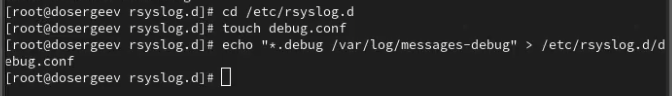

---
## Front matter
title: "Лабораторная работа № 7. Управление журналами событий в системе"
subtitle: "Отчёт"
author: "Сергеев Даниил Олегович"

## Generic otions
lang: ru-RU
toc-title: "Содержание"

## Bibliography
bibliography: bib/cite.bib
csl: pandoc/csl/gost-r-7-0-5-2008-numeric.csl

## Pdf output format
toc: true # Table of contents
toc-depth: 2
lof: true # List of figures
lot: true # List of tables
fontsize: 12pt
linestretch: 1.5
papersize: a4
documentclass: scrreprt
## I18n polyglossia
polyglossia-lang:
  name: russian
  options:
	- spelling=modern
	- babelshorthands=true
polyglossia-otherlangs:
  name: english
## I18n babel
babel-lang: russian
babel-otherlangs: english
## Fonts
mainfont: IBM Plex Serif
romanfont: IBM Plex Serif
sansfont: IBM Plex Sans
monofont: IBM Plex Mono
mathfont: STIX Two Math
mainfontoptions: Ligatures=Common,Ligatures=TeX,Scale=0.94
romanfontoptions: Ligatures=Common,Ligatures=TeX,Scale=0.94
sansfontoptions: Ligatures=Common,Ligatures=TeX,Scale=MatchLowercase,Scale=0.94
monofontoptions: Scale=MatchLowercase,Scale=0.94,FakeStretch=0.9
mathfontoptions:
## Biblatex
biblatex: true
biblio-style: "gost-numeric"
biblatexoptions:
  - parentracker=true
  - backend=biber
  - hyperref=auto
  - language=auto
  - autolang=other*
  - citestyle=gost-numeric
## Pandoc-crossref LaTeX customization
figureTitle: "Рис."
tableTitle: "Таблица"
listingTitle: "Листинг"
lofTitle: "Список иллюстраций"
lotTitle: "Список таблиц"
lolTitle: "Листинги"
## Misc options
indent: true
header-includes:
  - \usepackage{indentfirst}
  - \usepackage{float} # keep figures where there are in the text
  - \floatplacement{figure}{H} # keep figures where there are in the text
---

# Цель работы

Получить навыки работы с журналами мониторинга различных событий в системе. [@tuis]

# Задание

- Продемонстрируйте навыки работы с журналом мониторинга событий в реальном времени.
- Продемонстрируйте навыки создания и настройки отдельного файла конфигурации мониторинга отслеживания событий веб-службы.
- Продемонстрируйте навыки работы с journalctl.
- Продемонстрируйте навыки работы с journald.

# Ход выполнения лабораторной работы

## Мониторинг журнала системных событий в реальном времени

Откроем три вкладки терминала и в каждом из них войдем под учетную запись root. На втором из них запустим мониторинг сисемных событий в реальном времени (tail -f /var/log/messages), а на третьем вернемся к своей стандартной учетной записи и попробуем снова получить полномочия администратора (Предварительно выйдем из нее, нажав сочетание Ctrl+d). На этот раз специально введем неправильный пароль, чтобы сообщение об ошибке передалось в лог системных событий. Чтобы зафиксировать сообщение "hello" пропишем команду logger hello. Оно отобразиться в выводе второго терминала.

{#fig:001 width=90%}

Во второй вкладке терминала с мониторингом остановим вывод логов в реальном времени (Ctrl+c) и выведем последние 20 строк файла сообщений безопасности командой tail -n 20 /var/log/secure

{#fig:002 width=90%}

## Изменение правил rsyslog.conf

В первой вкладке терминала установим Apache (пакет httpd). После окончания процесса установки запустим службу командами systemctl start httpd и systemctl enable httpd

{#fig:003 width=90%}

Во второй вкладке терминала посмотрим журнал сообщений об ошибках веб-службы. Закроем его сочетанием Ctrl+c.

{#fig:004 width=90%}

В третьем терминале перейдем в каталог /etc/httpd/conf и отредактируем конфиг службы httpd.conf, добавив в конце строку ErrorLog syslog:local1.

{#fig:005 width=90%}

Теперь перейдем в каталог /etc/rsyslog.d и создадим файл мониторинга событий веб-службы.

{#fig:006 width=90%}

Пропишем в нем строку, которая позволит нам отправлять все сообщения, получаемые для local1, в файл /var/log/httpd-error.log

{#fig:007 width=90%}

Перейдем обратно в первый терминал и перезагрузим rsyslogd и httpd:

- systemctl restart rsyslog.service
- systemctl restart httpd

В третьей вкладке терминала создадим отдельный файл конфигурации для мониторинга отладочной информации.

{#fig:008 width=90%}

Во втором терминале запустим мониторинг файла /var/log/messages-debug в реальном времени, а на третьей вкладке отправим пробное сообщение с помощью команды logger:

- logger -p daemon.debug "Daemon Debug Message"

{#fig:009 width=90%}

## Использование journalctl

Проведем ряд операций journalctl. А именно:

- Посмотрим содержимое журнала с событиями с момента последнего запуска системы: journalctl

{#fig:010 width=90%}

- Посмотрим содержимое журнала без использования пейджера: journalctl --no-pager

{#fig:011 width=90%}

- Включим режим просмотра в реальном времени: journalctl -f

{#fig:012 width=90%}

- Просмотрим события для UID0: journalctl _UID=0

{#fig:013 width=90%}

- Отобразим последние 20 строк журнала: journalctl -n 20

{#fig:014 width=90%}

- Просмотрим только сообщения об ошибках: journalctl -p err

{#fig:015 width=90%}

- Отфильтруем вывод журнала по точному времени: journalctl --since "2025-10-18 18:28:00"

{#fig:016 width=90%}

- Отфильтруем вывод журнала по относительному времени с выводом сообщений с ошибкой приоритета: journalctl --since yesterday -p err

{#fig:017 width=90%}

- Выведем детальную информацию: journalctl -o verbose

{#fig:018 width=90%}

- Просмотрим дополнительную информацию о службе, напрмер о sshd: journalctl _SYSTEMD_UNIT=sshd.service

{#fig:019 width=90%}

## Постоянный журнал journald

Запустим терминал и получим полномочия администратора. Создадим каталог для хранения записей журнала и настроим права доступа так, чтобы journald смог записывать информацию в журнал /var/log/journal. Для принятия изменений используем команду killall -USR1 systemd-journald

{#fig:020 width=90%}

Журнал systemd теперь стал постоянным. Посмотрим сообщения журнала с момента загрузки: journalctl -b.

{#fig:021 width=90%}

# Ответы на контрольные вопросы

1. Какой файл используется для настройки rsyslogd?

- /etc/rsyslog.conf

2. В каком файле журнала rsyslogd содержатся сообщения, связанные с аутентификацией?

- /var/log/secure

3. Если вы ничего не настроите, то сколько времени потребуется для ротации файлов журналов?

- По умолчанию в дистрибутиве Rocky Linux установлена утилита logrotate, которая автоматически ротирует журналы. Чтобы узнать период ротации, можно посмотреть файл /etc/logrotate.conf

{#fig:022 width=90%}

- Для ротации файлов журналов потребуется одна неделя (weekly)

4. Какую строку следует добавить в конфигурацию для записи всех сообщений с приоритетом info в файл /var/log/messages.info?

- "*.info /var/log/messages.info"

5. Какая команда позволяет вам видеть сообщения журнала в режиме реального времени?

- tail -f \<Журнал\>

6. Какая команда позволяет вам видеть все сообщения журнала, которые были написаны для PID 1 между 9:00 и 15:00?

- journalctl _PID=1 --since="09:00" --until "15:00"

7. Какая команда позволяет вам видеть сообщения journald после последней перезагрузки системы?

- journalctl -b(--boot)

8. Какая процедура позволяет сделать журнал journald постоянным?

- Создать директорию для хранения журналов: mkdir -p /var/log/journal

- Настроить права директории: chown root:systemd-journal /var/log/journal; chmod 2775 /var/log/journal.

- Перезапустить систему или службу: reboot или killall -USR1 systemd-journald

# Вывод

В результате выполнения лабораторной работы я получил навыки работы с утилитой journalctl и мониторинга событий в системе Linux.

# Список литературы{.unnumbered}

::: {#refs}
:::
