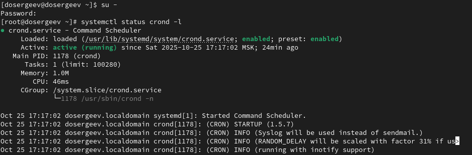
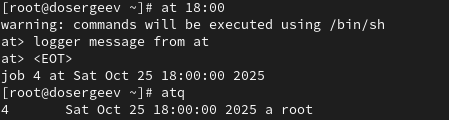

---
## Front matter
lang: ru-RU
title: Лабораторная работа № 7
subtitle: Управление журналами событий в системе
author:
  - Сергеев Д. О.
institute:
  - Российский университет дружбы народов, Москва, Россия
date: 18 октября 2025

## i18n babel
babel-lang: russian
babel-otherlangs: english

## Formatting pdf
toc: false
toc-title: Содержание
slide_level: 2
aspectratio: 169
section-titles: true
theme: metropolis
header-includes:
 - \metroset{progressbar=frametitle,sectionpage=progressbar,numbering=fraction}
---

# Информация

## Докладчик

:::::::::::::: {.columns align=center}
::: {.column width="70%"}

  * Сергеев Даниил Олегович
  * Студент
  * Направление: Прикладная информатика
  * Российский университет дружбы народов
  * [1132246837@pfur.ru](mailto:1132246837@pfur.ru)

:::
::::::::::::::

# Цель работы

Получить навыки работы с журналами мониторинга различных событий в системе.

# Задание

- Продемонстрируйте навыки работы с журналом мониторинга событий в реальном времени.
- Продемонстрируйте навыки создания и настройки отдельного файла конфигурации мониторинга отслеживания событий веб-службы.
- Продемонстрируйте навыки работы с journalctl.
- Продемонстрируйте навыки работы с journald.

# Ход выполнения лабораторной работы

# Мониторинг журнала системных событий в реальном времени

## Мониторинг журнала системных событий в реальном времени

:::::::::::::: {.columns align=center}
::: {.column width="40%"}

- tail -f /var/log/messages
- logger hello

:::
::: {.column width="60%"}

{#fig:001 width=100%}

:::
::::::::::::::

## Мониторинг журнала системных событий в реальном времени

- tail -n 20 /var/log/secure

{#fig:002 width=70%}

# Изменение правил rsyslog.conf

## Изменение правил rsyslog.conf

В первой вкладке терминала установим Apache (пакет httpd). После окончания процесса установки запустим службу командами systemctl start httpd и systemctl enable httpd

{#fig:003 width=90%}

## Изменение правил rsyslog.conf

{#fig:004 width=90%}

## Изменение правил rsyslog.conf

:::::::::::::: {.columns align=center}
::: {.column width="40%"}

- ErrorLog syslog:local1.

:::
::: {.column width="60%"}

{#fig:005 width=100%}

:::
::::::::::::::

## Изменение правил rsyslog.conf

Теперь перейдем в каталог /etc/rsyslog.d и создадим файл мониторинга событий веб-службы.

{#fig:006 width=90%}

## Изменение правил rsyslog.conf

Пропишем в нем строку, которая позволит нам отправлять все сообщения, получаемые для local1, в файл /var/log/httpd-error.log

{#fig:007 width=90%}

## Изменение правил rsyslog.conf

Перейдем обратно в первый терминал и перезагрузим rsyslogd и httpd:

- systemctl restart rsyslog.service
- systemctl restart httpd

В третьей вкладке терминала создадим отдельный файл конфигурации для мониторинга отладочной информации.

{#fig:008 width=90%}

## Изменение правил rsyslog.conf

- logger -p daemon.debug "Daemon Debug Message"

{#fig:009 width=90%}

# Использование journalctl

## Использование journalctl

- Посмотрим содержимое журнала с событиями с момента последнего запуска системы: journalctl

{#fig:010 width=90%}

## Использование journalctl

- Посмотрим содержимое журнала без использования пейджера: journalctl --no-pager

{#fig:011 width=90%}

## Использование journalctl

- Включим режим просмотра в реальном времени: journalctl -f

{#fig:012 width=90%}

## Использование journalctl

- Просмотрим события для UID0: journalctl _UID=0

{#fig:013 width=90%}

## Использование journalctl

- Отобразим последние 20 строк журнала: journalctl -n 20

{#fig:014 width=90%}

## Использование journalctl

- Просмотрим только сообщения об ошибках: journalctl -p err

{#fig:015 width=90%}

## Использование journalctl

- Отфильтруем вывод журнала по точному времени: journalctl --since "2025-10-18 18:28:00"

{#fig:016 width=90%}

## Использование journalctl

- Отфильтруем вывод журнала по относительному времени с выводом сообщений с ошибкой приоритета: journalctl --since yesterday -p err

{#fig:017 width=90%}

## Использование journalctl

- Выведем детальную информацию: journalctl -o verbose

{#fig:018 width=90%}

## Использование journalctl

- Просмотрим дополнительную информацию о службе, напрмер о sshd: journalctl _SYSTEMD_UNIT=sshd.service

{#fig:019 width=90%}

# Постоянный журнал journald

## Постоянный журнал journald

{#fig:020 width=90%}

## Постоянный журнал journald

Журнал systemd теперь стал постоянным. Посмотрим сообщения журнала с момента загрузки: journalctl -b.

{#fig:021 width=90%}

# Ответы на контрольные вопросы

## Ответы на контрольные вопросы

1. Какой файл используется для настройки rsyslogd?

- /etc/rsyslog.conf

2. В каком файле журнала rsyslogd содержатся сообщения, связанные с аутентификацией?

- /var/log/secure

## Ответы на контрольные вопросы

3. Если вы ничего не настроите, то сколько времени потребуется для ротации файлов журналов?

- По умолчанию в дистрибутиве Rocky Linux установлена утилита logrotate, которая автоматически ротирует журналы. Чтобы узнать период ротации, можно посмотреть файл /etc/logrotate.conf

## Если вы ничего не настроите, то сколько времени потребуется для ротации файлов журналов?

:::::::::::::: {.columns align=center}
::: {.column width="40%"}

- Для ротации файлов журналов потребуется одна неделя (weekly)

:::
::: {.column width="60%"}

{#fig:022 width=100%}

:::
::::::::::::::

## Ответы на контрольные вопросы

4. Какую строку следует добавить в конфигурацию для записи всех сообщений с приоритетом info в файл /var/log/messages.info?

- "*.info /var/log/messages.info"

5. Какая команда позволяет вам видеть сообщения журнала в режиме реального времени?

- tail -f \<Журнал\>

6. Какая команда позволяет вам видеть все сообщения журнала, которые были написаны для PID 1 между 9:00 и 15:00?

- journalctl _PID=1 --since="09:00" --until "15:00"

## Ответы на контрольные вопросы

7. Какая команда позволяет вам видеть сообщения journald после последней перезагрузки системы?

- journalctl -b(--boot)

8. Какая процедура позволяет сделать журнал journald постоянным?

- Создать директорию для хранения журналов: mkdir -p /var/log/journal

- Настроить права директории: chown root:systemd-journal /var/log/journal; chmod 2775 /var/log/journal.

- Перезапустить систему или службу: reboot или killall -USR1 systemd-journald

# Вывод

В результате выполнения лабораторной работы я получил навыки работы с утилитой journalctl и мониторинга событий в системе Linux.
