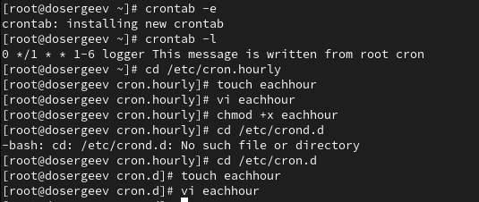

---
## Front matter
lang: ru-RU
title: Лабораторная работа № 8
subtitle: Планировщики событий
author:
  - Сергеев Д. О.
institute:
  - Российский университет дружбы народов, Москва, Россия
date: 25 октября 2025

## i18n babel
babel-lang: russian
babel-otherlangs: english

## Formatting pdf
toc: false
toc-title: Содержание
slide_level: 2
aspectratio: 169
section-titles: true
theme: metropolis
header-includes:
 - \metroset{progressbar=frametitle,sectionpage=progressbar,numbering=fraction}
---

# Информация

## Докладчик

:::::::::::::: {.columns align=center}
::: {.column width="70%"}

  * Сергеев Даниил Олегович
  * Студент
  * Направление: Прикладная информатика
  * Российский университет дружбы народов
  * [1132246837@pfur.ru](mailto:1132246837@pfur.ru)

:::
::::::::::::::

# Цель работы

Получение навыков работы с планировщиками событий cron и at.

# Задание

- Выполните задания по планированию задач с помощью crond
- Выполните задания по планированию задач с помощью atd

# Ход выполнения лабораторной работы

# Планирование задач с помощью cron

## Планирование задач с помощью cron

{#fig:001 width=90%}

## Планирование задач с помощью cron

:::::::::::::: {.columns align=center}
::: {.column width="50%"}

- Текущая оболочка: SHELL=/bin/bash;
- Путь до оболочки: PATH=/sbin:/bin...;
- Адрес, куда будут отправлены сообщения cron: MAILTO=root;
- Пример синтаксиса для планирования задач.

:::
::: {.column width="50%"}

{#fig:002 width=90%}

:::
::::::::::::::

## Планирование задач с помощью cron

- \*/1 \* \* \* \* logger This message is written from root cron

{#fig:003 width=90%}

## Планирование задач с помощью cron

Изменим запись в crontab на следующую:

1. crontab -e:
- 0 \*/1 \* \* 1-6 logger This message is written from root cron.

2. /etc/cron.hourly:
- #!/bin/sh
- logger This message is written at $(date)

3. /etc/cron.d/eachhour:
- 11 \* \* \* \* root logger This message is written from /etc/cron.d

## Планирование задач с помощью cron

{#fig:004 width=90%}

## Планирование задач с помощью cron

Через 2-3 часа просмотрим журнал системных событий:

{#fig:005 width=90%}

# Планирование заданий с помощью at

## Планирование заданий с помощью at

{#fig:006 width=90%}

## Планирование заданий с помощью at

{#fig:007 width=90%}

## Планирование заданий с помощью at

{#fig:008 width=90%}

# Ответы на контрольные вопросы

1. Как настроить задание cron, чтобы оно выполнялось раз в 2 недели?

- 0 0 * * 1 \[ $(expr $(date +\\%W) \\% 2) -eq 0 \] && cmd \[args...\]

2. Как настроить задание cron, чтобы оно выполнялось 1-го и 15-го числа каждого месяца в 2 часа ночи?

- 0 2 1,15 * * cmd \[args...\]

3. Как настроить задание cron, чтобы оно выполнялось каждые 2 минуты каждый день?

- */2 * * * * cmd \[args...\]

## Ответы на контрольные вопросы

4. Как настроить задание cron, чтобы оно выполнялось 19 сентября ежегодно?

- 0 0 19 9 * cmd \[args...\]

5. Как настроить задание cron, чтобы оно выполнялось каждый четверг сентября ежегодно?

- 0 0 * 9 4 cmd \[args...\]

## Ответы на контрольные вопросы

6. Какая команда позволяет вам назначить задание cron для пользователя alice? Приведите подтверждающий пример.

- crontab -u alice -e

{#fig:009 width=90%}

## Ответы на контрольные вопросы

7. Как указать, что пользователю bob никогда не разрешено назначать задания через cron? Приведите подтверждающий пример.

- Необходимо добавить пользователя в список /etc/cron.deny.

{#fig:010 width=90%}

## Ответы на контрольные вопросы

8. Вам нужно убедиться, что задание выполняется каждый день, даже если сервер во время выполнения временно недоступен. Как это сделать?

- Можно добавить задание в список служб anacron в файле /etc/anacrontab.

9. Какая команда позволяет узнать, запланированы ли какие-либо задания на выполнение планировщиком atd?

- Позволяет команда atq

# Вывод

В результате выполнения лабораторной работы я получил навыки по планированию одноразовых и регулярных системных заданий с использованием планировщиков cron и at
