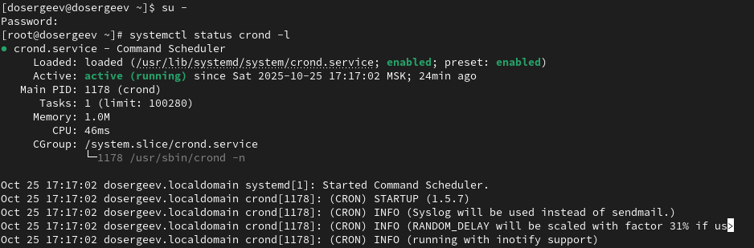
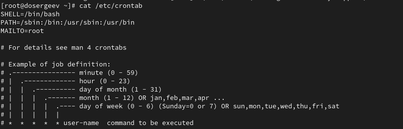
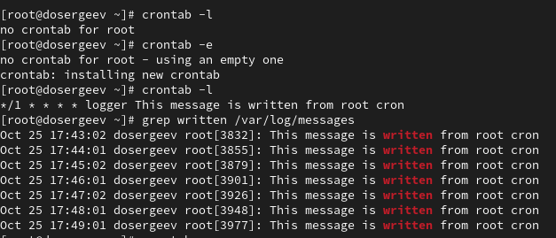
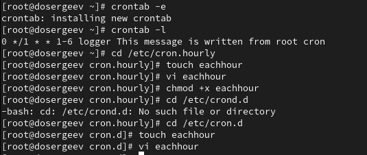
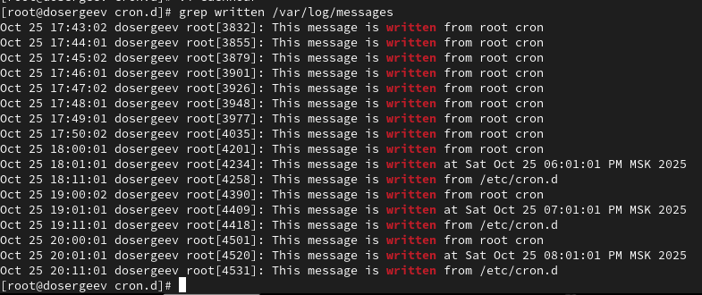
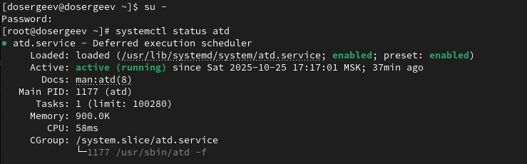
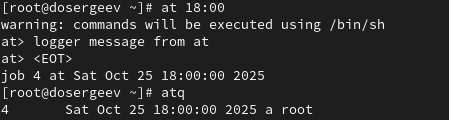
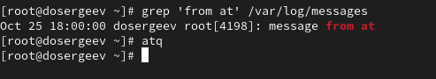
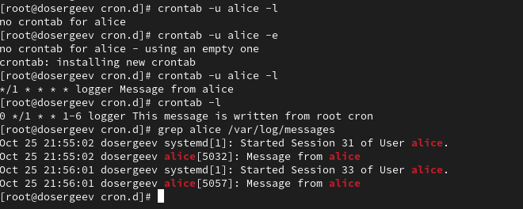
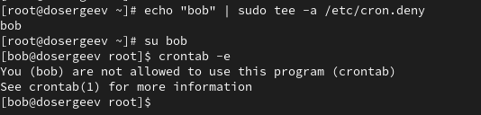

---
## Front matter
title: "Лабораторная работа № 8. Планировщики событий"
subtitle: "Отчёт"
author: "Сергеев Даниил Олегович"

## Generic otions
lang: ru-RU
toc-title: "Содержание"

## Bibliography
bibliography: bib/cite.bib
csl: pandoc/csl/gost-r-7-0-5-2008-numeric.csl

## Pdf output format
toc: true # Table of contents
toc-depth: 2
lof: true # List of figures
lot: true # List of tables
fontsize: 12pt
linestretch: 1.5
papersize: a4
documentclass: scrreprt
## I18n polyglossia
polyglossia-lang:
  name: russian
  options:
	- spelling=modern
	- babelshorthands=true
polyglossia-otherlangs:
  name: english
## I18n babel
babel-lang: russian
babel-otherlangs: english
## Fonts
mainfont: IBM Plex Serif
romanfont: IBM Plex Serif
sansfont: IBM Plex Sans
monofont: IBM Plex Mono
mathfont: STIX Two Math
mainfontoptions: Ligatures=Common,Ligatures=TeX,Scale=0.94
romanfontoptions: Ligatures=Common,Ligatures=TeX,Scale=0.94
sansfontoptions: Ligatures=Common,Ligatures=TeX,Scale=MatchLowercase,Scale=0.94
monofontoptions: Scale=MatchLowercase,Scale=0.94,FakeStretch=0.9
mathfontoptions:
## Biblatex
biblatex: true
biblio-style: "gost-numeric"
biblatexoptions:
  - parentracker=true
  - backend=biber
  - hyperref=auto
  - language=auto
  - autolang=other*
  - citestyle=gost-numeric
## Pandoc-crossref LaTeX customization
figureTitle: "Рис."
tableTitle: "Таблица"
listingTitle: "Листинг"
lofTitle: "Список иллюстраций"
lotTitle: "Список таблиц"
lolTitle: "Листинги"
## Misc options
indent: true
header-includes:
  - \usepackage{indentfirst}
  - \usepackage{float} # keep figures where there are in the text
  - \floatplacement{figure}{H} # keep figures where there are in the text
---

# Цель работы

Получение навыков работы с планировщиками событий cron и at. [@tuis]

# Задание

- Выполните задания по планированию задач с помощью crond
- Выполните задания по планированию задач с помощью atd

# Ход выполнения лабораторной работы

## Планирование задач с помощью cron

Запустим терминал и получим права администратора (su -). Проверим, запущен ли демон crond.

{#fig:001 width=90%}

Посмотрим содержимое файла конфигурации crontab: cat /etc/crontab. Внутри указаны сведения:

- Текущая оболочка: SHELL=/bin/bash;
- Путь до оболочки: PATH=/sbin:/bin...;
- Адрес, куда будут отправлены сообщения cron: MAILTO=root;
- Пример синтаксиса для планирования задач.

{#fig:002 width=90%}

Посмотрим список заданий в расписании с помощью crontab -l. Так как мы не устанавливали никаких задач, выводится сообщение: no crontab for root. Откроем файл расписания на редактирование и введем следующую строку:

- \*/1 \* \* \* \* logger This message is written from root cron

Она будет запускать команду logger с заданным сообщением каждую минуту с момента сохранения задания. Синтаксис выглядит данным образом:

: Синтаксис задач crontab {#tbl:std-dir}

| Минута (0-59) | Час (0-23) | День месяца (1-31) | Месяц (1-12) | День недели (1-7(0)) | Пользователь(если не для всей системы) | Команда и её аргументы |
|---------------|------------|--------------------|--------------|----------------------|----------------------------------------|------------------------|
|\* (/шаг)      |\* (/шаг)   |\* (/шаг)           |\* (/шаг)     |\* (/шаг)             |user                                    | cmd  \[arg...\]        |

Ещё раз просмотрим список заданий в расписании (crontab -l): теперь там выводится задача, которую мы описали в файле расписания. Подождем несколько минут и проверим, вывелись ли сообщения в журнал системных событий.

{#fig:003 width=90%}

Изменим запись в crontab на следующую:

-  0 \*/1 \* \* 1-6 logger This message is written from root cron.

После изменения, команда logger будет запускаться с понедельника по пятницу каждый час после нуля минут. Например: 12:00, 13:00 и так далее.

Перейдем в каталог /etc/cron.hourly и создадим в нём файл сценария eachhour. Откроем его для редактирования и запишем в него:

- #!/bin/sh
- logger This message is written at $(date)

После чего сделаем eachhour исполняемым: chmod +x eachhour. Теперь перейдем в /etc/cron.d и создадим в нём файл с расписанием eachhour. Также запишем в него строку:

- 11 \* \* \* \* root logger This message is written from /etc/cron.d

Эта команда будет отправлять сообщение в /var/log/messages. ежедневно каждый час, ровно после 11 минут по системному времени. Например: 12:11, 13:11, 14:11 и так далее.

{#fig:004 width=90%}

Через 2-3 часа просмотрим журнал системных событий.

{#fig:005 width=90%}

Из него мы можем увидеть, что eachhour успешно запускается каждый час после нуля минут из каталога cron.hourly и из crontab и в 11 минут из /etc/cron.d.

## Планирование заданий с помощью at

Запустим терминал через учетную запись root. Проверим что служба atd загружена и запущена.

{#fig:006 width=90%}

Так как она работает, перейдем к следующему пункту. Зададим выполнение команды logger на время 18:00 и убедимся, что она действительно запланирована с помощью команды atq.

{#fig:007 width=90%}

Дождемся указанного времени и проверим логи.

{#fig:008 width=90%}

Сообщение появилось ровно в 18:00 - значит команда выполнилась успешно.

# Ответы на контрольные вопросы

1. Как настроить задание cron, чтобы оно выполнялось раз в 2 недели?

- 0 0 * * 1 \[ $(expr $(date +\\%W) \\% 2) -eq 0 \] && cmd \[args...\]

2. Как настроить задание cron, чтобы оно выполнялось 1-го и 15-го числа каждого месяца в 2 часа ночи?

- 0 2 1,15 * * cmd \[args...\]

3. Как настроить задание cron, чтобы оно выполнялось каждые 2 минуты каждый день?

- */2 * * * * cmd \[args...\]

4. Как настроить задание cron, чтобы оно выполнялось 19 сентября ежегодно?

- 0 0 19 9 * cmd \[args...\]

5. Как настроить задание cron, чтобы оно выполнялось каждый четверг сентября ежегодно?

- 0 0 * 9 4 cmd \[args...\]

6. Какая команда позволяет вам назначить задание cron для пользователя alice? Приведите подтверждающий пример.

- crontab -u alice -e

{#fig:009 width=90%}

7. Как указать, что пользователю bob никогда не разрешено назначать задания через cron? Приведите подтверждающий пример.

- Необходимо добавить пользователя в список /etc/cron.deny.

{#fig:010 width=90%}

8. Вам нужно убедиться, что задание выполняется каждый день, даже если сервер во время выполнения временно недоступен. Как это сделать?

- Можно добавить задание в список служб anacron в файле /etc/anacrontab.

9. Какая команда позволяет узнать, запланированы ли какие-либо задания на выполнение планировщиком atd?

- Позволяет команда atq

# Вывод

Получение навыков работы с планировщиками событий cron и at.

В результате выполнения лабораторной работы я получил навыки по планированию одноразовых и регулярных системных заданий с использованием планировщиков cron и at

# Список литературы{.unnumbered}

::: {#refs}
:::
