---
## Front matter
lang: ru-RU
title: Лабораторная работа № 9
subtitle: Управление SELinux
author:
  - Сергеев Д. О.
institute:
  - Российский университет дружбы народов, Москва, Россия
date: 01 ноября 2025

## i18n babel
babel-lang: russian
babel-otherlangs: english

## Formatting pdf
toc: false
toc-title: Содержание
slide_level: 2
aspectratio: 169
section-titles: true
theme: metropolis
header-includes:
 - \metroset{progressbar=frametitle,sectionpage=progressbar,numbering=fraction}
---

# Информация

## Докладчик

:::::::::::::: {.columns align=center}
::: {.column width="70%"}

  * Сергеев Даниил Олегович
  * Студент
  * Направление: Прикладная информатика
  * Российский университет дружбы народов
  * [1132246837@pfur.ru](mailto:1132246837@pfur.ru)

:::
::::::::::::::

# Цель работы

Получить навыки работы с контекстом безопасности и политиками SELinux.

# Задание

- Продемонстрировать навыки по управлению режимами SELinux
- Продемонстрировать навыки по восстановлению контекста безопасности SELinux
- Настроить контекст безопасности для нестандартного расположения файлов веб-службы
- Продемонстрировать навыки работы с переключателями SELinux

# Ход выполнения лабораторной работы

# Управление режимами SELinux

## Управление режимами SELinux

{#fig:001 width=90%}

## Управление режимами SELinux

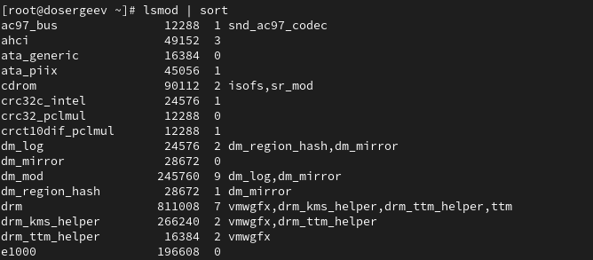{#fig:002 width=90%}

## Управление режимами SELinux

{#fig:003 width=90%}

## Управление режимами SELinux

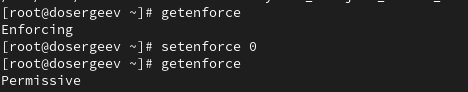{#fig:004 width=90%}

## Управление режимами SELinux

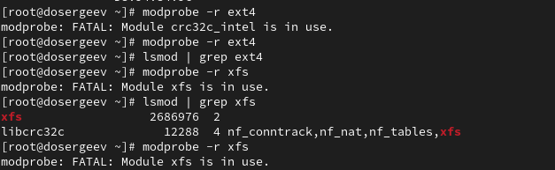{#fig:005 width=90%}

## Управление режимами SELinux

{#fig:006 width=90%}

## Управление режимами SELinux

Снова откроем файл /etc/sysconfig/selinux с помощью редактора и установим режим SELINUX=enforcing вручную. Перезагрузим систему.

Во время загрузки выводится предупреждающее сообщение о восстановлении меток SElinux.

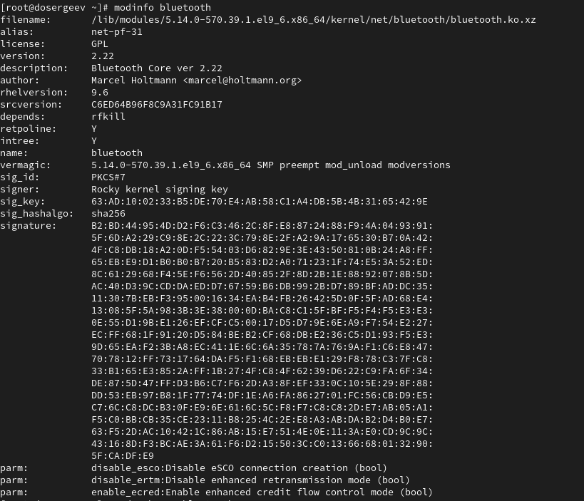{#fig:007 width=90%}

# Использование restorecon для восстановления контекста безопасности

## Использование restorecon для восстановления контекста безопасности

{#fig:008 width=90%}

## Использование restorecon для восстановления контекста безопасности

{#fig:009 width=90%}

## Использование restorecon для восстановления контекста безопасности
 
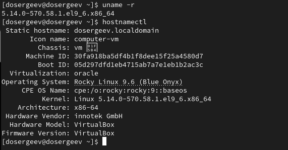{#fig:010 width=90%}

# Настройка контекста безопасности для нестандартного расположения файлов веб-сервера

## Настройка контекста безопасности для нестандартного расположения файлов веб-сервера

{#fig:011 width=90%}

## Настройка контекста безопасности для нестандартного расположения файлов веб-сервера

Создадим новое хранилище для файлов веб-сервера: mkdir /web; Также создадим индекс (в новом каталоге): touch index.html.

В индекс запишем сообщение - Welcome to my web-server.

Откроем файл /etc/httpd/conf/httpd.conf на редактирование. Закомментируем строку DocumentRoot и тег (раздел) Directory, после чего добавим те же строки, заменив пути /var/www/html и /var/www на /web.

## Настройка контекста безопасности для нестандартного расположения файлов веб-сервера

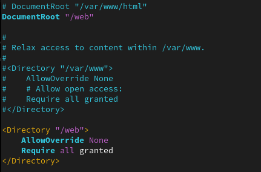{#fig:012 width=90%}

## Настройка контекста безопасности для нестандартного расположения файлов веб-сервера

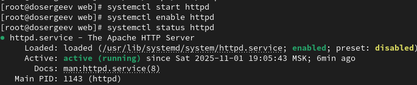{#fig:013 width=90%}

## Настройка контекста безопасности для нестандартного расположения файлов веб-сервера

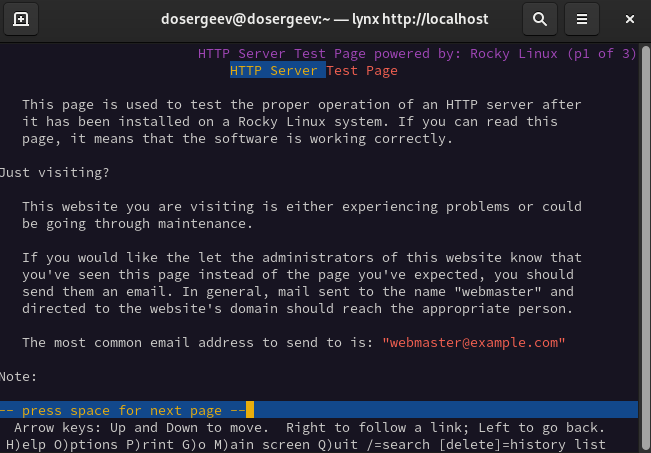{#fig:014 width=90%}

## Настройка контекста безопасности для нестандартного расположения файлов веб-сервера

В терминале с полномочиями администратора установим новую метку контекста к /web и восстановим контекст безопасности.

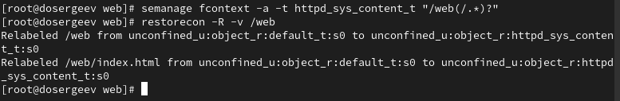{#fig:015 width=90%}

## Настройка контекста безопасности для нестандартного расположения файлов веб-сервера

{#fig:016 width=90%}

# Работа с переключателями SELinux

## Работа с переключателями SELinux

{#fig:017 width=90%}

## Работа с переключателями SELinux

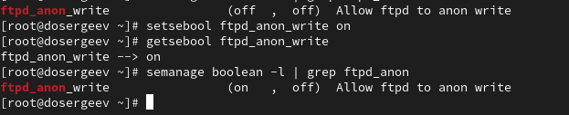{#fig:018 width=90%}

## Работа с переключателями SELinux

{#fig:019 width=90%}

Теперь переключатель имеет состояние (on , on). Это значит, что теперь он включен как постоянная настройка и как настройка времени выполнения.

# Ответы на контрольные вопросы

## Ответы на контрольные вопросы

1. Вы хотите временно поставить SELinux в разрешающем режиме. Какую команду вы используете?

- setenforce 0

2. Вам нужен список всех доступных переключателей SELinux. Какую команду вы используете?

- getsebool -a

3. Каково имя пакета, который требуется установить для получения легко читаемых сообщений журнала SELinux в журнале аудита?

- setroubleshoot

## Ответы на контрольные вопросы

4. Какие команды вам нужно выполнить, чтобы применить тип контекста httpd_sys_content_t к каталогу /web?

- semanage fcontext-a-t httpd_sys_content_t "/web(/.*)?" - добавляет правило в политику
- restorecon -R -v /web - обновляет политику

5. Какой файл вам нужно изменить, если вы хотите полностью отключить SELinux?

- /etc/selinux/config или /etc/sysconfig/selinux

6. Где SELinux регистрирует все свои сообщения?

- /var/log/audit/audit.log

## Ответы на контрольные вопросы

7. Вы не знаете, какие типы контекстов доступны для службы ftp. Какая команда позволяет получить более конкретную информацию?

- seinfo -t | grep ftp

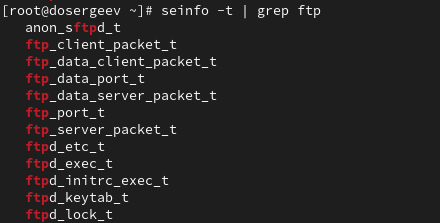{#fig:020 width=90%}

## Ответы на контрольные вопросы

8. Ваш сервис работает не так, как ожидалось, и вы хотите узнать, связано ли это с SELinux или чем-то ещё. Какой самый простой способ узнать?

- Можно перевести SELinux в разрешающий режим (setenforce 0). Таким образом, если проблема связана с SELinux, то сервис перестанет блокироваться политикой, возобновив свою работу. Для дальнейшего анализа можно просмотреть журналы, ведь в режиме permissive SELinux все ещё отправляет логи.

# Вывод

В результате выполнения лабораторной работы я получил навыки работы с контекстом безопасности и политиками SELinux, научился настраивать контекст безопасности для нестандартного расположения файлов веб сервера и переключатели для служб на примере ftp.
