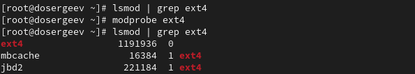
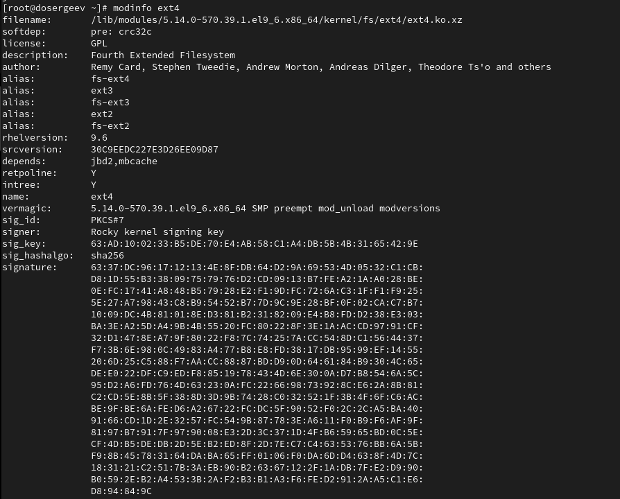
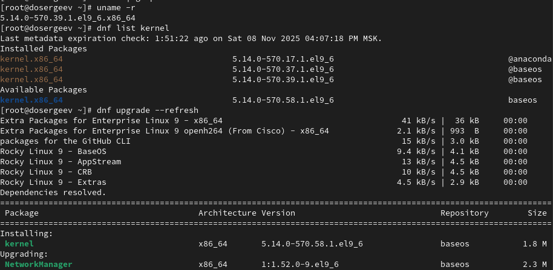
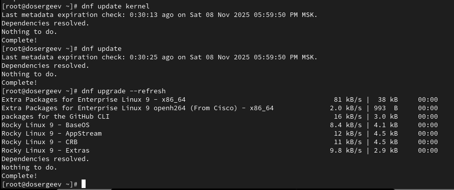

---
## Front matter
title: "Лабораторная работа № 10. Основы работы с модулями ядра операционной системы"
subtitle: "Отчёт"
author: "Сергеев Даниил Олегович"

## Generic otions
lang: ru-RU
toc-title: "Содержание"

## Bibliography
bibliography: bib/cite.bib
csl: pandoc/csl/gost-r-7-0-5-2008-numeric.csl

## Pdf output format
toc: true # Table of contents
toc-depth: 2
lof: true # List of figures
lot: true # List of tables
fontsize: 12pt
linestretch: 1.5
papersize: a4
documentclass: scrreprt
## I18n polyglossia
polyglossia-lang:
  name: russian
  options:
	- spelling=modern
	- babelshorthands=true
polyglossia-otherlangs:
  name: english
## I18n babel
babel-lang: russian
babel-otherlangs: english
## Fonts
mainfont: IBM Plex Serif
romanfont: IBM Plex Serif
sansfont: IBM Plex Sans
monofont: IBM Plex Mono
mathfont: STIX Two Math
mainfontoptions: Ligatures=Common,Ligatures=TeX,Scale=0.94
romanfontoptions: Ligatures=Common,Ligatures=TeX,Scale=0.94
sansfontoptions: Ligatures=Common,Ligatures=TeX,Scale=MatchLowercase,Scale=0.94
monofontoptions: Scale=MatchLowercase,Scale=0.94,FakeStretch=0.9
mathfontoptions:
## Biblatex
biblatex: true
biblio-style: "gost-numeric"
biblatexoptions:
  - parentracker=true
  - backend=biber
  - hyperref=auto
  - language=auto
  - autolang=other*
  - citestyle=gost-numeric
## Pandoc-crossref LaTeX customization
figureTitle: "Рис."
tableTitle: "Таблица"
listingTitle: "Листинг"
lofTitle: "Список иллюстраций"
lotTitle: "Список таблиц"
lolTitle: "Листинги"
## Misc options
indent: true
header-includes:
  - \usepackage{indentfirst}
  - \usepackage{float} # keep figures where there are in the text
  - \floatplacement{figure}{H} # keep figures where there are in the text
---

# Цель работы

Получить навыки работы с утилитами управления модулями ядра операционной системы. [@tuis]

# Задание

- Продемонстрируйте навыки работы по управлению модулями ядра.
- Продемонстрируйте навыки работы по загрузке модулей ядра с параметрами.

# Ход выполнения лабораторной работы

## Управление модулями ядра из командной строки

Запустим терминал и зайдем в учетную запись администратора (su -). Посмотрим, какие устройства имеются в системе на данный момент и какие модули ядра с ними связаны.
```bash
lspci -k
```

{#fig:001 width=90%}

Рассмотрим полученную информацию. 

Общая форма записи устройства:

- Шаблон: адрес  класс:  производитель [вендор:устройство] название \[доп_инфо\] (ревизия)
- Пример: 00:01.0 ISA bridge: Intel Corporation 82371SB PIIX3 ISA [Natoma/Triton II]
    1. 00:01.0 - Номер шины PCI: 00; Номер устройства: 01; Номер функции: 0;
    2. ISA bridge - мост для использования шин ISA;
    3. Intel Corporation - производитель Intel;
    4. 82371SB PIIX3 ISA - имя устройства;
    5. [Natoma/Triton II] - устройство входит в состав чипсета Natoma/Triton II;

Для модулей ядра, используемых устройством:

- Kernel driver in use - драйвер ядра, который используется в данный момент;
- Kernel modules - список всех модулей, которых использует данное устройство;

Теперь посмотрим, какие модули ядра загружены, для этого воспользуемся командой:
```bash
lsmod | sort
```

{#fig:002 width=90%}

Команда вывела список всех модулей, содержащий также размер модулей в памяти, количество используемых экземпляров модуля и зависимости от других модулей.

Проверим, загружен ли модуль ext4 и если нет, загрузим его и убедимся, что он загрузится:
```bash
lsmod | grep ext4
modprobe ext4
lsmod | grep ext4
```

{#fig:003 width=90%}

Модуль ext4 успешно загрузен. Проверим информацию о нем:
```bash
modinfo ext4
```

{#fig:004 width=90%}

Опишем выведенную командой информацию.

- filename - полный путь к сжатому файлу модуля ядра в формате .xz;
- softdep - мягкие зависимости;
- license - тип лицензии;
- description - краткое описание модуля;
- author - разработчик(и) модуля;
- alias - псевдонимы модуля (альтернативные имена);
- rheVersion - версия Red Hat Enterprise Linux, для которой собран модуль;
- srcversion - уникальный хеш исходного кода модуля;
- depends - жесткие зависимости;
- retpoline - преключатель о наличии защиты от уязвимости Spectre;
- intree - переключатель о том, является ли модуль частью основного дерева ядра Linux;
- vermagic - совместь версий ядра;
- sig_id - тип системы цифровой подписи;
- signer - владелец ключа подписи;
- sig_key - отпечаток ключа подписи;
- sig_hashalgo - алгоритм хеширования для подписи;
- signature - полная цифровая подпись модуля в hex-формате;

После загрузки модуля, попробуем его выгрузить:
```bash
modprobe -r ext4
```

Для отключения модуля потребовалось ввести команду второй раз.

Теперь попробуем выгрузить модуль ядра xfs:
```bash
modprobe -r xfs
```

Мы получили сообщение об ошибке, так как модуль ядра в данный момент используется.

{#fig:005 width=90%}

## Загрузка модулей ядра с параметрами

Посмотрим, загружен ли модуль bluetooth в системе, если нет, то загрузим его:
```bash
lsmod | grep bluetooth
modprobe bluetooth
```

После загрузки посмотрим список модулей ядра, отвечающих за работу с Bluetooth:
```bash
lsmod | grep bluetooth
```

{#fig:006 width=90%}

Теперь посмотрим информацию о модуле bluetooth:
```bash
modinfo bluetooth
```

{#fig:007 width=90%}

В отличие от ext4, у модуля bluetooth имеются параметры, а именно:

- disable_esco - Отключить создание соединений eSCO;
- disable_ertm - Отключить расширенный режим повторной передачи;
- enable_ecred - Включить расширенный режим управления потоком на основе кредитов;

Выгрузим модуль ядра bluetooth.
```bash
modprobe -r bluetooth
```

## Обновление ядра системы

В том же терминале с полномочиями администратора посмотрим версию ядра, используемую в операционной системе, а также выведем на экран список пакетов, относящихся к ядру операционной системы.
```bash
uname -r
dnf list kernel
```

Обновим пакеты системы:
```bash
dnf upgrade --refresh
```

{#fig:008 width=90%}

Ядро имеет версию 5.14.0-570.**39**.1.el9_6.x86_64

Обновим ядро операционной системы, а затем саму операционную систему:
```bash
dnf update kernel
dnf update
dnf upgrade --refresh
```

{#fig:009 width=90%}

Все пакеты и ядро уже обновлены, поэтому перегрузим систему. В моем случае новая версия ядра при загрузке выбралась автоматически, поэтому пропустим этап выбора ядра.

Посмотрим новую версию ядра.
```bash
uname -r
hostnamectl
```

{#fig:010 width=90%}

Теперь система имеет версию 5.14.0-570.**58**.1.el9_6.x86_64

# Ответы на контрольные вопросы

1. Какая команда показывает текущую версию ядра, которая используется на вашей системе?

- uname -r

2. Как можно посмотреть более подробную информацию о текущей версии ядра операционной системы?

- hostnamectl

3. Какая команда показывает список загруженных модулей ядра?

- lsmod

4. Какая команда позволяет вам определять параметры модуля ядра?

- modinfo \<модуль\>

5. Как выгрузить модуль ядра?

- modprobe -r \<модуль\> 
- или rmmod \<модуль\>

6. Что вы можете сделать, если получите сообщение об ошибке при попытке выгрузить модуль ядра?

- Проверить зависимости модуля, если они есть, то выгрузить их. После чего снова попытаться выгрузить модуль.

7. Как определить, какие параметры модуля ядра поддерживаются?

- modinfo \<модуль\> | grep parm

8. Как установить новую версию ядра?

- dnf upgrade --refresh - обновим систему
- dnf update kernel - обновим ядро на новую версию
- dnf update - проверим обновление ядра
- dnf upgrade --refresh - проверим обновление системы
- После выполнения данных команд необходимо перезапустить систему, чтобы выбрать новое ядро.

# Вывод

В результате выполнения лабораторной работы я узнал как проверять, какие модули и устройства загружены в систему, научился загружать и выгружать модули с параметрами и без и понял как корректно обновлять ядро системы.

# Список литературы{.unnumbered}

::: {#refs}
:::
