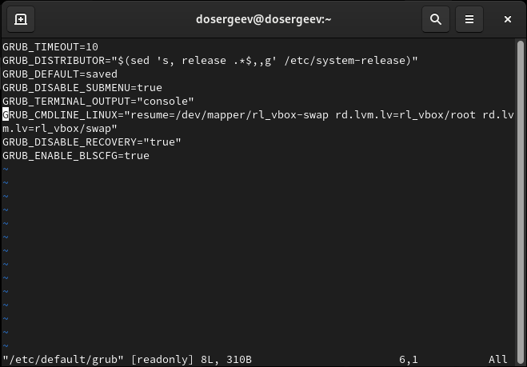
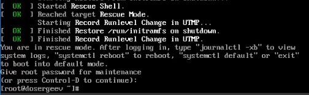
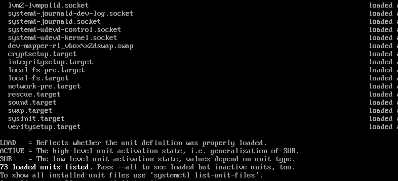
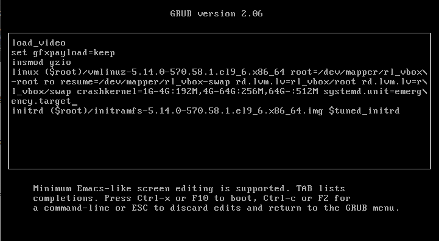

---
## Front matter
lang: ru-RU
title: Лабораторная работа № 11
subtitle: Управление загрузкой системы
author:
  - Сергеев Д. О.
institute:
  - Российский университет дружбы народов, Москва, Россия
date: 15 ноября 2025

## i18n babel
babel-lang: russian
babel-otherlangs: english

## Formatting pdf
toc: false
toc-title: Содержание
slide_level: 2
aspectratio: 169
section-titles: true
theme: metropolis
header-includes:
 - \metroset{progressbar=frametitle,sectionpage=progressbar,numbering=fraction}
---

# Информация

## Докладчик

:::::::::::::: {.columns align=center}
::: {.column width="70%"}

  * Сергеев Даниил Олегович
  * Студент
  * Направление: Прикладная информатика
  * Российский университет дружбы народов
  * [1132246837@pfur.ru](mailto:1132246837@pfur.ru)

:::
::::::::::::::

# Цель работы

Получить навыки работы с загрузчиком системы GRUB2.

# Задание

- Продемонстрируйте навыки по изменению параметров GRUB и записи изменений в файл конфигурации
- Продемонстрируйте навыки устранения неполадок при работе с GRUB
- Продемонстрируйте навыки работы с GRUB без использования root

# Ход выполнения лабораторной работы

# Модификация параметров GRUB2

## Модификация параметров GRUB2

:::::::::::::: {.columns align=center}
::: {.column width="50%"}

{#fig:001 width=100%}

:::
::: {.column width="50%"}

```GRUB_TIMEOUT=10```,

удалим значения ```rhgb``` и ```quiet``` в параметре ```GRUB_CMDLINE_LINUX```

После изменений закроем редактор и запишим изменения в GRUB2:
```bash
grub2-mkconfig -o /boot/grub2/grub.cfg
```

:::
::::::::::::::

## Модификация параметров GRUB2

Перезагрузим систему и убедимся, что мы можем выбрать версии ядра для загрузки.

{#fig:002 width=90%}

# Устранения неполадок

## Устранения неполадок

{#fig:003 width=90%}

## Устранения неполадок

{#fig:004 width=90%}

## Устранения неполадок

:::::::::::::: {.columns align=center}
::: {.column width="20%"}

```bash
systemctl list-units
```

Всего загруженно 73 файла модулей.

:::
::: {.column width="80%"}

{#fig:005 width=90%}

:::
::::::::::::::

## Устранения неполадок

```bash
systemctl show-environment
```

Команда выдает 4 различные переменные:

- /usr/local/sbin
- /usr/local/bin
- /usr/sbin
- /usr/bin

{#fig:006 width=90%}

## Устранения неполадок

Перезапустим систему:
```bash
systemctl reboot
```

{#fig:007 width=90%}

## Устранения неполадок

:::::::::::::: {.columns align=center}
::: {.column width="50%"}

```bash
systemctl list-units | tail -n 20
```

На этот раз было загружено 53 юнита.

Снова перезагрузим систему и перейдем к следующему заданию:
```bash
systemctl reboot
```

:::
::: {.column width="50%"}

{#fig:008 width=100%}

:::
::::::::::::::

# Сброс пароля root

## Сброс пароля root

{#fig:009 width=90%}

## Сброс пароля root

Получим доступ к системному образу для чтения и записи:
```bash
mount -o remount,rw /sysroot
```

Сделаем содержимое каталога /sysimage новым корневым каталогом, набрав:
```bash
chroot /sysroot
```

Теперь установим новый пароль для root:
```bash
passwd
```

## Сброс пароля root

На данном этапе загрузки SELinux ещё не активирован, поэтому убедимся что тип контекста установлен правильно. Загрузим политику SELinux и вручную установим правильный тип контекста /etc/shadow:
```bash
load_policy -i
chcon -t shadow_t /etc/shadow
```

Принудительно перезагрузим систему:
```bash
reboot -f
```

## Сброс пароля root

{#fig:010 width=100%}

# Ответы на контрольные вопросы

## Ответы на контрольные вопросы

1. Какой файл конфигурации следует изменить для применения общих изменений в GRUB2?

- /etc/default/grub

2. Как называется конфигурационный файл GRUB2, в котором вы применяете изменения для GRUB2?

- grub.cfg по пути /boot/grub2/grub.cfg

3. После внесения изменений в конфигурацию GRUB2, какую команду вы должны выполнить, чтобы изменения сохранились и воспринялись при загрузке системы?

- grub2-mkconfig -o /boot/grub2/grub.cfg
- или напрямую grub2-mkconfig > /boot/grub2/grub.cfg

# Вывод

В результате выполнения лабораторной работы я получил навыки работы с загрузчиком системы GRUB2, научился переводить систему в аварийный режим и режим восстановления и узнал как сбросить пароль root на раннем этапе загрузки системы.
