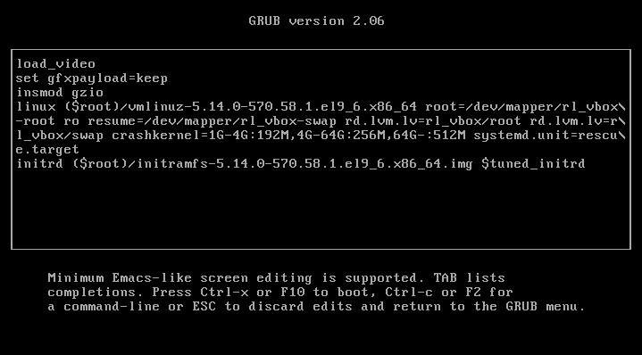
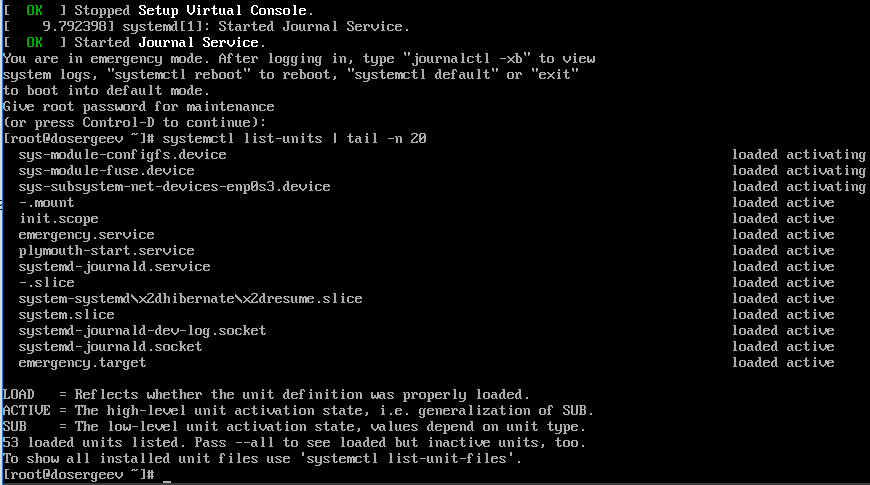
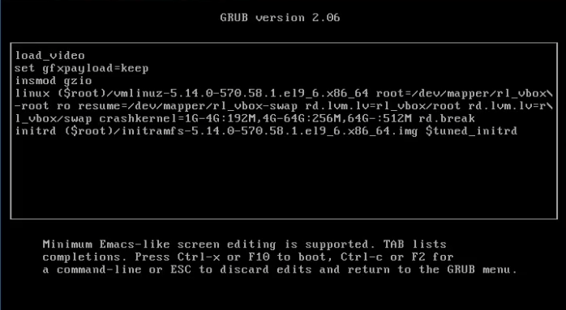

---
## Front matter
title: "Лабораторная работа № 11. Управление загрузкой системы"
subtitle: "Отчёт"
author: "Сергеев Даниил Олегович"

## Generic otions
lang: ru-RU
toc-title: "Содержание"

## Bibliography
bibliography: bib/cite.bib
csl: pandoc/csl/gost-r-7-0-5-2008-numeric.csl

## Pdf output format
toc: true # Table of contents
toc-depth: 2
lof: true # List of figures
lot: true # List of tables
fontsize: 12pt
linestretch: 1.5
papersize: a4
documentclass: scrreprt
## I18n polyglossia
polyglossia-lang:
  name: russian
  options:
	- spelling=modern
	- babelshorthands=true
polyglossia-otherlangs:
  name: english
## I18n babel
babel-lang: russian
babel-otherlangs: english
## Fonts
mainfont: IBM Plex Serif
romanfont: IBM Plex Serif
sansfont: IBM Plex Sans
monofont: IBM Plex Mono
mathfont: STIX Two Math
mainfontoptions: Ligatures=Common,Ligatures=TeX,Scale=0.94
romanfontoptions: Ligatures=Common,Ligatures=TeX,Scale=0.94
sansfontoptions: Ligatures=Common,Ligatures=TeX,Scale=MatchLowercase,Scale=0.94
monofontoptions: Scale=MatchLowercase,Scale=0.94,FakeStretch=0.9
mathfontoptions:
## Biblatex
biblatex: true
biblio-style: "gost-numeric"
biblatexoptions:
  - parentracker=true
  - backend=biber
  - hyperref=auto
  - language=auto
  - autolang=other*
  - citestyle=gost-numeric
## Pandoc-crossref LaTeX customization
figureTitle: "Рис."
tableTitle: "Таблица"
listingTitle: "Листинг"
lofTitle: "Список иллюстраций"
lotTitle: "Список таблиц"
lolTitle: "Листинги"
## Misc options
indent: true
header-includes:
  - \usepackage{indentfirst}
  - \usepackage{float} # keep figures where there are in the text
  - \floatplacement{figure}{H} # keep figures where there are in the text
---

# Цель работы

Получить навыки работы с загрузчиком системы GRUB2. [@tuis]

# Задание

- Продемонстрируйте навыки по изменению параметров GRUB и записи изменений в файл конфигурации
- Продемонстрируйте навыки устранения неполадок при работе с GRUB
- Продемонстрируйте навыки работы с GRUB без использования root

# Ход выполнения лабораторной работы

## Модификация параметров GRUB2

Запустим терминал и зайдем в учетную запись администратора (su -). Откроем файл /etc/default/grub в vi и изменим параметр ```GRUB_TIMEOUT``` на 10 секунд, а также удалим значения ```rhgb``` и ```quiet``` в параметре ```GRUB_CMDLINE_LINUX```, чтобы после перезагрузки системы мы могли наблюдать прокрутку загрузочных сообщений. Сохраним изменения.

{#fig:001 width=90%}

После изменений закроем редактор и запишим изменения в GRUB2:
```bash
grub2-mkconfig -o /boot/grub2/grub.cfg
```

Перезагрузим систему и убедимся, что мы можем выбрать версии ядра для загрузки.

{#fig:002 width=90%}

## Устранения неполадок

В меню GRUB выберем строку с текущей версией ядра и нажмем "**e**" для редактирования. Прокрутим вниз до строки, загружающей ядро (linux (\$root)/vmlinuz-.), и в её конце введем ```systemd.unit=rescue.target```.

Дополнительно уберем значения ```rhgb``` и ```quiet```.

{#fig:003 width=90%}

Сохраним изменения, нажав Ctrl+x. Дождемся появления запроса на пароль root и введем его.

{#fig:004 width=90%}

Посмотрим список всех загруженных файлов модулей:
```bash
systemctl list-units
```

{#fig:005 width=90%}

Всего загруженно 73 файла модулей.

Теперь посмотрим, какие переменные среды оболочки сейчас задействованы.
```bash
systemctl show-environment
```

{#fig:006 width=90%}

Команда выдает 4 различные переменные:

- /usr/local/sbin
- /usr/local/bin
- /usr/sbin
- /usr/bin

Перезапустим систему:
```bash
systemctl reboot
```

Как только меню GRUB снова отобразится, ещё раз перейдём в режим редактирования. На этот раз в конце строки, загружающей ядро введем ```systemd.unit=emergency.target```, чтобы перейти в аварийный режим. Не забудем убрать значения ```rhgb``` и ```quiet```.

{#fig:007 width=90%}

Продолжим процесс загрузки (Ctrl+x) и снова введем пароль root. Проверим список загруженный файлов модулей:
```bash
systemctl list-units | tail -n 20
```

{#fig:008 width=90%}

На этот раз было загружено 53 юнита.

Снова перезагрузим систему и перейдем к следующему заданию:
```bash
systemctl reboot
```

## Сброс пароля root

В меню GRUB в конце строки linux введем
```bash
rd.break
```

Удалим значения ```rhgb``` и ```quiet``` и продожим процесс загрузки.

{#fig:009 width=90%}

Получим доступ к системному образу для чтения и записи:
```bash
mount -o remount,rw /sysroot
```

Сделаем содержимое каталога /sysimage новым корневым каталогом, набрав:
```bash
chroot /sysroot
```

Теперь установим новый пароль для root:
```bash
passwd
```

На данном этапе загрузки SELinux ещё не активирован, поэтому убедимся что тип контекста установлен правильно. Загрузим политику SELinux и вручную установим правильный тип контекста /etc/shadow:
```bash
load_policy -i
chcon -t shadow_t /etc/shadow
```

Принудительно перезагрузим систему:
```bash
reboot -f
```

{#fig:010 width=90%}

# Ответы на контрольные вопросы

1. Какой файл конфигурации следует изменить для применения общих изменений в GRUB2?

- /etc/default/grub

2. Как называется конфигурационный файл GRUB2, в котором вы применяете изменения для GRUB2?

- grub.cfg по пути /boot/grub2/grub.cfg

3. После внесения изменений в конфигурацию GRUB2, какую команду вы должны выполнить, чтобы изменения сохранились и воспринялись при загрузке системы?

- grub2-mkconfig -o /boot/grub2/grub.cfg
- или напрямую grub2-mkconfig > /boot/grub2/grub.cfg

# Вывод

В результате выполнения лабораторной работы я получил навыки работы с загрузчиком системы GRUB2, научился переводить систему в аварийный режим и режим восстановления и узнал как сбросить пароль root на раннем этапе загрузки системы.

# Список литературы{.unnumbered}

::: {#refs}
:::
