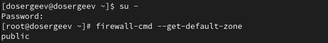
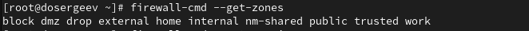
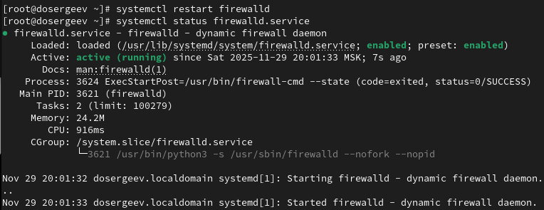
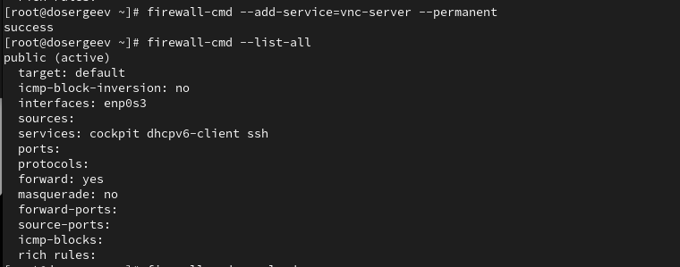
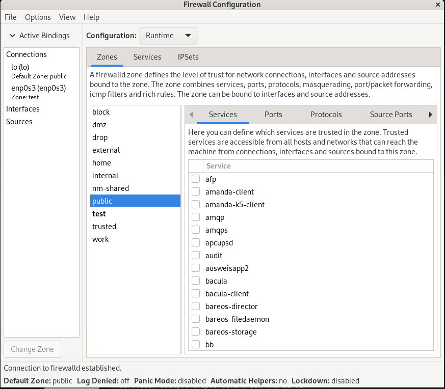
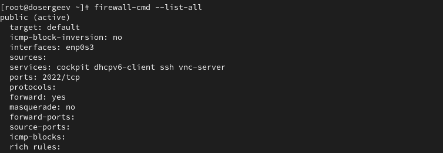
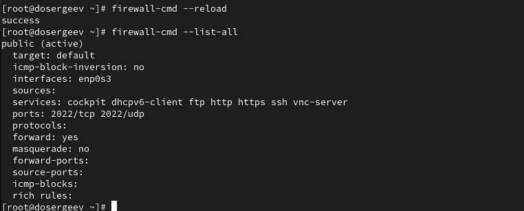
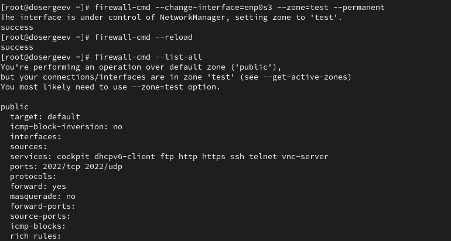
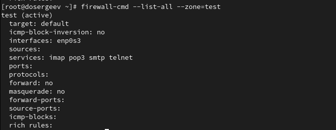

---
## Front matter
lang: ru-RU
title: Лабораторная работа № 13
subtitle: Фильтр пакетов
author:
  - Сергеев Д. О.
institute:
  - Российский университет дружбы народов, Москва, Россия
date: 29 ноября 2025

## i18n babel
babel-lang: russian
babel-otherlangs: english

## Formatting pdf
toc: false
toc-title: Содержание
slide_level: 2
aspectratio: 169
section-titles: true
theme: metropolis
header-includes:
 - \metroset{progressbar=frametitle,sectionpage=progressbar,numbering=fraction}
---

# Информация

## Докладчик

:::::::::::::: {.columns align=center}
::: {.column width="70%"}

  * Сергеев Даниил Олегович
  * Студент
  * Направление: Прикладная информатика
  * Российский университет дружбы народов
  * [1132246837@pfur.ru](mailto:1132246837@pfur.ru)

:::
::::::::::::::

# Цель работы

Получить навыки настройки пакетного фильтра в Linux.

# Задание

1. Используя firewall-cmd:

– определить текущую зону по умолчанию;
– определить доступные для настройки зоны;
– определить службы, включённые в текущую зону;
– добавить сервер VNC в конфигурацию брандмауэра;

2. Используя firewall-config:

– добавьте службы http и ssh в зону public;
– добавьте порт 2022 протокола UDP в зону public;
– добавьте службу ftp;

3. Выполните задание для самостоятельной работы.

# Ход выполнения лабораторной работы

## Управление брандмауэром с помощью firewall-cmd

Запустим терминал и зайдем в учетную запись администратора (su -). Начнем с изучения текущей конфигурации брандмауэра.

Определим текущую зону по умолчанию:
```bash
firewall-cmd --get-default-zone
```

{#fig:001 width=90%}

## Управление брандмауэром с помощью firewall-cmd

Сейчас по умолчанию установлена зона ```public```.

Определим доступные для настройки зоны:
```bash
firewall-cmd --get-zones
```

{#fig:002 width=90%}

Доступны зоны: ```block```, ```dmz```, ```drop```, ```external```, ```home```, ```internal```, ```nm-shared```, ```public```, ```trusted```, ```work```.

## Управление брандмауэром с помощью firewall-cmd

Посмотрим службы, доступные на компьютере:
```bash
firewall-cmd --get-services
```

{#fig:003 width=90%}

## Управление брандмауэром с помощью firewall-cmd

Определим службы, доступные в текущей зоне:
```bash
firewall-cmd --list-services
```

{#fig:004 width=90%}

Для зоны ```public``` доступны службы ```cockpit```, ```dhcppv6-client```, ```ssh```.

## Управление брандмауэром с помощью firewall-cmd

{#fig:005 width=70%}

Как мы видим, параметры одинаковые, так как ```public``` является зоной по умолчанию (ключ ```--list-all``` выводит параметры зоны по умолчанию или же ```default```).

## Управление брандмауэром с помощью firewall-cmd

{#fig:006 width=90%}

## Управление брандмауэром с помощью firewall-cmd

Перезапустим службу firewalld и проверим, что она запущена:
```bash
systemctl restart firewalld
systemctl status firewalld
```

{#fig:007 width=80%}

## Управление брандмауэром с помощью firewall-cmd

Проверим, есть ли vnc-server в конфигурации после перезапуска:
```bash
firewall-cmd --list-all
```

{#fig:008 width=90%}

## Управление брандмауэром с помощью firewall-cmd

Служба ```vnc-server``` больше не указана. Это произошло потому, что изменения, внесенные без параметра ```--permanent```, являются временными до перезагрузки службы и не добавляются в конфигурацию.

{#fig:009 width=90%}

## Управление брандмауэром с помощью firewall-cmd

{#fig:010 width=90%}

Теперь сервер запущен.

## Управление брандмауэром с помощью firewall-cmd

{#fig:011 width=90%}

## Управление брандмауэром с помощью firewall-config

Под той же учетной записью (root) установим ```firewall-config``` и запустим его.
```bash
dnf install firewall-config
# или (как в моем случае) из подсказки после ввода firewall-config
```

{#fig:012 width=90%}

## Управление брандмауэром с помощью firewall-config

{#fig:013 width=90%}

## Управление брандмауэром с помощью firewall-config

Теперь выберем вкладку Ports и на этой вкладке нажмем Add. Введем порт 2022 и укажем протокол udp.

{#fig:014 width=90%}

## Управление брандмауэром с помощью firewall-config

Закроем утилиту firewall-config и проверим изменения.
```bash
firewall-cmd --list-all
```

{#fig:015 width=90%}

## Управление брандмауэром с помощью firewall-config

Чтобы изменения вступили в силу, перезагрузим конфигурацию firewalld.
```bash
firewall-cmd --reload
firewall-cmd --list-all
```

{#fig:016 width=90%}

# Самостоятельная работа

{#fig:017 width=90%}

Добавим службу ```telnet``` в командной строке:
```bash
firewall-cmd --add-service=telnet --zone=test --permanent
```

Теперь откроем графический интерфейс и в нем добавим службы ```imap```, ```pop3``` и ```smtp```.

## Самостоятельная работа

{#fig:018 width=90%}

## Самостоятельная работа

{#fig:019 width=90%}

## Самостоятельная работа

Так как по умолчанию стоит зона ```public```, выводим параметры с указанием конкретной зоны:
```bash
firewall-cmd --list-all --zone=test
```

{#fig:020 width=90%}

# Ответы на контрольные вопросы

## Ответы на контрольные вопросы

1. Какая служба должна быть запущена перед началом работы с менеджером конфигурации брандмауэра firewall-config?

- ```firewalld.service```

2. Какая команда позволяет добавить UDP-порт 2355 в конфигурацию брандмауэра в зоне по умолчанию?

- ```firewall-cmd --add-port=2355/udp #--permanent```

3. Какая команда позволяет показать всю конфигурацию брандмауэра во всех зонах?

- ```firewall-cmd --list-all-zones```

## Ответы на контрольные вопросы

4. Какая команда позволяет удалить службу vnc-server из текущей конфигурации брандмауэра?

- ```firewall-cmd --remove-service=vnc-server #--permanent```

5. Какая команда firewall-cmd позволяет активировать новую конфигурацию, добавленную опцией --permanent?

- ```firewall-cmd --reload```

## Ответы на контрольные вопросы

6. Какой параметр firewall-cmd позволяет проверить, что новая конфигурация была добавлена в текущую зону и теперь активна?

- ```firewall-cmd --list-all```

7. Какая команда позволяет добавить интерфейс eno1 в зону public?

- ```firewall-cmd --zone=public --add-interface=eno1 #--permanent```

8. Если добавить новый интерфейс в конфигурацию брандмауэра, пока не указана зона, в какую зону он будет добавлен?

- В зону по умолчанию. Её можно узнать, использовав команду ```firewall-cmd --get-default-zone```

# Вывод

В результате выполнения лабораторной работы я получил навыки работы с брандмауэром службы firewalld, узнал как настраивать и применять конфигурацию для текущей зоны и как упростить конфигурацию с помощью утилиты firewall-config
