---
## Front matter
lang: ru-RU
title: Лабораторная работа № 14
subtitle: Партиции, файловые системы, монтирование
author:
  - Сергеев Д. О.
institute:
  - Российский университет дружбы народов, Москва, Россия
date: 06 декабря 2025

## i18n babel
babel-lang: russian
babel-otherlangs: english

## Formatting pdf
toc: false
toc-title: Содержание
slide_level: 2
aspectratio: 169
section-titles: true
theme: metropolis
header-includes:
 - \metroset{progressbar=frametitle,sectionpage=progressbar,numbering=fraction}
---

# Информация

## Докладчик

:::::::::::::: {.columns align=center}
::: {.column width="70%"}

  * Сергеев Даниил Олегович
  * Студент
  * Направление: Прикладная информатика
  * Российский университет дружбы народов
  * [1132246837@pfur.ru](mailto:1132246837@pfur.ru)

:::
::::::::::::::

# Цель работы

Получить навыки создания разделов на диске и файловых систем. Получить навыки монтирования файловых систем.

# Задание

1. Добавьте два диска на виртуальной машине;
2. Продемонстрируйте навыки создания разделов MBR с помощьюfdisk;
3. Продемонстрируйте навыки создания логических разделов с помощью fdisk;
4. Продемонстрируйте навыки создания раздела подкачки с помощью fdisk;
5. Продемонстрируйте навыки создания разделов GPT с помощью gdisk;
6. Продемонстрируйте навыки форматирования файловой системы XFS;
7. Продемонстрируйте навыки форматирования файловой системы EXT4;
8. Продемонстрируйте навыки ручного монтирования файловых систем;
9. Продемонстрируйте навыки монтирования файловых систем с помощью /etc/fstab;
10. Выполните задание для самостоятельной работы;

# Ход выполнения лабораторной работы

# Создание виртуальных носителей

## Создание виртуальных носителей

Добавим к виртуальной системе Rocky Linux два диска размером 512 МБ. Для этого в VirtualBox откроем меню настройки системы и перейдем во вкладку ```Носители```. Добавим новые жёсткие диски для контроллера ```SATA```. В появившемся окне нажмем на кнопку ```Создать файл образа диска```.

{#fig:001 width=45%}

## Создание виртуальных носителей

Назовём первый диск ```disk1```, а второй ```disk2```. Укажем тип VDI и память - 512 МБ. После нажмем кнопку ```Создать```. В окне носителей выберем каждый диск по очереди и нажмем кнопку ```Выбрать```, чтобы подключить диски к контроллеру.

{#fig:002 width=60%}

# Создание разделов MBR с помощью fdisk

## Создание разделов MBR с помощью fdisk

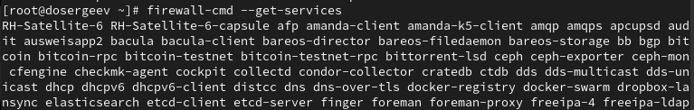{#fig:003 width=70%}

## Создание разделов MBR с помощью fdisk

Пусть нам необходимо сделать разметку разделов для диска ```/dev/sdb```:
```bash
# используем утилиту fdisk
fdisk /dev/sdb
```

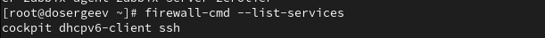{#fig:004 width=90%}

## Создание разделов MBR с помощью fdisk

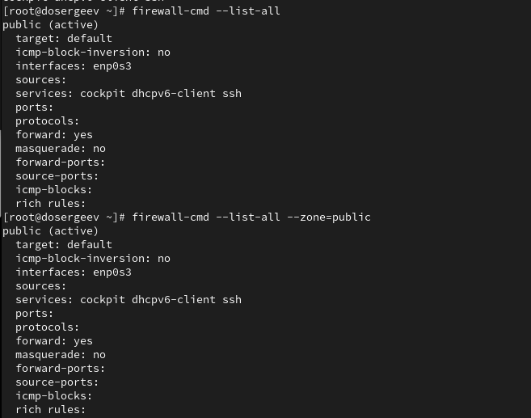{#fig:005 width=90%}

## Создание разделов MBR с помощью fdisk

{#fig:006 width=90%}

## Создание разделов MBR с помощью fdisk

{#fig:007 width=70%}

# Создание логических разделов

## Создание логических разделов

Запустим редактор дисков и создадим новый раздел:
```bash
fdisk /dev/sdb
```

{#fig:008 width=70%}

## Создание логических разделов

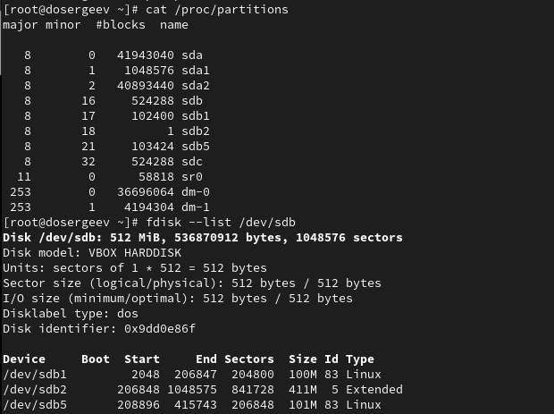{#fig:009 width=70%}

# Создание раздела подкачки

## Создание раздела подкачки

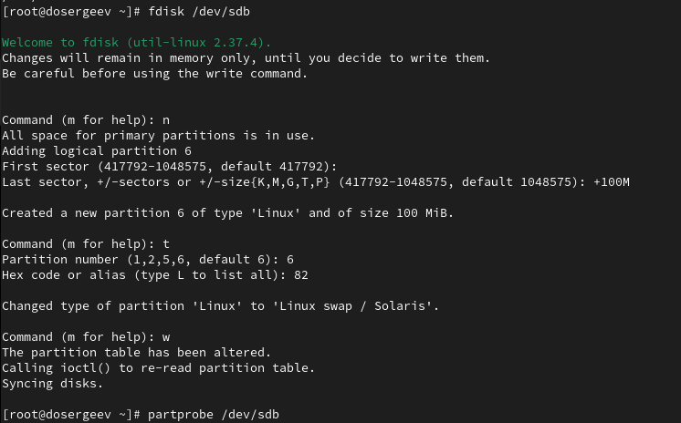{#fig:010 width=70%}

## Создание раздела подкачки

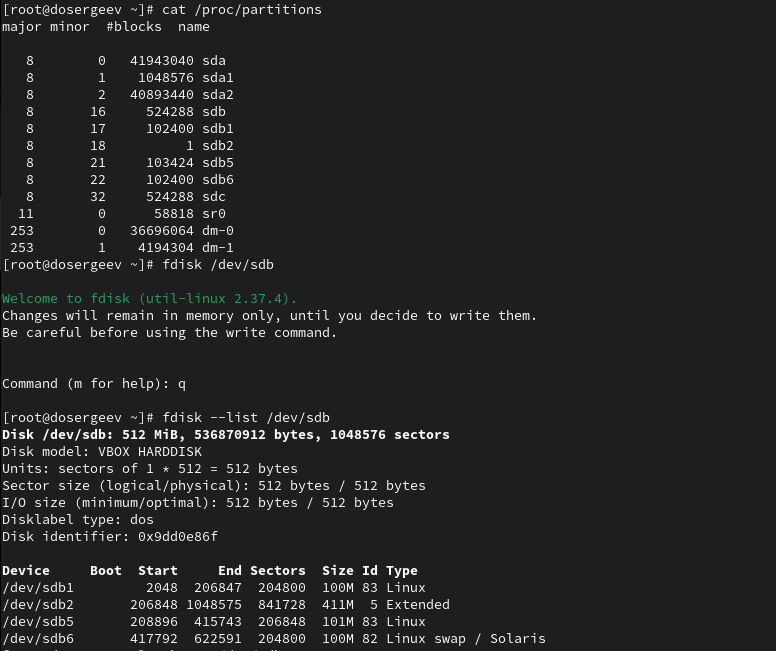{#fig:011 width=50%}

## Создание раздела подкачки

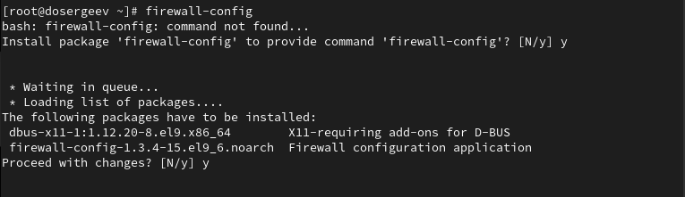{#fig:012 width=90%}

# Создание разделов GPT с помощью gdisk

## Создание разделов GPT с помощью gdisk

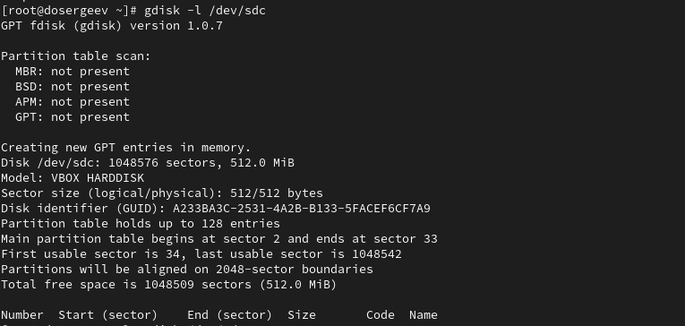{#fig:013 width=70%}

Так как разбиение диска отсутствует, создаётся таблица разделов GPT и соответствующее разбиение в памяти.

## Создание разделов GPT с помощью gdisk

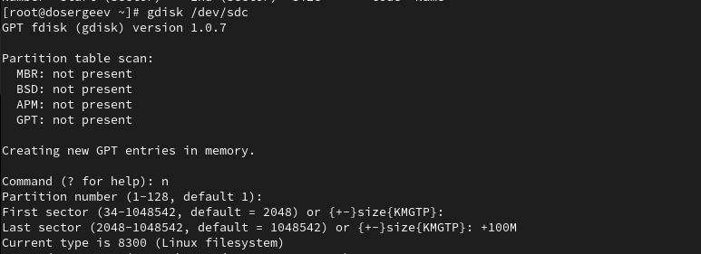{#fig:014 width=90%}

В отличие от ```fdisk```, нам предлагается указать тип разбиения. Указываем значение по умолчанию (8300). После создания раздела выведем разбиение диска:

## Создание разделов GPT с помощью gdisk

{#fig:015 width=90%}

## Создание разделов GPT с помощью gdisk

{#fig:016 width=90%}

## Создание разделов GPT с помощью gdisk

{#fig:017 width=90%}

# Форматирование файловой системы XFS

## Форматирование файловой системы XFS

{#fig:018 width=90%}

# Форматирование файловой системы EXT4

## Форматирование файловой системы EXT4

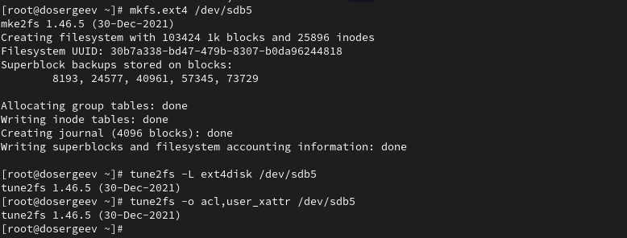{#fig:019 width=90%}

# Ручное монтирование файловых систем

## Ручное монтирование файловых систем

{#fig:020 width=90%}

## Ручное монтирование файловых систем

{#fig:021 width=90%}

# Монтирование разделов с помощью /etc/fstab

## Монтирование разделов с помощью /etc/fstab

{#fig:022 width=90%}

## Монтирование разделов с помощью /etc/fstab

Скопируем UUID для этого устройства. Откроем файл ```/etc/fstab``` на редактирование и добавим в него строку:
```bash
vi /etc/fstab

# В файле
UUID=9a335330-c2fc-4054-9f54-c3e288abec4b /mnt/data xfs defaults 1 2
```

## Монтирование разделов с помощью /etc/fstab

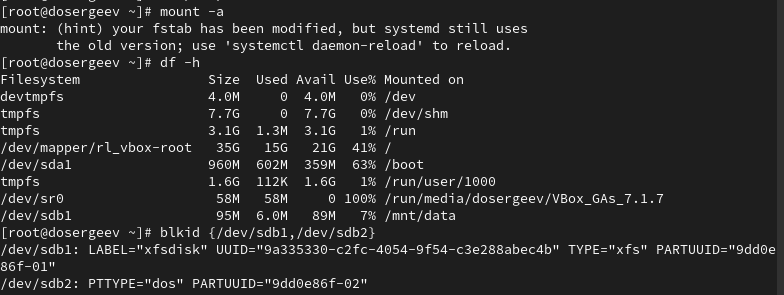{#fig:023 width=90%}

# Самостоятельная работа

## Самостоятельная работа

Добавим два раздела по 100 MiB на диск ```/dev/sdb``` (через ```gdisk```).

{#fig:024 width=90%}

## Самостоятельная работа

{#fig:025 width=90%}

## Самостоятельная работа

{#fig:026 width=90%}

## Самостоятельная работа

Сохраним изменения, нажав ```w```, и обновим таблицу разделов.
```bash
partprobe /dev/sdb
cat /proc/partitions
```

{#fig:027 width=90%}

## Самостоятельная работа

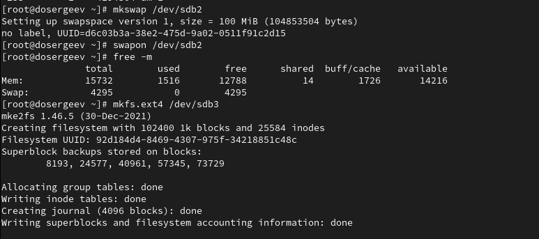{#fig:028 width=90%}

## Самостоятельная работа

Создадим каталог для автоматического монтирования ```/dev/sdb3```:
```bash
mkdir -p /mnt/data-ext4
ls -l /mnt
```

Узнаем UUID для разделов и запишем их в автозапуск:
```bash
blkid {/dev/sdb2,/dev/sdb3}
vi /etc/fstab

# В файле
UUID=d6c03b3a-38e2-475d-9a02-0511f91c2d15 none swap defaults 0 0
UUID=92d184d4-8469-4307-975f-34218851c48c /mnt/data-ext ext4 defaults 1 2
```

## Самостоятельная работа

{#fig:029 width=90%}

## Самостоятельная работа

{#fig:030 width=90%}

## Самостоятельная работа

Перезагрузим систему и убедимся, что все правильно:

{#fig:031 width=90%}

# Ответы на контрольные вопросы

## Ответы на контрольные вопросы

1. Какой инструмент используется для создания разделов GUID?

- ```gdisk```

2. Какой инструмент применяется для создания разделов MBR?

- ```fdisk```

3. Какой файл используется для автоматического монтирования разделов во время загрузки?

- ```/etc/fstab```

## Ответы на контрольные вопросы

4. Какой вариант монтирования целесообразно выбрать, если необходимо, чтобы файловая система не была автоматически примонтирована во время загрузки?

- В ```/etc/fstab``` добавить опцию ```noauto``` в поле параметров монтирования

5. Какая команда позволяет форматировать раздел с типом 82 с соответствующей файловой системой?

- ```mkswap /dev/диск``` - форматировать;
- ```swapon /dev/диск``` - подключить после форматирования;

## Ответы на контрольные вопросы

6. Вы только что добавили несколько разделов для автоматического монтирования при загрузке. Как можно безопасно проверить, будет ли это работать без реальной перезагрузки?

- ```mount -a``` - монтирует все из /etc/fstab;
- ```df -h``` - выводит информацию о пространстве в файловых системах;

7. Какая файловая система создаётся, если вы используете команду mkfs без какой-либо спецификации файловой системы?

- ```EXT2```

## Ответы на контрольные вопросы

8. Как форматировать раздел EXT4?

- ```mkfs.ext4 /dev/диск```

9. Как найти UUID для всех устройств на компьютере?

- ```blkid```

# Вывод

В результате выполнения лабораторной работы я получил навыки по созданию и настройке разделов на диске и файловых систем, узнал как монтировать и форматировать файловые системы, а также как правильно редактировать автоматическое монтирование систем после перезагрузки.

