---
## Front matter
lang: ru-RU
title: Лабораторная работа № 15
subtitle: Управление логическими томами
author:
  - Сергеев Д. О.
institute:
  - Российский университет дружбы народов, Москва, Россия
date: 14 декабря 2025

## i18n babel
babel-lang: russian
babel-otherlangs: english

## Formatting pdf
toc: false
toc-title: Содержание
slide_level: 2
aspectratio: 169
section-titles: true
theme: metropolis
header-includes:
 - \metroset{progressbar=frametitle,sectionpage=progressbar,numbering=fraction}
---

# Информация

## Докладчик

:::::::::::::: {.columns align=center}
::: {.column width="70%"}

  * Сергеев Даниил Олегович
  * Студент
  * Направление: Прикладная информатика
  * Российский университет дружбы народов
  * [1132246837@pfur.ru](mailto:1132246837@pfur.ru)

:::
::::::::::::::

# Цель работы

Получить навыки управления логическими томами.

# Задание

- Продемонстрировать навыки создания физических томов на LVM;
- Продемонстрировать навыки создания группы томов и логических томов на LVM;
- Продемонстрировать навыки изменения размера логических томов на LVM;
- Выполнить задание для самостоятельной работы;

# Ход выполнения лабораторной работы

# Создание физического тома

## Создание физического тома

Перед выполнением лабораторной работы добавим через меню VirutalBox дополнительный диск ```disk3.vdi``` размером 512 МБ.

Получим полномочия администратора и удалим в файле ```/etc/fstab``` строки автомонтирования из предыдущей лабораторной работы (```/mnt/data``` и ```/mnt/data-ext```) и отмонтируем соответствующие файловые системы.
```bash
su -
vi /etc/fstab
umount /mnt/data
umount /mnt/data-ext
```

## Создание физического тома

Убедимся, что диски не подмонтированы:
```bash
mount | grep mnt
# дополнительно узнаем новые имена дисков
fdisk --list
```

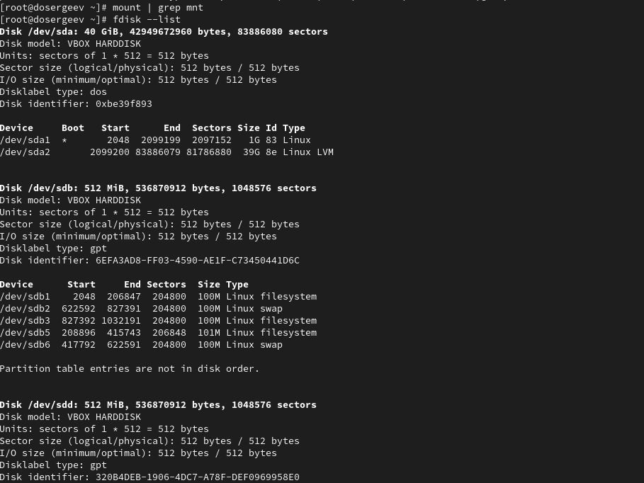{#fig:001 width=90%}

## Создание физического тома

С помощью ```fdisk``` сделаем новую разметку для дисков из прошлой лабораторной работы. Сейчас они называются ```/dev/sdb``` и ```/dev/sdd```:
```bash
fdisk /dev/sdb
```

## Создание физического тома

{#fig:002 width=90%}

## Создание физического тома

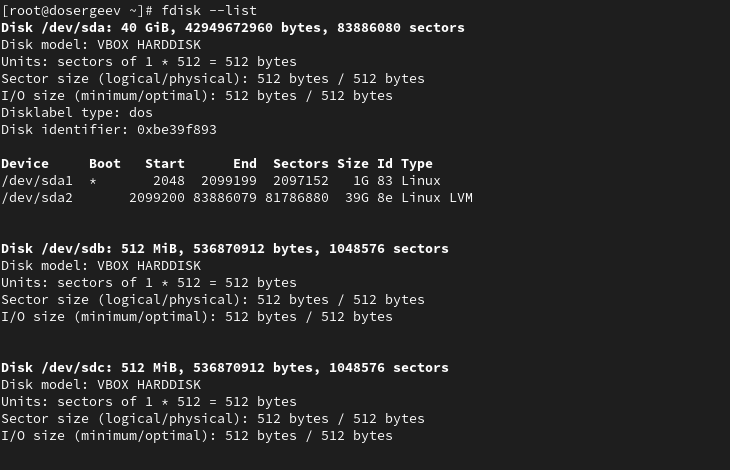{#fig:003 width=90%}

## Создание физического тома

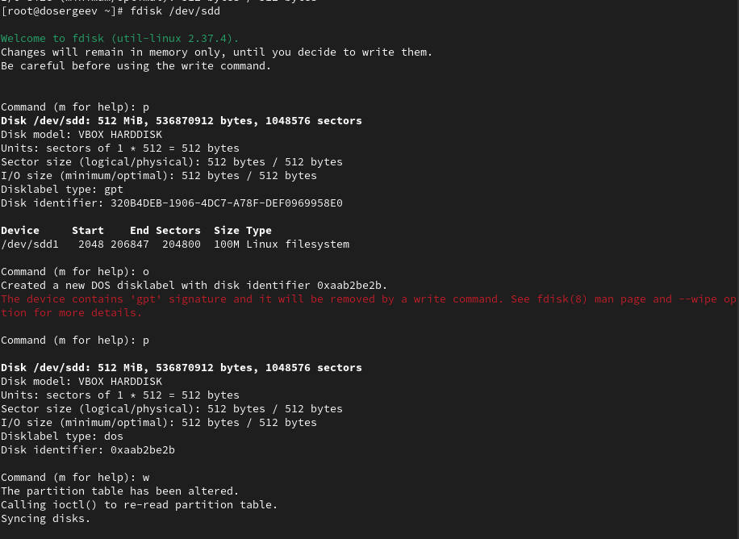{#fig:004 width=90%}

## Создание физического тома

Запишем изменения в таблицу разделов ядра:
```bash
partprobe /dev/{sdb,sdd}
```

Так как пространство подкачки ```/dev/sdb2``` находится в использовании, отключим его и перезапишем изменения:
```bash
swapoff /dev/sdb2
partprobe /dev/{sdb,sdd}
cat /proc/partitions
```

## Создание физического тома

{#fig:005 width=90%}

## Создание физического тома

Будем работать с диском ```/dev/sdc```, подключенным перед лабораторной работой. Создадим новый основной раздел (под номером 1), укажем размер ```+100M``` и тип ```8e - Linux LVM```. Обновим таблицу разделов ядра

## Создание физического тома

{#fig:006 width=90%}

## Создание физического тома

{#fig:007 width=90%}

# Создание группы томов и логических томов

## Создание группы томов и логических томов

Создадим группу томов и присвоим её физический том ```/dev/sdc1```, проверим что все создано успешно:
```bash
vgcreate vgdata /dev/sdc1
# проверим наличие группы томов
vgs
# проверим физический том
pvs
```

Создадим логический том LVM с именем ```lvdata```, который будет использовать 50% доступного дискового пространства в группе ```vgdata```, и проверим:
```bash
lvcreate -n lvdata -l 50%FREE vgdata
lvs
```

## Создание группы томов и логических томов

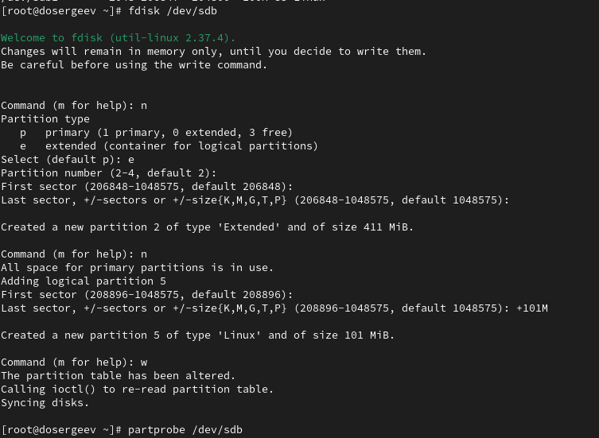{#fig:008 width=90%}

## Создание группы томов и логических томов

{#fig:009 width=90%}

## Создание группы томов и логических томов

{#fig:010 width=90%}

# Изменение размера логических томов

## Изменение размера логических томов

{#fig:011 width=90%}

## Изменение размера логических томов

Сейчас ```lvdata``` имеет размер ```40M```. Увеличим его на 50% оставшегося доступного дискового пространства в группе ```vgdata```. Убдеимся, что добавленное пространство стало доступным:
```bash
lvextend -r -l + 50%FREE /dev/vgdata/lvdata
lvs
df -h
```

## Изменение размера логических томов

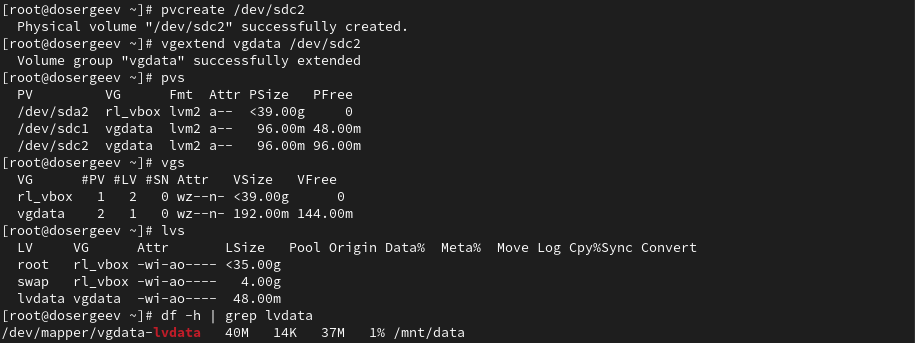{#fig:012 width=90%}

## Изменение размера логических томов

Теперь уменьшим размер ```lvdata``` на ```50M``` и также выполним проверку

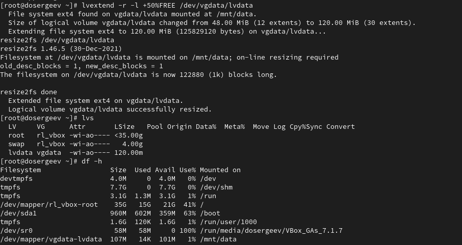{#fig:013 width=90%}

## Изменение размера логических томов

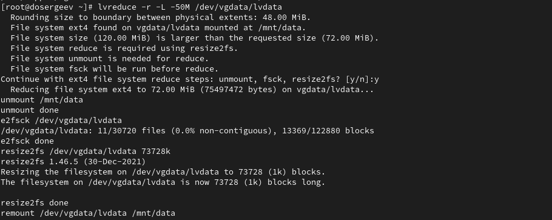{#fig:014 width=90%}

# Выполнение самостоятельной работы

## Выполнение самостоятельной работы

Будем выполнять работу на диске ```/dev/sdb```. Создадим новый основной раздел размером ```400M``` и типом ```8e - Linux LVM```

{#fig:015 width=90%}

## Выполнение самостоятельной работы

{#fig:016 width=90%}

## Выполнение самостоятельной работы

Теперь сделаем раздел физическим томом и создадим группу томов

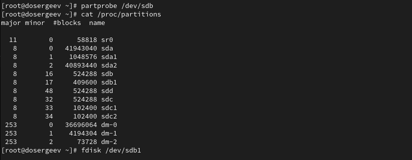{#fig:017 width=90%}

## Выполнение самостоятельной работы

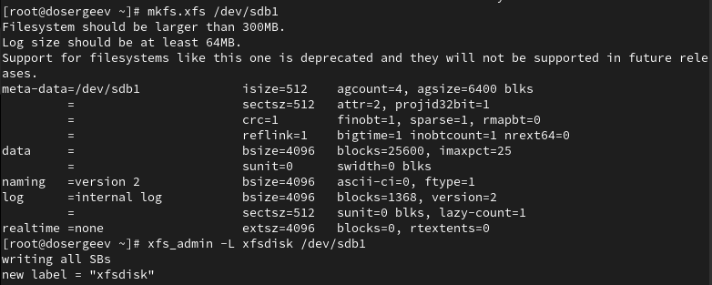{#fig:018 width=90%}

## Выполнение самостоятельной работы

Подключим автомонтирование. Для этого создадим каталог ```/mnt/groups``` и добавим в конфиг ```/etc/fstab``` строку:
```bash
mkdir -p /mnt/groups
vi /etc/fstab

# в конфиге /etc/fstab
/dev/vg/lvgroup /mnt/groups xfs defaults 1 2
```

## Выполнение самостоятельной работы

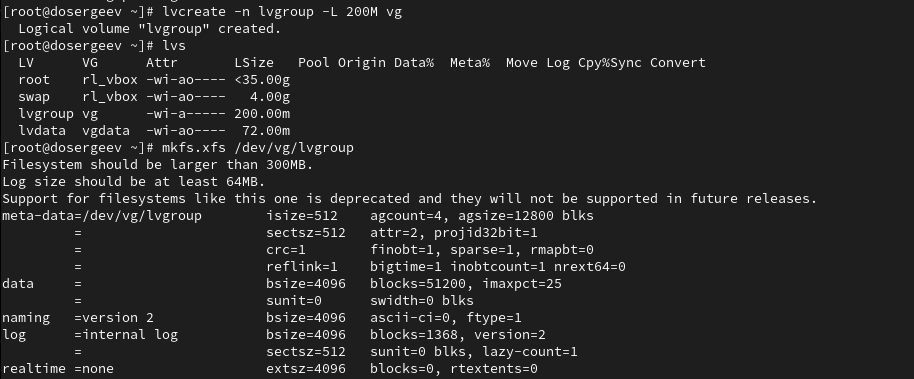{#fig:019 width=90%}

## Выполнение самостоятельной работы

{#fig:020 width=90%}

Перезагрузим систему.

## Выполнение самостоятельной работы

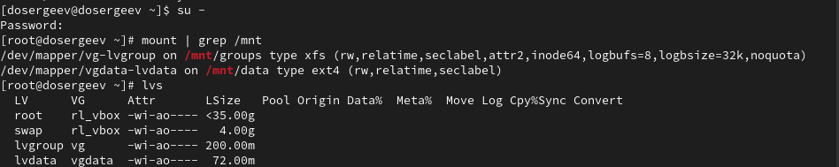{#fig:021 width=90%}

## Выполнение самостоятельной работы

Расширим том ```lvgroup``` на ```150M``` и проверим изменения размера тома и файловой системы

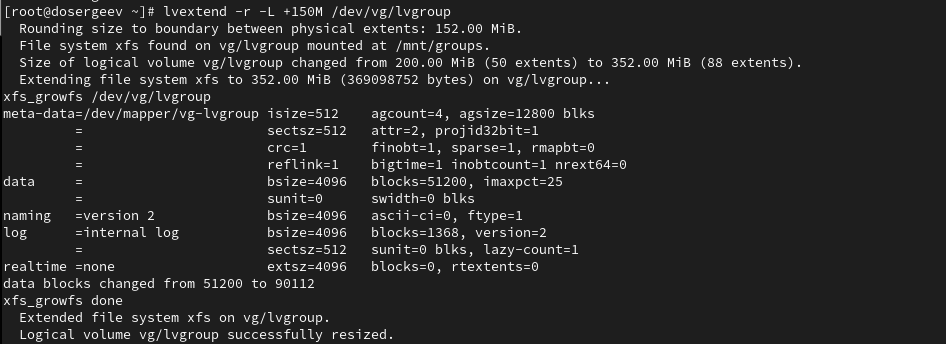{#fig:022 width=90%}

## Выполнение самостоятельной работы

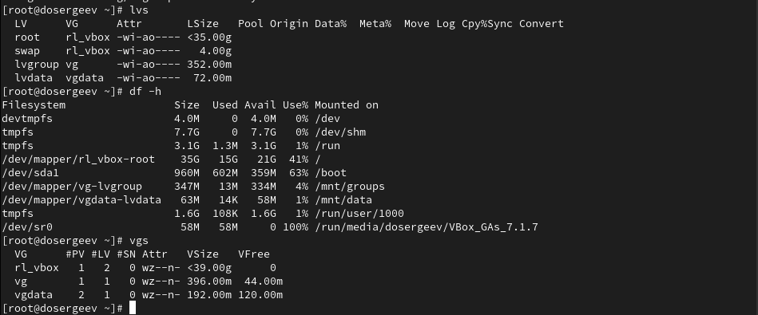{#fig:023 width=90%}

# Ответы на контрольные вопросы

## Ответы на контрольные вопросы

1. Какой тип раздела используется в разделе GUID для работы с LVM?

- ```8e - Linux LVM```

2. Какой командой можно создать группу томов с именем vggroup, которая содержит физическое устройство /dev/sdb3 и использует физический экстент 4 MiB?

- ```vgcreate -s 4M vggroup /dev/sdb3```

3. Какая команда показывает краткую сводку физических томов в вашей системе, а также группу томов, к которой они принадлежат?

- ```pvs```

## Ответы на контрольные вопросы

4. Что вам нужно сделать,чтобы добавить весь жёсткий диск /dev/sdd в группу томов группы?

- ```vgextend vggroup /dev/sdd```
- или если группы ещё не существует: ```vgcreate vggroup /dev/sdd```

5. Какая команда позволяет вам создать логический том lvvol1 с размером 6 MiB?

- ```lvcreate -n lvvol1 -L 6M <группа>```

6. Какая команда позволяет вам добавить 100 МБ в логический том lvvol1, если предположить, что дисковое пространство доступно в группе томов?

- ```lvextend -L +100M /dev/vggroup/lvvol1```

## Ответы на контрольные вопросы

7. Каков первый шаг, чтобы добавить ещё 200 МБ дискового пространства в логический том, если требуемое дисковое пространство недоступно в группе томов?

- Необходимо создать новый физический том и добавить его в группу, чтобы она получила больше дискового пространства
- ```pvcreate /dev/sd...```
- ```vgextend vggroup /dev/sd...```

8. Какую опцию нужно использовать с командой lvextend, чтобы также изменить размер файловой системы?

- Нужно добавить опцию ```-r```
- ```lvextend -r -L <размер> <раздел>```

## Ответы на контрольные вопросы

9. Как посмотреть, какие логические тома доступны?

- ```lvs```

10. Какую команду нужно использовать для проверки целостности файловой системы на /dev/vgdata/lvdata?

- ```fsck /dev/vgdata/lvdata```

# Вывод

В результате выполнения лабораторной работы я узнал как управлять логическими томами и создавать их. Получил навыки по расширению и сокращению размеров логических томов и по объединению томов в группы.
