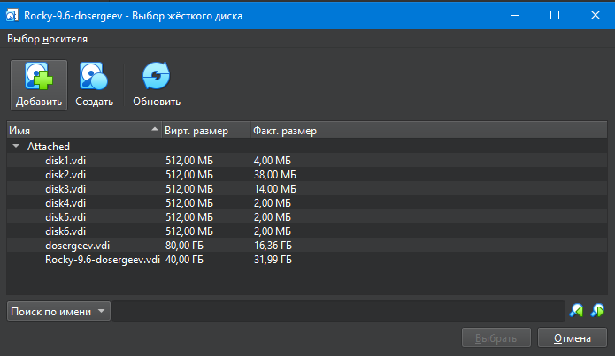
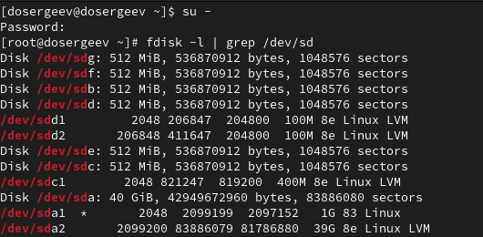
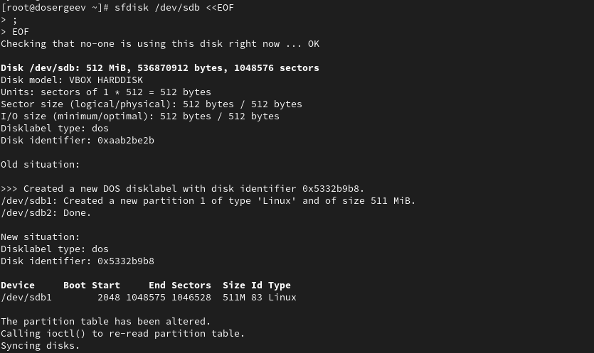
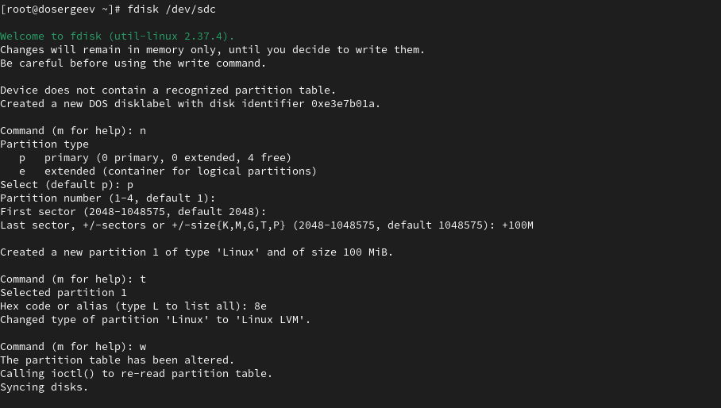
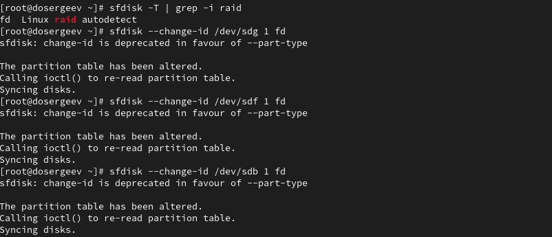
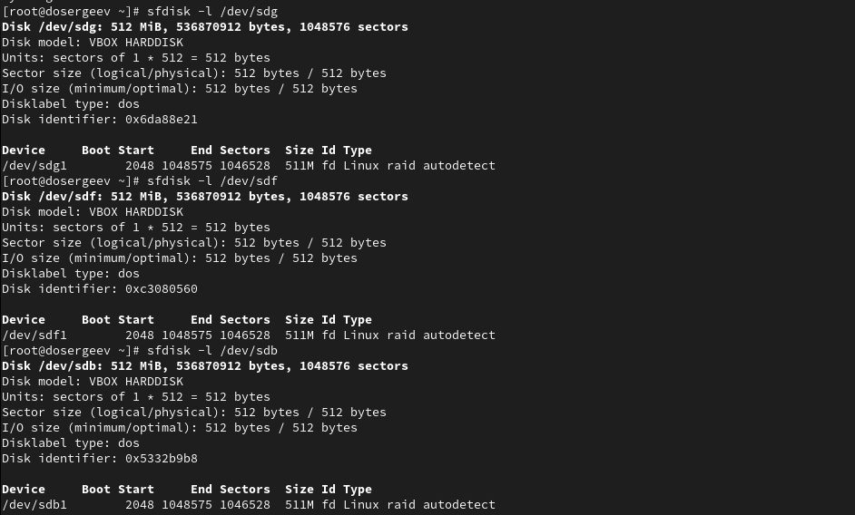
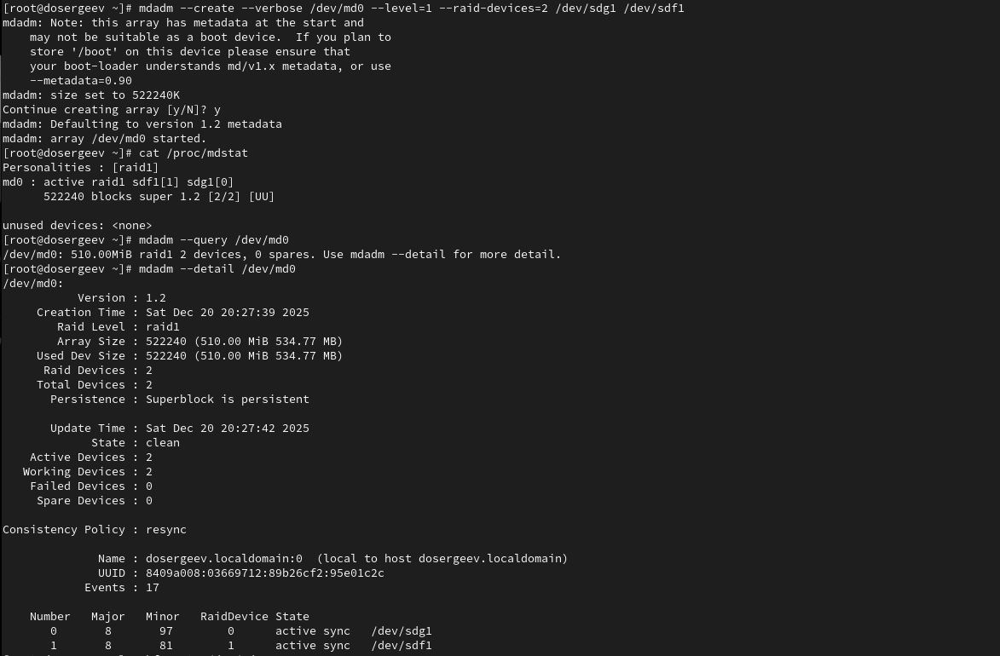
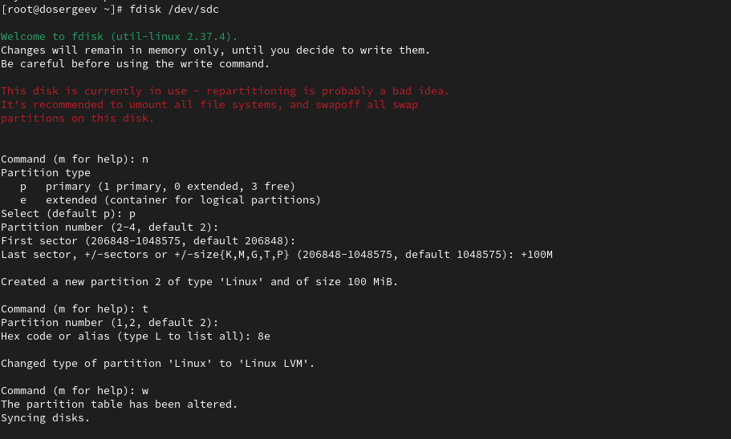
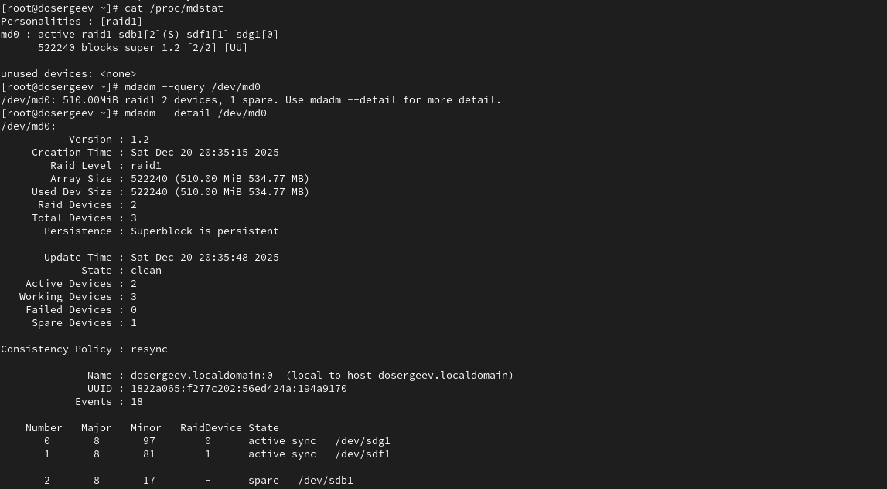
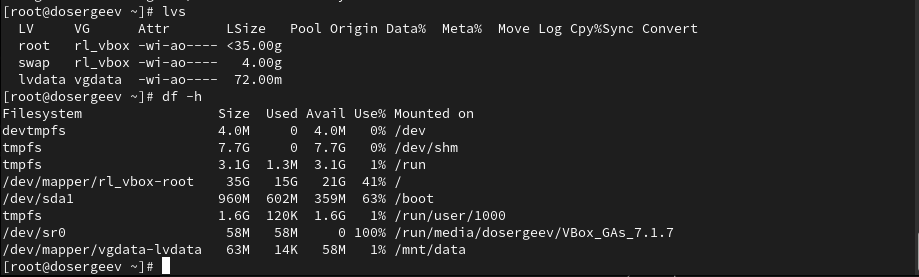

---
## Front matter
lang: ru-RU
title: Лабораторная работа № 16
subtitle: Программный RAID
author:
  - Сергеев Д. О.
institute:
  - Российский университет дружбы народов, Москва, Россия
date: 20 декабря 2025

## i18n babel
babel-lang: russian
babel-otherlangs: english

## Formatting pdf
toc: false
toc-title: Содержание
slide_level: 2
aspectratio: 169
section-titles: true
theme: metropolis
header-includes:
 - \metroset{progressbar=frametitle,sectionpage=progressbar,numbering=fraction}
---

# Информация

## Докладчик

:::::::::::::: {.columns align=center}
::: {.column width="70%"}

  * Сергеев Даниил Олегович
  * Студент
  * Направление: Прикладная информатика
  * Российский университет дружбы народов
  * [1132246837@pfur.ru](mailto:1132246837@pfur.ru)

:::
::::::::::::::

# Цель работы

Освоить работу с RAID-массивами при помощи утилиты mdadm.

# Задание

- Прочитайте руководство по работе с утилитами fdisk, sfdisk и mdadm.
- Добавить три диска на виртуальную машину (объёмом от 512 MiB каждый). При помощи sfdisk создать на каждом из дисков по одной партиции, задав тип раздела для RAID.
- Создать массив RAID 1 из двух дисков, смонтировать его. Эмитировать сбой одного из дисков массива, удалить искусственно выведенный из строя диск, добавить в массив работающий диск.
- Создать массив RAID 1 из двух дисков, смонтировать его. Добавить к массиву третий диск. Эмитировать сбой одного из дисков массива. Проанализировать состояние массива, указать различия по сравнению с предыдущим случаем.
- Создать массив RAID 1 из двух дисков, смонтировать его. Добавить к массиву третий диск. Изменить тип массива с RAID1 на RAID5, изменить число дисков в массиве с 2 на 3. Проанализировать состояние массива, указать различия по сравнению с предыдущим случаем

# Ход выполнения лабораторной работы

# Создание виртуальных носителей

## Создание виртуальных носителей

Перед выполнением лабораторной работы добавим через меню VirutalBox дополнительные диски ```disk4.vdi```, ```disk5.vdi```, ```disk6.vdi``` размером 512 МБ.

{#fig:001 width=70%}

# Создание RAID-диска

## Создание RAID-диска

{#fig:002 width=90%}

## Создание RAID-диска

{#fig:003 width=90%}

## Создание RAID-диска

{#fig:004 width=90%}

## Создание RAID-диска

{#fig:005 width=90%}

## Создание RAID-диска

{#fig:006 width=90%}

## Создание RAID-диска

{#fig:007 width=90%}

## Создание RAID-диска

{#fig:008 width=90%}

## Создание RAID-диска

{#fig:009 width=70%}

## Создание RAID-диска

{#fig:010 width=90%}

## Создание RAID-диска

{#fig:011 width=90%}

## Создание RAID-диска

{#fig:012 width=90%}

# RAID-массив с горячим резервом (hotspare)

## RAID-массив с горячим резервом (hotspare)

{#fig:013 width=90%}

## RAID-массив с горячим резервом (hotspare)

{#fig:014 width=90%}

## RAID-массив с горячим резервом (hotspare)

{#fig:015 width=90%}

## RAID-массив с горячим резервом (hotspare)

Массив автоматически пересобрался - теперь активны диски ```[0]/dev/sdg1``` и ```[1]/dev/sdb1```. Диск ```[-]/dev/sdf1```, в свою очередь, имеет состояние ```faulty```, это значит что диск неисправен.

Удалим массив и очистим метаданные:
```bash
umount /dev/md0
mdadm --stop /dev/md0
mdadm --zero-superblock /dev/sdg1
mdadm --zero-superblock /dev/sdf1
mdadm --zero-superblock /dev/sdb1
```

# Преобразование массива RAID 1 в RAID 5

## Преобразование массива RAID 1 в RAID 5

{#fig:016 width=90%}

## Преобразование массива RAID 1 в RAID 5

{#fig:017 width=90%}

## Преобразование массива RAID 1 в RAID 5

{#fig:018 width=90%}

## Преобразование массива RAID 1 в RAID 5

{#fig:019 width=90%}

## Преобразование массива RAID 1 в RAID 5

Диск ```[2]/dev/sdb1``` автоматически подключился и активировался, теперь работают 3 диска из 3.

Удалим массив и очистим метаданные:
```bash
umount /dev/md0
mdadm --stop /dev/md0
mdadm --zero-superblock /dev/sdg1
mdadm --zero-superblock /dev/sdf1
mdadm --zero-superblock /dev/sdb1
```

# Ответы на контрольные вопросы

## Ответы на контрольные вопросы

1. Приведите определение RAID.

- ```RAID``` (Redundant Array of Independent Disks – Избыточный массив независимых дисков) — это метод виртуализации, позволяющий объединять несколько дисков в единый логический том, имеющий лучшие характеристики1 или, простыми словами, несколько дисков, соединенных в единую систему с выделенным местом для исправления ошибок в данных. 

## Ответы на контрольные вопросы

2. Какие типы RAID-массивов существуют на сегодняшний день?

- RAID 0 - чередование; 
- RAID 1 - зеркало; 
- RAID 2 - чередование + код Хемминга; 
- RAID 3 - чередование + диск четности; 
- RAID 4 - чередование + диск четности (блоки данных вместо байтов); 
- RAID 5 - чередование + хранение контрольных сумм распределяется по всему массиву; 
- RAID 6 - чередование + две контрольные суммы; 
- RAID 10 - массив RAID 0, построенный из RAID 1; 
- RAID 50 - массив RAID 0, построенный из RAID 5; 
- RAID 60 - массив RAID 0, построенный из RAID 6;

## Ответы на контрольные вопросы

3. Охарактеризуйте RAID 0, RAID 1, RAID 5, RAID 6, опишите алгоритм работы, назначение, приведите примеры применения.

3.1. ```RAID 0``` 

- Данные разбиваются на блоки и записываются на два или более дисков последовательно и без дублирования. 
- Назначение: увеличение производительности. 
- Примеры: **не критичные к потере данных**, но требующие высокой скорости системы.

3.2. ```RAID 1``` 

- Представляет собой полную копию информации одного диска массива на другой. 
- Назначение: необходим для важных данных, сохранение которых стоит в приоритете. 
- Примеры: файл-сервера с критически важными данными, малые базы данных.

## Ответы на контрольные вопросы

3.3. ```RAID 5``` 

- Данные и контрольные суммы, необходимые для восстановления, распределяются по всем дискам массива. 
- Четность рассчитывается по алгоритму XOR. 
- Назначение: баланс между производительностью, отказоустойчивостью и эффективностью использования пространства. 
- Примеры: сервера общего назначения, системы хранения данных, архивы, где важны и объем и надежность.

## Ответы на контрольные вопросы

3.4. ```RAID 6``` 

- Улучшенный RAID 5. Контрольные суммы на этот массив записываются в двойном размере, что требует и увеличения объема для их хранения в два раза.
- Назначение: повышенная отказоустойчивость. Создан для повышения надежности в массивах с большим количеством дисков и/или с дисками большой емкости.
- Примеры: системы, в которых простои недопустимы, большие массивы хранения данных, системы резервного копирования.

# Вывод

В результате выполнения лабораторной работы я узнал как создавать RAID-массивы в операционной системе Linux и освоил работу специальной утилиты mdadm.
